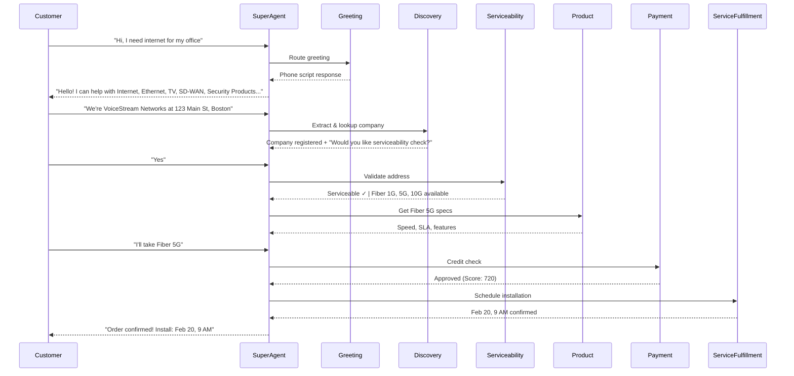

# Multi-Agent System Architecture

**B2B Conversational Sales Agent - ADK-Powered Multi-Agent Orchestration**

## 🔴 MANDATORY: Documentation-First Approach

**BEFORE making ANY changes (config, code, structure), you MUST:**

1. **Read the documentation first** - in this order:
   - This file (CLAUDE.md)
   - [AGENTS.md](AGENTS.md)
   - Component-specific docs (e.g., `DiscoveryAgent/AGENTS.md`)
   - [README.md](README.md)

2. **Common tasks → Required reading:**
   - Configuration changes → [SuperAgent/README.md](SuperAgent/README.md) (`.env` variables)
   - Agent development → Component's AGENTS.md
   - Sub-agent work → [super_agent/sub_agents/CLAUDE.md](SuperAgent/super_agent/sub_agents/CLAUDE.md)

3. **DO NOT "explore to figure it out"** - The documentation exists to prevent this!


---

## System Architecture

### Multi-Agent System (MAS) Pattern

This system implements a **Super Agent/Sub-Agent** orchestration pattern using Google ADK (Agent Development Kit). The architecture enforces strict separation between autonomous reasoning (LLM-driven) and deterministic execution (API/DB-driven) to ensure zero-hallucination compliance for critical business operations.

```
┌─────────────────────────────────────────────────────────────┐
│                     PRESENTATION LAYER                       │
│  React 19 Client (SSE Streaming) ↔ FastAPI Server           │
└──────────────────────┬──────────────────────────────────────┘
                       │
┌──────────────────────▼──────────────────────────────────────┐
│                  ORCHESTRATION LAYER                         │
│  SuperAgent (Root Orchestrator)                              │
│  • Intent Analysis & Routing                                 │
│  • Context Management                                        │
│  • Session State                                             │
│  • Guardrails & Safety                                       │
└──────────────────────┬──────────────────────────────────────┘
                       │
         ┌─────────────┼─────────────┐
         │             │             │
┌────────▼──────┐ ┌───▼────────┐ ┌──▼──────────┐
│   DISCOVERY   │ │   CONFIG   │ │ TRANSACTION │
│               │ │            │ │             │
│ • Discovery   │ │ • Service- │ │ • Payment   │
│   Agent       │ │   ability  │ │   Agent     │
│               │ │   Agent    │ │             │
│ • Greeting    │ │            │ │ • Service   │
│   Agent       │ │ • Product  │ │   Fulfill.  │
│               │ │   Agent    │ │   Agent     │
│ • FAQ Agent   │ │            │ │             │
│               │ │ • Offer    │ │ • Order     │
│               │ │   Mgmt     │ │   Agent     │
└───────────────┘ └────────────┘ └─────────────┘
         │             │             │
         └─────────────┼─────────────┘
                       │
┌──────────────────────▼──────────────────────────────────────┐
│                 INFRASTRUCTURE LAYER                         │
│  • SQLite (Prospect/Order DB)                                │
│  • ChromaDB (Product RAG)                                    │
│  • GIS/Coverage Map API (Serviceability)                     │
│  • Pricing Engine API (Offers)                               │
│  • Payment Gateway (Credit/Auth)                             │
│  • Scheduler API (Installation)                              │
└──────────────────────────────────────────────────────────────┘
```

### Agent-to-Agent (A2A) Communication Protocol

Agents communicate via **JSON-RPC-style A2A messaging**:

```json
{
  "sender": "super_agent",
  "receiver": "discovery_agent",
  "correlation_id": "uuid-1234",
  "timestamp": "2026-02-15T10:30:00Z",
  "content": {
    "action": "lookup_company",
    "parameters": {
      "company_name": "VoiceStream Networks",
      "address": "123 Main St, Boston, MA"
    }
  }
}
```

**Key A2A Principles:**
- Asynchronous message passing
- Correlation IDs for request/response tracking
- Structured logging of all inter-agent communication
- Agent autonomy: sub-agents execute without user intervention once invoked

### Model Context Protocol (MCP)

MCP is used to connect agents to **local tools and data sources**:
- Database connections (SQLite for prospect/order data)
- File system access (product manuals, coverage maps)
- External API wrappers (GIS, payment gateway stubs)

**MCP Usage Pattern:**
```python
# Agent declares tools via MCP
from google.adk.tools import FunctionTool

@FunctionTool
def check_address_serviceability(address: str) -> dict:
    """Queries GIS API to determine if address is serviceable"""
    # Deterministic lookup - no LLM hallucination
    return gis_api.query(address)
```

---

## Sub-Agent Registry

### Currently Deployed (SuperAgent Integration)

| Agent | Status | Location | Description |
|-------|--------|----------|-------------|
| **SuperAgent** | ✅ Active | `SuperAgent/super_agent/agent.py` | Root orchestrator. Routes intents, manages session state, delegates to sub-agents |
| **DiscoveryAgent** | ✅ Active | `DiscoveryAgent/bootstrap_agent/` | Prospect identification, company lookup, BANT qualification, intelligent slot-filling |
| **ServiceabilityAgent** | ✅ Active | `ServiceabilityAgent/serviceability_agent/` | PRE-SALE address validation, coverage verification, infrastructure assessment |
| **ProductAgent** | ✅ Active | `ProductAgent/product_agent/` | RAG-powered product catalog, technical specs, feature docs (ChromaDB) |
| **GreetingAgent** | ✅ Active | `SuperAgent/super_agent/sub_agents/greeting/` | Handles greetings, phone script generation for human agents |
| **FAQAgent** | ✅ Active | `SuperAgent/super_agent/sub_agents/faq/` | Answers product questions, policies, SLAs, support topics |

### Standalone (Not Yet Integrated)

| Agent | Status | Location | Description |
|-------|--------|----------|-------------|
| **PaymentAgent** | ⏳ Ready | `PaymentAgent/payment_agent/` | Credit checks, payment validation, fraud assessment, authorization |
| **ServiceFulfillmentAgent** | ⏳ Ready | `ServiceFulfillmentAgent/service_fulfillment_agent/` | POST-SALE installation scheduling, provisioning, service activation |

### Planned (Future Implementation)

| Agent | Status | Purpose |
|-------|--------|---------|
| **OfferManagementAgent** | 🔮 Planned | Pricing calculation, bundle creation, promotional discounts |
| **OrderAgent** | 🔮 Planned | Cart management, contract generation, order finalization |
| **CustomerCommsAgent** | 🔮 Planned | Automated notifications (email/SMS) for order, payment, installation |

---

## Technical Stack

### Core Technologies

| Layer | Technology | Version | Purpose |
|-------|-----------|---------|---------|
| **LLM** | Google Gemini | 2.5 Flash | Autonomous reasoning, intent analysis, conversation |
| **Agent Framework** | Google ADK | 1.20.0+ | Multi-agent orchestration, tool integration, A2A protocol |
| **Backend** | Python | 3.12+ | Agent logic, API integration |
| **Server** | FastAPI | Latest | REST + SSE streaming for real-time chat |
| **Frontend** | React + Vite | 19 | Client UI with streaming message display |
| **State Mgmt** | React Context | - | Chat history, session state |
| **Styling** | Tailwind CSS | - | Rapid, clean UI components |
| **Vector DB** | ChromaDB | - | RAG for product manuals (ProductAgent) |
| **Transactional DB** | SQLite | - | Prospect data (DiscoveryAgent), Orders |
| **API Protocol** | A2A JSON-RPC | Custom | Inter-agent communication |

### Model Configuration

**Production Model:** `gemini-3-flash-preview` (via `GEMINI_MODEL` env var)

- Temperature: 0.7 (SuperAgent/greeting/FAQ), 0.0 (deterministic agents)
- Max tokens: 2048-8192 (agent-specific)
- Safety settings: Configurable per-agent

**Alternative Models Supported:**

- `gemini-2.0-flash` (stable release)
- `gemini-2.5-flash` (future)
- `gemini-pro` (high-reasoning tasks)

---

## The Golden Rule

**All agents MUST strictly follow ADK standards:**

### 1. ADK Bootstrap Template Structure

Every agent project follows this canonical pattern:

```
AgentName/
├── pyproject.toml              # Python package definition
├── agent_name/                 # Top-level package
│   ├── __init__.py             # Exports root agent
│   ├── agent.py                # Agent instance + logic
│   ├── prompts.py              # Instruction templates
│   ├── config.py               # Settings (pydantic)
│   ├── sub_agents/             # Directory per sub-agent
│   │   ├── sub_agent_1/
│   │   │   ├── __init__.py
│   │   │   └── agent.py
│   └── tools/                  # Function tools
│       └── tools.py
├── tests/                      # Pytest test suite
└── README.md                   # Agent documentation
```

**Why This Matters:**
- Consistent navigation across all agent projects
- Clean import resolution (`from agent_name import get_agent`)
- Proper package isolation (critical for ADK parent-binding)

### 2. ADK Agent Initialization Pattern

```python
from google.adk.agents import Agent
from google.genai import types

agent = Agent(
    name="agent_name",
    model=os.getenv("GEMINI_MODEL"),  # No default - fail fast if not configured
    instruction="System prompt defining agent behavior...",
    description="Brief agent purpose for orchestrator routing",
    sub_agents=[],                  # If this is an orchestrator
    tools=[tool1, tool2],           # FunctionTools for deterministic ops
    generate_content_config=types.GenerateContentConfig(
        temperature=0.7,
        max_output_tokens=2048,
    ),
)
```

**Note:** Avoid default values for critical config like `GEMINI_MODEL`. Use `os.getenv("VARIABLE")` without fallback to fail fast if environment is not properly configured.

### 3. Tool Definition Pattern (MCP Integration)

```python
from google.adk.tools import FunctionTool

@FunctionTool
def tool_function(param: str) -> dict:
    """
    Clear docstring - becomes tool description for LLM.

    Args:
        param: Parameter description

    Returns:
        dict: Result schema
    """
    # Deterministic logic only - no LLM calls inside tools
    return {"result": "data"}
```

### 4. Importlib Isolation for Sub-Agents

**Critical for ADK:** When a sub-agent exists as a separate project, it must be loaded via `importlib` to avoid parent-binding conflicts:

```python
# SuperAgent/super_agent/sub_agents/discovery/agent.py

import importlib.util
import sys
import types as pytypes

# Stub parent package to prevent __init__.py execution
if "bootstrap_agent" not in sys.modules:
    _stub = pytypes.ModuleType("bootstrap_agent")
    _stub.__path__ = [_DISCOVERY_PKG]
    sys.modules["bootstrap_agent"] = _stub

# Load agent module in isolation
_agent_spec = importlib.util.spec_from_file_location(
    "bootstrap_agent.agent",
    os.path.join(_DISCOVERY_PKG, "agent.py")
)
_agent_mod = importlib.util.module_from_spec(_agent_spec)
sys.modules[_agent_spec.name] = _agent_mod
_agent_spec.loader.exec_module(_agent_mod)

# Export fresh Agent instance
discovery_agent = _agent_mod.discovery_agent
```

**Why:** ADK enforces one parent per agent. If `DiscoveryAgent/__init__.py` runs, it binds `discovery_agent` to its own root. Importlib loads a fresh instance for SuperAgent's orchestration.

### 5. Sub-Agent Naming Best Practices

**CRITICAL:** Sub-agents loaded via importlib must use **hardcoded names** to avoid environment variable conflicts.

**❌ WRONG (causes name conflicts):**
```python
# ServiceabilityAgent/serviceability_agent/agent.py
from dotenv import load_dotenv

load_dotenv()  # ← Loads root .env which may have AGENT_NAME=super_sales_agent

AGENT_NAME = os.getenv("AGENT_NAME", "serviceability_agent")  # ← Gets overridden!

serviceability_agent = Agent(
    name=AGENT_NAME,  # ← Results in wrong name, ADK can't find agent
    ...
)
```

**✅ CORRECT (hardcoded name, no conflicts):**
```python
# ServiceabilityAgent/serviceability_agent/agent.py
# No load_dotenv() call - sub-agents inherit config from parent

GEMINI_MODEL = os.getenv("GEMINI_MODEL")  # Read from parent's environment

serviceability_agent = Agent(
    name="serviceability_agent",  # ← Hardcoded, always correct
    model=GEMINI_MODEL,
    ...
)
```

**Key Rules:**
1. **Never call `load_dotenv()` in sub-agent code** - environment already loaded by SuperAgent
2. **Hardcode agent names** - don't read from `AGENT_NAME` environment variable
3. **No default model values** - use `os.getenv("GEMINI_MODEL")` without fallback to fail fast if not configured
4. **Root agent (SuperAgent) sets environment** - sub-agents inherit it

**Why This Matters:**
- When `load_dotenv()` runs in ServiceabilityAgent, it reads root `.env` containing `AGENT_NAME=super_sales_agent`
- This overrides the sub-agent's intended name, causing ADK to fail with "Agent not found in agent tree"
- Hardcoded names ensure consistent agent identity regardless of environment state

### 6. Configuration Management

**Centralized Config (Pydantic):**
```python
# super_agent/config.py
from pydantic import Field
from pydantic_settings import BaseSettings

class AgentSettings(BaseSettings):
    agent_name: str = "SuperAgent"
    enable_sub_agents: bool = True
    system_message: str = "You are a B2B sales assistant..."

    class Config:
        env_file = "../server/.env"

settings = AgentSettings()
```

### 7. Logging Standards

```python
import logging

logger = logging.getLogger("superagent.module_name")
logger.setLevel(logging.INFO)

# Log agent lifecycle events
logger.info(f"Agent {agent.name} loaded with {len(agent.tools)} tools")
logger.debug(f"Processing request: {request_data}")
logger.error(f"Tool execution failed: {error}")
```

### 8. Error Handling Pattern

```python
try:
    result = tool_function(params)
except ValidationError as e:
    logger.error(f"Validation failed: {e}")
    return {"error": "Invalid input", "details": str(e)}
except ExternalAPIError as e:
    logger.error(f"API failure: {e}")
    return {"error": "Service unavailable", "fallback": True}
```

### 9. Testing Requirements

Every agent MUST include:
- Unit tests for individual tools (`pytest`)
- Integration tests for A2A communication
- E2E scenario tests (matches [Scenarios.md](Scenarios.md))

```python
# tests/test_agent.py
def test_agent_initialization():
    assert agent.name == "expected_name"
    assert len(agent.tools) > 0

def test_tool_execution():
    result = tool_function("test_input")
    assert result["status"] == "success"
```

---

## Agent Interaction Flow

### Current Implementation: Natural Two-Step Workflow

**Design Decision (Feb 2026):** The system uses a **natural conversational flow** where each user message is one agent turn. Multi-step processes (e.g., Discovery → Serviceability) happen through explicit user confirmation rather than automatic server-side orchestration.

**Rationale:**
- ✅ **ADK-aligned:** Respects ADK's one-turn-per-agent architecture
- ✅ **User control:** Customer explicitly chooses each step
- ✅ **Simple:** No server-side pattern matching or recursive routing
- ✅ **Predictable:** No reliance on LLM text generation variations

**Example Flow:**

```
User: "We're Crane.io at 123 Main St, Philadelphia PA"
→ DiscoveryAgent: "Welcome! I've registered Crane.io at 123 Main St.
                   Would you like me to check if this address is serviceable?"

User: "Yes"
→ ServiceabilityAgent: "✅ This location is serviceable with Fiber (FTTP)..."
```

**Alternative Architectures:**
1. **Recursive Router** ❌ - Server-side pattern matching and auto-continuation (brittle, fights ADK)
2. **Tool-Based Handoff** ⚠️ - Agent calls tool to trigger routing (ADK-native, can implement if needed)

---

### Typical Sales Conversation Flow



Note: Each arrow from Customer represents a separate user message/turn.

### ### Routing Decision Tree

**SuperAgent Routing Logic (Priority Order):**

1. **Company/Business Identification** → DiscoveryAgent (first time only)
   - Trigger: "We're [CompanyName]", "I work at [Business]"
   - Action: Lookup or create prospect, BANT scoring
   - Response: Confirms registration, asks if user wants serviceability check

2. **Address Validation/Coverage** → ServiceabilityAgent (PRE-SALE)
   - Trigger: "Is service available at [address]?", "Check coverage", "Yes" (after discovery asks)
   - Action: GIS lookup, return available infrastructure and speeds
   - Note: User must explicitly request or confirm serviceability check

3. **Greetings** → GreetingAgent
   - Trigger: "Hi", "Hello", "Good morning"
   - Action: Generate phone script listing all products

4. **FAQ/Support** → FAQAgent
   - Trigger: "What's your policy?", "How long is install?", "Tell me about [product]"
   - Action: Answer from knowledge base

5. **Product Catalog** → Tool: `get_product_catalog`
   - Trigger: "Show me all products", "What voice services?"
   - Action: Direct tool call, no sub-agent

6. **Customer Lookup** → Tool: `lookup_customer` (fallback)
   - Trigger: Account number, existing customer by name
   - Action: Direct DB query

---

## Deployment Architecture

### Current Deployment (Development)

```
SuperAgent/
├── server/                     # FastAPI backend
│   ├── main.py                 # Server entry, SSE streaming
│   ├── api/
│   │   └── chat.py             # Chat endpoint
│   ├── middleware/
│   │   ├── auth.py             # Basic auth
│   │   └── rate_limiter.py     # Rate limiting
│   └── .env                    # Config (GEMINI_MODEL, API keys)
├── client/                     # React frontend
│   └── src/
│       └── components/
│           └── Chat.tsx        # SSE streaming UI
└── super_agent/                # Agent package (installed via pip -e .)
    ├── agent.py                # Root orchestrator
    ├── prompts.py              # System instructions
    ├── config.py               # Settings
    └── sub_agents/             # Sub-agent wrappers
```

**Startup:**
```bash
# Terminal 1 - Backend
cd SuperAgent/server
pip install -e ..              # Install super_agent package
uvicorn main:app --reload

# Terminal 2 - Frontend
cd SuperAgent/client
npm run dev
```

### Production Considerations (Future)

- **Containerization:** Docker for each agent + SuperAgent server
- **Orchestration:** Kubernetes for scaling sub-agents independently
- **Message Queue:** RabbitMQ/Kafka for A2A communication (replace in-memory)
- **Observability:** OpenTelemetry + Cloud Logging for agent decision trails
- **Secret Management:** Google Secret Manager for API keys
- **Database:** PostgreSQL (replace SQLite for multi-tenancy)

---

## Key Architectural Decisions

### Why Super Agent/Sub-Agent Pattern?

**Alternatives Considered:**
1. ❌ Monolithic LLM with all tools → Prompt bloat, poor intent separation
2. ❌ Sequential pipeline → Rigid, can't handle dynamic conversation flow
3. ✅ **Hierarchical orchestration** → Flexible routing, isolated concerns, A2A autonomy

**Benefits:**
- Clear separation of concerns (discovery ≠ pricing ≠ fulfillment)
- Independent development/testing of sub-agents
- A2A enables multi-turn autonomous negotiation
- Sub-agents can be owned by different teams

### Why ADK Over LangChain/LlamaIndex?

| Feature | ADK | LangChain | Decision |
|---------|-----|-----------|----------|
| Multi-agent orchestration | ✅ Native | ⚠️ Via LangGraph | ADK built for A2A |
| Google Gemini integration | ✅ First-class | ➖ Generic | Optimized for Gemini |
| Tool definition | ✅ `@FunctionTool` | ✅ Similar | Parity |
| Observability | ✅ Built-in | ➖ Manual | ADK advantage |
| Learning curve | ⚠️ Newer docs | ✅ Mature | Acceptable trade-off |

**Verdict:** ADK's native multi-agent support + Gemini optimization outweigh LangChain's maturity.

### Why Importlib Isolation?

**Problem:** ADK enforces `one parent per agent`. If `DiscoveryAgent/__init__.py` runs:
```python
# DiscoveryAgent/bootstrap_agent/__init__.py
from .agent import discovery_agent  # <-- Binds to DiscoveryAgent's root
```

Then importing in SuperAgent fails:
```python
# SuperAgent/super_agent/agent.py
from discovery_agent import discovery_agent  # ERROR: Already has parent
```

**Solution:** `importlib.util.spec_from_file_location` loads modules **without executing `__init__.py`**, creating a fresh Agent instance for SuperAgent's hierarchy.

### Why SQLite for Development?

**Rationale:**
- Zero setup (no DB server)
- Sufficient for single-user academic demo
- Easy to inspect/reset (`sqlite3 data.db`)

**Migration Path:** Schema compatible with PostgreSQL (production uses same ORM/SQL)

---

## Security & Compliance

### Data Privacy (Academic Demo)

- ✅ Mock customer data only (no real PII)
- ✅ API keys in `.env` (not committed)
- ⚠️ Production requires: Encryption at rest/transit, PII anonymization

### Payment Security

- ⚠️ **NOT PCI-DSS compliant** (demo only)
- Production requires: Tokenization, secure vault, audit logging

### LLM Safety

**Guardrails in SuperAgent:**
- Blocked topics: Competitors, pricing (unless via deterministic tool), sensitive data
- Safety settings: `BLOCK_MEDIUM_AND_ABOVE` for harassment/hate speech
- Output filtering: No PII leakage in LLM responses

---

## Observability & Debugging

### Logging Levels

```python
# Enable debug logging
export LOG_LEVEL=DEBUG

# Agent-specific logs
logger.info(f"[{agent.name}] Tool execution: {tool_name}")
logger.debug(f"A2A message sent: {message}")
```

### A2A Audit Trail

All inter-agent messages logged with:
- Correlation ID (trace request across agents)
- Timestamp
- Sender/Receiver
- Full message payload

**Example Log:**
```json
{
  "timestamp": "2026-02-15T10:30:15Z",
  "level": "INFO",
  "correlation_id": "uuid-1234",
  "sender": "super_agent",
  "receiver": "discovery_agent",
  "action": "lookup_company",
  "parameters": {"company_name": "VoiceStream Networks"},
  "duration_ms": 245
}
```

### Testing Agent Behavior

```bash
# Run all agent tests
pytest tests/

# Test specific agent
pytest tests/test_discovery_agent.py -v

# E2E scenario test
pytest tests/test_scenarios.py::test_serviceability_flow
```

---

## Development Workflow

### Adding a New Sub-Agent

1. **Create agent project:**
   ```bash
   mkdir NewAgent
   cd NewAgent
   # Copy structure from BootStrapAgent/
   ```

2. **Follow ADK Bootstrap Template:**
   - `pyproject.toml` with package definition
   - `new_agent/agent.py` with Agent instance
   - Tools in `new_agent/tools/`

3. **Create wrapper in SuperAgent:**
   ```bash
   mkdir SuperAgent/super_agent/sub_agents/new_agent
   # Create __init__.py and agent.py with importlib loader
   ```

4. **Register in SuperAgent:**
   ```python
   # super_agent/agent.py
   from .sub_agents.new_agent import new_agent

   sub_agents=[discovery_agent, serviceability_agent, greeting_agent, faq_agent, new_agent]
   ```

5. **Update routing in prompts.py:**
   ```python
   # super_agent/prompts.py
   """
   N. **New Agent Use Case**
      Transfer to **new_agent** for [description]
      Examples: [user inputs]
   """
   ```

### Modifying Agent Instructions

**Location:** `agent_name/prompts.py` (centralized) or `agent.py` (inline)

**Best Practice:** Keep prompts in `prompts.py` for version control, A/B testing

**After change:**
```bash
# Restart server to reload agent
pkill -f uvicorn
cd SuperAgent/server && uvicorn main:app --reload
```

---

## References

- **Project README:** [README.md](README.md) - Full project overview
- **Test Scenarios:** [Scenarios.md](Scenarios.md) - Positive/negative test cases
- **Milestone Plan:** [MilestonePlan.md](MilestonePlan.md) - Development timeline
- **Google ADK Docs:** https://cloud.google.com/products/agent-development-kit
- **Gemini API:** https://ai.google.dev/gemini-api/docs
