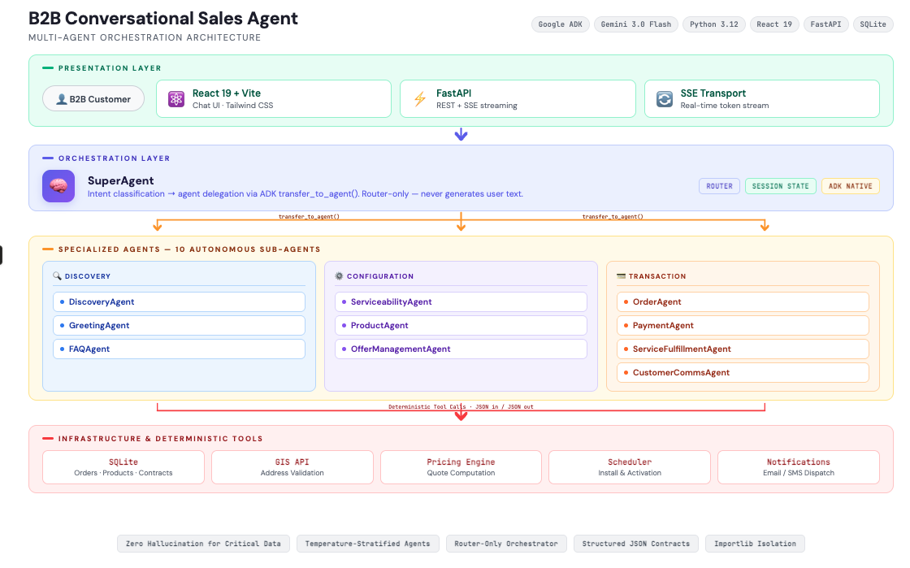

# Architecture

## B2B Conversational Sales Agent - Multi-Agent System Architecture



*Interactive version: Open [architecture.html](./architecture.html) in your browser for the full styled diagram*

## Architecture Overview

### 🎯 Multi-Agent Orchestration
- **SuperAgent**: Central orchestrator that routes user intent to specialized sub-agents
- **10 Specialized Agents**: Each handles a distinct domain (Discovery, Serviceability, Product, Pricing, Order, Payment, etc.)
- **ADK Native Delegation**: Uses Google ADK's `transfer_to_agent` mechanism

### 🔄 Communication Flow
```
User → React Client → FastAPI → ADK Runner → SuperAgent → Sub-Agent → Tools → Infrastructure
```
Responses stream back via Server-Sent Events (SSE)

### 🛡️ Zero-Hallucination Design
- **LLM decides WHAT** to do (intent routing, conversation flow)
- **Tools provide HOW and DATA** (addresses, prices, orders from deterministic sources)
- **JSON Outputs**: Tools return structured data to prevent LLM modification

### 🔧 Technology Stack
- **Frontend**: React 19 + Tailwind CSS
- **Backend**: FastAPI + Python 3.12+
- **Agent Framework**: Google ADK 1.20.0+
- **LLM**: Gemini 3 Flash Preview
- **Database**: SQLite
- **Streaming**: SSE

## Example Conversation Flows

### Discovery → Serviceability
```
User: "We're Crane.io at 123 Main St, Philadelphia PA"
  ↓ SuperAgent routes to DiscoveryAgent
  ↓ Discovery looks up company → adds to database (JSON)
  ↓ "Welcome! Would you like a serviceability check?"
  
User: "Yes"
  ↓ SuperAgent routes to ServiceabilityAgent
  ↓ Serviceability validates address via GIS API
  ↓ "✅ Serviceable with Fiber 1G/5G/10G"
```

### Product → Offer → Order
```
User: "Fiber 5G pricing with SD-WAN?"
  ↓ ProductAgent → Catalog lookup
  ↓ OfferAgent → Pricing calculation (JSON quote)
  ↓ "Quote #12345: $X,XXX/month"
  
User: "Proceed"
  ↓ OrderAgent → Create order
  ↓ PaymentAgent → Credit check + authorization
  ↓ FulfillmentAgent → Schedule installation
  ↓ "Order confirmed! Install: Feb 20, 9 AM"
```

## Agent Responsibilities

| Agent | Purpose | Infrastructure |
|-------|---------|----------------|
| **Discovery** | Company identification, BANT qualification | SQLite (Prospect DB) |
| **Serviceability** | PRE-SALE address validation, coverage check | GIS API |
| **Product** | Product catalog lookup, tech specs | JSON Catalog |
| **Offer Mgmt** | Pricing calculation, quote generation | Pricing Engine API |
| **Order** | Cart management, order creation | SQLite (Orders DB) |
| **Payment** | Credit checks, payment authorization | Payment Gateway |
| **Fulfillment** | POST-SALE installation scheduling | Scheduler API |
| **Comms** | Automated notifications | Order DB |
| **Greeting** | Initial contact, phone scripts | Static content |
| **FAQ** | Product questions, policies, SLAs | Knowledge base |

## Project Structure

```
ConversationalSalesAgent/
├── SuperAgent/              # Root orchestrator + UI
│   ├── client/              # React frontend
│   ├── server/              # FastAPI backend
│   ├── super_agent/         # Orchestration logic
│   │   ├── agent.py         # SuperAgent definition
│   │   ├── prompts.py       # Routing instructions
│   │   └── sub_agents/      # Agent wrappers
│   └── data/                # Orders & Quotes DB
│
├── DiscoveryAgent/          # Prospect identification
├── ServiceabilityAgent/     # Address validation
├── ProductAgent/            # Product catalog
├── OfferManagement/         # Pricing & quotes
├── OrderAgent/              # Cart & orders
├── PaymentAgent/            # Payment processing
├── ServiceFulfillmentAgent/ # Installation
└── CustomerCommunicationAgent/ # Notifications
```

---

**📚 Documentation:**
- [AGENTS.md](AGENTS.md) - Complete architecture guide
- [README.md](README.md) - Quick start & overview
- [Scenarios.md](Scenarios.md) - Test scenarios
