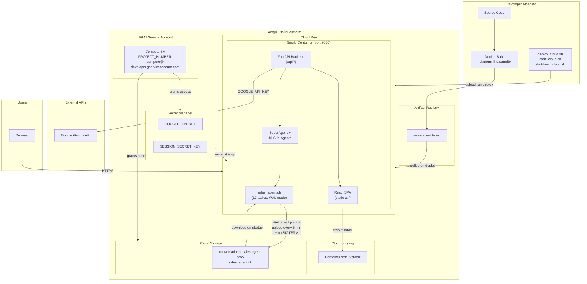

# GCP Cloud Run Deployment Guide

## Overview

This guide covers the full lifecycle of deploying the ConversationalSalesAgent to Google Cloud Platform using Cloud Run — from first-time setup through daily operations.

## GCP Services Diagram



### What Gets Deployed

A **single Cloud Run container** that serves both the React frontend and the FastAPI backend on port 8000:

```
Browser → Cloud Run (single container, port 8000)
               ├── FastAPI serves React SPA at /
               ├── /api/chat    → SSE streaming chat
               ├── /api/session → session management
               └── /health      → health check

Unified SQLite Persistence (sales_agent.db):
  17 tables across 7 domains (Discovery, Offer, Order,
  Payment, Fulfillment, Customer, Communication)
  WAL mode + FK enforcement
  Synced to/from GCS bucket every 5 min + on SIGTERM
  Path: /app/SuperAgent/data/sales_agent.db

Secrets (injected from Secret Manager):
  GOOGLE_API_KEY     → Gemini API access
  SESSION_SECRET_KEY → Session cookie signing
```

### How Gemini Is Accessed

The container uses the `GOOGLE_API_KEY` (injected from Secret Manager) to call Google's Gemini API over the internet at `https://generativelanguage.googleapis.com`. Gemini does not run inside the container — it is a remote API call.

### Unified SQLite Data Persistence

All 10 sub-agents share a single `sales_agent.db` file (17 tables, WAL mode, FK enforcement). The entrypoint script manages GCS synchronization with **WAL checkpoint before every upload** to prevent database corruption:

- **On startup:** downloads `sales_agent.db` from GCS bucket (`GCS_DATA_BUCKET`)
- **Every 5 minutes:** runs `PRAGMA wal_checkpoint(TRUNCATE)` then uploads to GCS
- **On shutdown** (SIGTERM): runs WAL checkpoint + final upload before container exits
- **If no GCS bucket:** `init_db()` creates a fresh schema on first startup

> **Why WAL checkpoint?** SQLite WAL mode writes changes to a separate `-wal` file. Uploading the `.db` without checkpointing first results in a corrupted/incomplete database. `PRAGMA wal_checkpoint(TRUNCATE)` consolidates all WAL changes into the main `.db` file before upload.

### Estimated Monthly Cost

| Resource | Cost |
|----------|------|
| Cloud Run (min 0, max 1, ~4GB/2CPU, pay-per-request) | ~$5–20/month |
| Artifact Registry storage (~5GB image) | ~$0.50/month |
| Secret Manager (2 secrets) | <$0.10/month |
| GCS bucket (200KB DB file, ~2000 syncs/month) | <$0.05/month |
| **Total** | **~$6–21/month** |

With `min-instances=0` the container spins down when idle (no cost) and cold-starts (~5–10 seconds) on the first request after idle. The frontend automatically recreates sessions on 401 so cold starts are handled gracefully.

---

## Prerequisites

Before starting, ensure the following are installed on your Mac:

### 1. Google Cloud SDK (gcloud)

```bash
brew install --cask google-cloud-sdk
```

Verify:
```bash
gcloud version
```

### 2. Docker Desktop

Download and install from [https://www.docker.com/products/docker-desktop](https://www.docker.com/products/docker-desktop).

Make sure Docker Desktop is **running** (whale icon in menu bar) before building images.

### 3. Login to gcloud

```bash
gcloud auth login
```

This opens a browser window — sign in with your Google account.

---

## One-Time GCP Setup

These steps are done **once** when setting up the project for the first time.

### Step 1 — Create GCP Project

```bash
export PROJECT_ID=conversational-sales-agent
gcloud projects create $PROJECT_ID --name="Conversational Sales Agent"
gcloud config set project $PROJECT_ID
```

> After running this, **enable billing** manually:
> 1. Go to [https://console.cloud.google.com/billing](https://console.cloud.google.com/billing)
> 2. Click **"My Projects"** tab
> 3. Find your project → 3-dot menu → **"Change billing"** → select your billing account
>
> The next steps will fail without billing enabled.

### Step 2 — Enable Required GCP APIs

```bash
gcloud services enable \
    run.googleapis.com \
    artifactregistry.googleapis.com \
    secretmanager.googleapis.com \
    storage.googleapis.com
```

### Step 3 — Create GCS Bucket for SQLite Data

```bash
export REGION=us-central1
export BUCKET_NAME="${PROJECT_ID}-data"

# Create the bucket
gcloud storage buckets create gs://$BUCKET_NAME --location=$REGION

# Upload the unified sales_agent.db (run from workspace root)
gcloud storage cp SuperAgent/data/sales_agent.db \
    gs://$BUCKET_NAME/sales_agent.db
```

Verify the upload at [https://console.cloud.google.com/storage](https://console.cloud.google.com/storage) — click the bucket and confirm `sales_agent.db` is present with a non-zero size.

### Step 4 — Create Artifact Registry Repository

Artifact Registry is GCP's private Docker image storage. Cloud Run pulls your image from here.

```bash
export REPO=sales-agent-repo
export IMAGE=$REGION-docker.pkg.dev/$PROJECT_ID/$REPO/sales-agent

gcloud artifacts repositories create $REPO \
    --repository-format=docker \
    --location=$REGION
```

### Step 5 — Create Secrets in Secret Manager

Secrets are stored securely in GCP and injected into the container at runtime. The `.env` file is **not** included in the Docker image.

```bash
# Google Gemini API Key — paste your actual key from SuperAgent/server/.env
echo -n "YOUR_GOOGLE_API_KEY" | gcloud secrets create GOOGLE_API_KEY --data-file=-

# Session signing key — auto-generated random value
openssl rand -base64 48 | tr -d '\n' | \
    gcloud secrets create SESSION_SECRET_KEY --data-file=-

# SMTP credentials for real email notifications (CustomerCommunicationAgent)
echo -n "comsales.notification@gmail.com" | gcloud secrets create SMTP_USER --data-file=-
echo -n "YOUR_GMAIL_APP_PASSWORD" | gcloud secrets create SMTP_PASSWORD --data-file=-
```

### Step 6 — Grant Service Account Permissions

Cloud Run runs your container as GCP's default compute service account. Grant it access to the secrets and GCS bucket:

```bash
PROJECT_NUMBER=$(gcloud projects describe $PROJECT_ID --format='value(projectNumber)')
SA="${PROJECT_NUMBER}-compute@developer.gserviceaccount.com"

# Allow container to read secrets
gcloud secrets add-iam-policy-binding GOOGLE_API_KEY \
    --role=roles/secretmanager.secretAccessor \
    --member="serviceAccount:$SA"

gcloud secrets add-iam-policy-binding SESSION_SECRET_KEY \
    --role=roles/secretmanager.secretAccessor \
    --member="serviceAccount:$SA"

gcloud secrets add-iam-policy-binding SMTP_USER \
    --role=roles/secretmanager.secretAccessor \
    --member="serviceAccount:$SA"

gcloud secrets add-iam-policy-binding SMTP_PASSWORD \
    --role=roles/secretmanager.secretAccessor \
    --member="serviceAccount:$SA"

# Allow container to read/write the GCS bucket (for SQLite sync)
gcloud storage buckets add-iam-policy-binding gs://$BUCKET_NAME \
    --member="serviceAccount:${SA}" \
    --role="roles/storage.objectAdmin"
```

> The service account (`PROJECT_NUMBER-compute@developer.gserviceaccount.com`) is **not a person** — it is the identity that your Cloud Run container runs as. Granting it permissions allows the container to access GCP resources.

### Step 7 — Build and Push Docker Image

Make sure **Docker Desktop is running** before executing these commands.

```bash
# From workspace root: ConversationalSalesAgent/
export CLOUDSDK_CORE_PROJECT=$PROJECT_ID
gcloud auth configure-docker $REGION-docker.pkg.dev --quiet --project=$PROJECT_ID

# Build for Linux/AMD64 (required on Apple Silicon Macs)
docker build --platform linux/amd64 -t $IMAGE:latest .

# Push to Artifact Registry
docker push $IMAGE:latest
```

> The build takes several minutes — it installs Node.js dependencies, builds the React app, then installs all Python dependencies. The image does **not** include the database; it is downloaded from GCS at container startup.

### Step 8 — Deploy to Cloud Run

```bash
gcloud run deploy conversational-sales-agent \
    --project=$PROJECT_ID \
    --image=$IMAGE:latest \
    --platform=managed \
    --region=$REGION \
    --port=8000 \
    --memory=4Gi \
    --cpu=2 \
    --min-instances=0 \
    --max-instances=1 \
    --concurrency=10 \
    --timeout=300 \
    --execution-environment=gen2 \
    --set-secrets="GOOGLE_API_KEY=GOOGLE_API_KEY:latest,SESSION_SECRET_KEY=SESSION_SECRET_KEY:latest,SMTP_USER=SMTP_USER:latest,SMTP_PASSWORD=SMTP_PASSWORD:latest" \
    --set-env-vars="\
GEMINI_MODEL=gemini-3-flash-preview,\
LLM_PROVIDER=google,\
ENABLE_SUB_AGENTS=true,\
SERVER_HOST=0.0.0.0,\
SERVER_PORT=8000,\
LOG_LEVEL=info,\
DEBUG=false,\
SMTP_ENABLED=true,\
SMTP_HOST=smtp.gmail.com,\
SMTP_PORT=587,\
SMTP_FROM_NAME=ComSales Notifications,\
MODEL_TEMPERATURE=0.7,\
MODEL_MAX_OUTPUT_TOKENS=2048,\
RATE_LIMIT_RPM=20,\
RATE_LIMIT_RPH=200,\
GCS_DATA_BUCKET=${BUCKET_NAME},\
SALES_AGENT_DB_PATH=/app/SuperAgent/data/sales_agent.db,\
SAFETY_DANGEROUS=BLOCK_LOW_AND_ABOVE,\
SAFETY_HARASSMENT=BLOCK_LOW_AND_ABOVE,\
SAFETY_HATE_SPEECH=BLOCK_LOW_AND_ABOVE,\
SAFETY_SEXUALLY_EXPLICIT=BLOCK_LOW_AND_ABOVE" \
    --allow-unauthenticated
```

> **Note:** The `deploy_cloud.sh` script uses `CLOUDSDK_CORE_PROJECT` and `--project=` flags instead of `gcloud config set project` to avoid the quota-project mismatch warning that can hang the CLI.
    --max-instances=1 \
    --concurrency=10 \
    --timeout=300 \
    --execution-environment=gen2 \
    --set-secrets="GOOGLE_API_KEY=GOOGLE_API_KEY:latest,SESSION_SECRET_KEY=SESSION_SECRET_KEY:latest,SMTP_USER=SMTP_USER:latest,SMTP_PASSWORD=SMTP_PASSWORD:latest" \
    --set-env-vars="\
GEMINI_MODEL=gemini-3-flash-preview,\
LLM_PROVIDER=google,\
ENABLE_SUB_AGENTS=true,\
SERVER_HOST=0.0.0.0,\
SERVER_PORT=8000,\
LOG_LEVEL=info,\
DEBUG=false,\
SMTP_ENABLED=true,\
SMTP_HOST=smtp.gmail.com,\
SMTP_PORT=587,\
SMTP_FROM_NAME=ComSales Notifications,\
MODEL_TEMPERATURE=0.7,\
MODEL_MAX_OUTPUT_TOKENS=2048,\
RATE_LIMIT_RPM=20,\
RATE_LIMIT_RPH=200,\
GCS_DATA_BUCKET=${BUCKET_NAME},\
SAFETY_DANGEROUS=BLOCK_LOW_AND_ABOVE,\
SAFETY_HARASSMENT=BLOCK_LOW_AND_ABOVE,\
SAFETY_HATE_SPEECH=BLOCK_LOW_AND_ABOVE,\
SAFETY_SEXUALLY_EXPLICIT=BLOCK_LOW_AND_ABOVE" \
    --allow-unauthenticated
```

Cloud Run auto-generates a URL in this format:
```
https://conversational-sales-agent-<random-hash>-uc.a.run.app
```

### Step 9 — Set ALLOWED_ORIGINS to the Deployed URL

> **Your service URLs (both are permanent and point to the same service):**
> - `https://conversational-sales-agent-647996714470.us-central1.run.app` (new format)
> - `https://conversational-sales-agent-enu5rlyquq-uc.a.run.app` (classic format)

```bash
gcloud run services update conversational-sales-agent \
    --project=$PROJECT_ID \
    --region=$REGION \
    --update-env-vars="ALLOWED_ORIGINS=https://conversational-sales-agent-647996714470.us-central1.run.app,https://conversational-sales-agent-enu5rlyquq-uc.a.run.app"
```

---

## Verifying the Deployment

Run these checks after deploying:

```bash
# 1. Health check
curl https://conversational-sales-agent-647996714470.us-central1.run.app/health
# Expected: {"status":"ok","agent":"super_sales_agent","model":"gemini-3-flash-preview"}

# 2. Open the app in browser
open https://conversational-sales-agent-647996714470.us-central1.run.app

# 3. Verify SQLite DB is in GCS
gcloud storage ls -l gs://conversational-sales-agent-data/
```

Then in the browser:
1. The React UI should load at the root URL
2. Start a chat — verify SSE streaming works (messages appear token by token)
3. Ask about a prospect company — verify the DiscoveryAgent queries the SQLite DB
4. Wait 5 minutes, then check GCS — the `sales_agent.db` timestamp should have updated

---

## Day-to-Day Operations

### Starting the Service

Use the provided script from the `SuperAgent/` directory:

```bash
./SuperAgent/start_cloud.sh
```

This scales the service back up to `max-instances=1` and prints the live URL. Note: with `min-instances=0`, the container only actually starts on the first incoming request (~5–10 second cold start).

Or manually:
```bash
gcloud run services update conversational-sales-agent \
    --region=us-central1 \
    --min-instances=0 \
    --max-instances=1
```

### Stopping the Service

Use the provided script:

```bash
./SuperAgent/shutdown_cloud.sh
```

This scales the service to `max-instances=0`, preventing any new container starts. The running container receives a SIGTERM signal, which triggers the final SQLite DB upload to GCS before shutdown.

Or manually:
```bash
gcloud run services update conversational-sales-agent \
    --region=us-central1 \
    --min-instances=0 \
    --max-instances=0
```

### Deploying Code Changes

After making any code changes, use the deploy script:

```bash
./SuperAgent/deploy_cloud.sh
```

This handles the full cycle automatically:
1. Checks gcloud authentication (uses `CLOUDSDK_CORE_PROJECT` env var — no `gcloud config set`)
2. Configures Docker for Artifact Registry
3. Builds the Docker image (`--platform linux/amd64`)
4. Pushes the image to Artifact Registry
5. Deploys the new image to Cloud Run with all env vars and secrets
6. Prints the live URLs

> **Note:** The deploy script avoids `gcloud config set project` which can hang due to quota-project mismatch warnings on some machines. It uses `export CLOUDSDK_CORE_PROJECT` and `--project=` flags instead.

### Viewing Logs

```bash
gcloud run services logs read conversational-sales-agent \
    --region=us-central1 \
    --limit=100
```

Or stream live logs:
```bash
gcloud run services logs tail conversational-sales-agent \
    --region=us-central1
```

Or view in the GCP console: [https://console.cloud.google.com/run](https://console.cloud.google.com/run) → click the service → **Logs** tab.

### Updating the Gemini API Key

If you need to rotate the API key:

```bash
# Add a new version of the secret
echo -n "NEW_GOOGLE_API_KEY" | gcloud secrets versions add GOOGLE_API_KEY --data-file=-

# Redeploy to pick up the new version
gcloud run deploy conversational-sales-agent \
    --image=$IMAGE:latest \
    --region=us-central1
```

### Checking the SQLite DB in GCS

```bash
# List the file with size and timestamp
gcloud storage ls -l gs://conversational-sales-agent-data/

# Download a copy locally for inspection
gcloud storage cp \
    gs://conversational-sales-agent-data/sales_agent.db \
    /tmp/sales_agent_cloud.db

# Verify integrity
sqlite3 /tmp/sales_agent_cloud.db "PRAGMA integrity_check;"

# Check table counts
sqlite3 /tmp/sales_agent_cloud.db "SELECT 'accounts', COUNT(*) FROM accounts UNION ALL SELECT 'orders', COUNT(*) FROM orders UNION ALL SELECT 'quotes', COUNT(*) FROM quotes;"
```

### Uploading a Local DB to GCS

If you need to replace the cloud database with your local copy:

```bash
# IMPORTANT: Checkpoint WAL before uploading to prevent corruption
sqlite3 SuperAgent/data/sales_agent.db "PRAGMA wal_checkpoint(TRUNCATE);"

# Upload to GCS
gcloud storage cp SuperAgent/data/sales_agent.db \
    gs://conversational-sales-agent-data/sales_agent.db
```

---

## Cloud Run Configuration Reference

| Setting | Value | Reason |
|---------|-------|--------|
| Memory | 4Gi | ADK + 10 sub-agents + Gemini SDK; 2GB risks OOM |
| CPU | 2 | Heavy agent loading at startup; SSE streaming is CPU-light |
| Min instances | 0 | Pay only for actual usage; container spins down when idle |
| Max instances | 1 | Single instance prevents SQLite write conflicts |
| Concurrency | 10 | SSE streams hold connections; conservative for single Uvicorn worker |
| Timeout | 300s | Multi-agent reasoning can be slow; 300s is Cloud Run maximum |
| Uvicorn workers | 1 | InMemorySessionService is not shared across processes |
| Execution env | gen2 | Required for better networking and startup performance |

### Environment Variables

| Variable | Value | Purpose |
|----------|-------|---------|
| `GEMINI_MODEL` | `gemini-3-flash-preview` | LLM model for all agents |
| `GCS_DATA_BUCKET` | `conversational-sales-agent-data` | GCS bucket for DB sync |
| `SALES_AGENT_DB_PATH` | `/app/SuperAgent/data/sales_agent.db` | Unified DB path inside container |
| `ENABLE_SUB_AGENTS` | `true` | Load all 10 sub-agents |
| `LOG_LEVEL` | `info` | Logging verbosity |
| `RATE_LIMIT_RPM` | `20` | API rate limit (requests/minute) |
| `RATE_LIMIT_RPH` | `200` | API rate limit (requests/hour) |
| `ALLOWED_ORIGINS` | `https://...run.app` | CORS allowed origins |
| `SAFETY_*` | `BLOCK_LOW_AND_ABOVE` | Gemini safety filter settings |

---

## Architecture Notes

### Why a Single Container?

Both the React frontend (pre-built static files) and the FastAPI backend run in the same container on port 8000. FastAPI serves:
- Static assets at `/assets/*`
- The React `index.html` for all other non-API routes (SPA routing)
- API endpoints at `/api/*`

This means the browser always talks to one URL — no CORS issues, no separate frontend hosting.

### Why a Unified Database?

All 10 sub-agents share a single `sales_agent.db` instead of separate per-agent databases. Benefits:
- **Foreign key integrity** — orders reference quotes, payments reference orders, etc.
- **Single GCS sync** — one file to upload/download instead of 4+
- **Cross-agent queries** — `check_customer_state()` can query the full customer lifecycle
- **WAL checkpoint safety** — one checkpoint covers all data

### Entrypoint Script (entrypoint.sh)

The container entrypoint handles the full DB lifecycle:

```
Container Start
  └─ mkdir -p /app/SuperAgent/data
  └─ export SALES_AGENT_DB_PATH=/app/SuperAgent/data/sales_agent.db
  └─ if GCS_DATA_BUCKET set:
       └─ Download sales_agent.db from GCS
       └─ Start background sync loop (every 5 min):
            └─ sqlite3 PRAGMA wal_checkpoint(TRUNCATE)
            └─ Upload to GCS
       └─ Register SIGTERM trap:
            └─ Kill sync loop
            └─ sqlite3 PRAGMA wal_checkpoint(TRUNCATE)
            └─ Final upload to GCS
  └─ exec uvicorn main:app --host 0.0.0.0 --port 8000 --workers 1
```

### Dockerfile (Multi-Stage Build)

```
Stage 1: frontend-builder (node:20-slim)
  └─ npm ci + npm run build → produces dist/

Stage 2: runtime (python:3.12-slim)
  └─ COPY all agent directories (preserves workspace structure)
  └─ COPY --from=frontend-builder dist/ → client/dist/
  └─ pip install requirements.txt + google-cloud-storage
  └─ mkdir -p /app/SuperAgent/data (empty — DB comes from GCS)
  └─ ENTRYPOINT ["/entrypoint.sh"]
```

> **Important:** The Docker image does NOT contain the database. The `SuperAgent/data/` directory is created empty; the entrypoint downloads the DB from GCS at startup.

### Why Not Vertex AI?

This project uses Google AI Studio (`GOOGLE_API_KEY`) to call Gemini directly. Vertex AI is a different Google service that also hosts Gemini but requires separate authentication and configuration.

### Session State

Chat sessions are stored in ADK's `InMemorySessionService` — in process memory, not on disk. Sessions are lost if the container restarts or cold-starts. The frontend (`api.js`) already handles this by automatically recreating sessions on a 401 response and retrying the request.

### Sub-Agent Path Resolution

All 9 agent directories (`DiscoveryAgent/`, `ServiceabilityAgent/`, etc.) are copied into the container at the same relative paths as your local workspace. The sub-agents use importlib to load each other with paths relative to the workspace root — the Docker image preserves this directory structure exactly.

---

## Scripts Reference

All scripts are in the `SuperAgent/` directory alongside `start_servers.sh`:

| Script | Purpose |
|--------|---------|
| `start_servers.sh` | Start the app **locally** (backend + frontend dev server) |
| `start_cloud.sh` | Scale Cloud Run service back up after stopping |
| `shutdown_cloud.sh` | Scale Cloud Run service to zero (stop the container) |
| `deploy_cloud.sh` | Build, push, and redeploy new code changes to Cloud Run |

---

## Troubleshooting

### Container fails to start
Check logs: `gcloud run services logs tail conversational-sales-agent --region=us-central1`

Common causes:
- `GOOGLE_API_KEY` secret not accessible — verify Step 6 permissions
- Missing Python package — check if `requirements.txt` is complete
- Build used wrong platform — always use `--platform linux/amd64`

### "database disk image is malformed"
Root cause: the DB was uploaded to GCS without WAL checkpointing first. Fix:
1. Download a known-good local copy: `sqlite3 SuperAgent/data/sales_agent.db "PRAGMA integrity_check;"`
2. Checkpoint WAL: `sqlite3 SuperAgent/data/sales_agent.db "PRAGMA wal_checkpoint(TRUNCATE);"`
3. Upload: `gcloud storage cp SuperAgent/data/sales_agent.db gs://conversational-sales-agent-data/sales_agent.db`
4. Redeploy or restart the Cloud Run service

### SQLite DB not loading
- Verify the DB file exists in GCS: `gcloud storage ls gs://conversational-sales-agent-data/`
- Check the `GCS_DATA_BUCKET` env var is set on the Cloud Run service
- Check logs for `[entrypoint]` messages on startup
- If missing, upload: `gcloud storage cp SuperAgent/data/sales_agent.db gs://conversational-sales-agent-data/sales_agent.db`

### `gcloud config set project` hangs
Known issue: quota-project mismatch warning stalls the CLI. The `deploy_cloud.sh` script avoids this by using `export CLOUDSDK_CORE_PROJECT=conversational-sales-agent` and `--project=` flags on all gcloud commands.

### Cold start is slow
Expected behaviour with `min-instances=0`. The first request after idle takes 5–10 seconds. Subsequent requests are fast. If this is unacceptable, set `--min-instances=1` (adds ~$90/month).

### 401 errors in the browser
Sessions are lost on cold start. The frontend auto-retries with a new session. If 401 errors persist, check that `SESSION_SECRET_KEY` secret is accessible.
