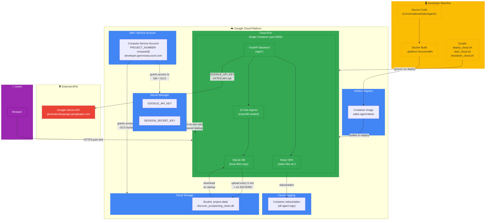

# GCP Cloud Run Deployment Guide

## Overview

This guide covers the full lifecycle of deploying the ConversationalSalesAgent to Google Cloud Platform using Cloud Run — from first-time setup through daily operations.

## GCP Services Diagram



### What Gets Deployed

A **single Cloud Run container** that serves both the React frontend and the FastAPI backend on port 8000:

```
Browser → Cloud Run (single container, port 8000)
               ├── FastAPI serves React SPA at /
               ├── /api/chat    → SSE streaming chat
               ├── /api/session → session management
               └── /health      → health check

SQLite Persistence:
  DiscoveryAgent/data/discover_prospecting_clean.db  ← synced to/from GCS bucket
  SuperAgent/data/embeddings/chroma.sqlite3          ← bundled in image (read-only)

Secrets:
  GOOGLE_API_KEY     → Google Secret Manager
  SESSION_SECRET_KEY → Google Secret Manager
```

### How Gemini Is Accessed

The container uses the `GOOGLE_API_KEY` (injected from Secret Manager) to call Google's Gemini API over the internet at `https://generativelanguage.googleapis.com`. Gemini does not run inside the container — it is a remote API call.

### SQLite Data Persistence

The DiscoveryAgent database is writable at runtime (agents INSERT/UPDATE prospect records). To persist data across container restarts:

- On **startup**: the container downloads `discover_prospecting_clean.db` from a GCS bucket
- Every **5 minutes**: the DB is uploaded back to GCS
- On **shutdown** (SIGTERM): a final upload runs before the container exits

The `chroma.sqlite3` embeddings file is read-only and bundled directly in the Docker image.

### Estimated Monthly Cost

| Resource | Cost |
|----------|------|
| Cloud Run (min 0, max 1, ~4GB/2CPU, pay-per-request) | ~$5–20/month |
| Artifact Registry storage (~5GB image) | ~$0.50/month |
| Secret Manager (2 secrets) | <$0.10/month |
| GCS bucket (200KB DB file, ~2000 syncs/month) | <$0.05/month |
| **Total** | **~$6–21/month** |

With `min-instances=0` the container spins down when idle (no cost) and cold-starts (~5–10 seconds) on the first request after idle. The frontend automatically recreates sessions on 401 so cold starts are handled gracefully.

---

## Prerequisites

Before starting, ensure the following are installed on your Mac:

### 1. Google Cloud SDK (gcloud)

```bash
brew install --cask google-cloud-sdk
```

Verify:
```bash
gcloud version
```

### 2. Docker Desktop

Download and install from [https://www.docker.com/products/docker-desktop](https://www.docker.com/products/docker-desktop).

Make sure Docker Desktop is **running** (whale icon in menu bar) before building images.

### 3. Login to gcloud

```bash
gcloud auth login
```

This opens a browser window — sign in with your Google account.

---

## One-Time GCP Setup

These steps are done **once** when setting up the project for the first time.

### Step 1 — Create GCP Project

```bash
export PROJECT_ID=conversational-sales-agent
gcloud projects create $PROJECT_ID --name="Conversational Sales Agent"
gcloud config set project $PROJECT_ID
```

> After running this, **enable billing** manually:
> 1. Go to [https://console.cloud.google.com/billing](https://console.cloud.google.com/billing)
> 2. Click **"My Projects"** tab
> 3. Find your project → 3-dot menu → **"Change billing"** → select your billing account
>
> The next steps will fail without billing enabled.

### Step 2 — Enable Required GCP APIs

```bash
gcloud services enable \
    run.googleapis.com \
    artifactregistry.googleapis.com \
    secretmanager.googleapis.com \
    storage.googleapis.com
```

### Step 3 — Create GCS Bucket for SQLite Data

```bash
export REGION=us-central1
export BUCKET_NAME="${PROJECT_ID}-data"

# Create the bucket
gcloud storage buckets create gs://$BUCKET_NAME --location=$REGION

# Upload the initial SQLite DB (run from workspace root)
gcloud storage cp DiscoveryAgent/data/discover_prospecting_clean.db \
    gs://$BUCKET_NAME/discover_prospecting_clean.db
```

Verify the upload at [https://console.cloud.google.com/storage](https://console.cloud.google.com/storage) — click the bucket and confirm the `.db` file is present with a non-zero size.

### Step 4 — Create Artifact Registry Repository

Artifact Registry is GCP's private Docker image storage. Cloud Run pulls your image from here.

```bash
export REPO=sales-agent-repo
export IMAGE=$REGION-docker.pkg.dev/$PROJECT_ID/$REPO/sales-agent

gcloud artifacts repositories create $REPO \
    --repository-format=docker \
    --location=$REGION
```

### Step 5 — Create Secrets in Secret Manager

Secrets are stored securely in GCP and injected into the container at runtime. The `.env` file is **not** included in the Docker image.

```bash
# Google Gemini API Key — paste your actual key from SuperAgent/server/.env
echo -n "YOUR_GOOGLE_API_KEY" | gcloud secrets create GOOGLE_API_KEY --data-file=-

# Session signing key — auto-generated random value
openssl rand -base64 48 | tr -d '\n' | \
    gcloud secrets create SESSION_SECRET_KEY --data-file=-
```

### Step 6 — Grant Service Account Permissions

Cloud Run runs your container as GCP's default compute service account. Grant it access to the secrets and GCS bucket:

```bash
PROJECT_NUMBER=$(gcloud projects describe $PROJECT_ID --format='value(projectNumber)')
SA="${PROJECT_NUMBER}-compute@developer.gserviceaccount.com"

# Allow container to read secrets
gcloud secrets add-iam-policy-binding GOOGLE_API_KEY \
    --role=roles/secretmanager.secretAccessor \
    --member="serviceAccount:$SA"

gcloud secrets add-iam-policy-binding SESSION_SECRET_KEY \
    --role=roles/secretmanager.secretAccessor \
    --member="serviceAccount:$SA"

# Allow container to read/write the GCS bucket (for SQLite sync)
gcloud storage buckets add-iam-policy-binding gs://$BUCKET_NAME \
    --member="serviceAccount:${SA}" \
    --role="roles/storage.objectAdmin"
```

> The service account (`PROJECT_NUMBER-compute@developer.gserviceaccount.com`) is **not a person** — it is the identity that your Cloud Run container runs as. Granting it permissions allows the container to access GCP resources.

### Step 7 — Build and Push Docker Image

Make sure **Docker Desktop is running** before executing these commands.

```bash
# From workspace root: ConversationalSalesAgent/
gcloud auth configure-docker $REGION-docker.pkg.dev

# Build for Linux/AMD64 (required on Apple Silicon Macs)
docker build --platform linux/amd64 -t $IMAGE:latest .

# Push to Artifact Registry
docker push $IMAGE:latest
```

> The build takes several minutes — it installs Node.js dependencies, builds the React app, then installs all Python dependencies.

### Step 8 — Deploy to Cloud Run

```bash
gcloud run deploy conversational-sales-agent \
    --image=$IMAGE:latest \
    --platform=managed \
    --region=$REGION \
    --port=8000 \
    --memory=4Gi \
    --cpu=2 \
    --min-instances=0 \
    --max-instances=1 \
    --concurrency=10 \
    --timeout=300 \
    --execution-environment=gen2 \
    --set-secrets="GOOGLE_API_KEY=GOOGLE_API_KEY:latest,SESSION_SECRET_KEY=SESSION_SECRET_KEY:latest" \
    --set-env-vars="\
GEMINI_MODEL=gemini-3-flash-preview,\
LLM_PROVIDER=google,\
ENABLE_SUB_AGENTS=true,\
SERVER_HOST=0.0.0.0,\
SERVER_PORT=8000,\
LOG_LEVEL=info,\
DEBUG=false,\
SMTP_ENABLED=false,\
MODEL_TEMPERATURE=0.7,\
MODEL_MAX_OUTPUT_TOKENS=2048,\
RATE_LIMIT_RPM=20,\
RATE_LIMIT_RPH=200,\
GCS_DATA_BUCKET=${BUCKET_NAME},\
SAFETY_DANGEROUS=BLOCK_LOW_AND_ABOVE,\
SAFETY_HARASSMENT=BLOCK_LOW_AND_ABOVE,\
SAFETY_HATE_SPEECH=BLOCK_LOW_AND_ABOVE,\
SAFETY_SEXUALLY_EXPLICIT=BLOCK_LOW_AND_ABOVE" \
    --allow-unauthenticated
```

Cloud Run auto-generates a URL in this format:
```
https://conversational-sales-agent-<random-hash>-uc.a.run.app
```

### Step 9 — Set ALLOWED_ORIGINS to the Deployed URL

> **Your service URLs (both are permanent and point to the same service):**
> - `https://conversational-sales-agent-enu5rlyquq-uc.a.run.app` (classic format)
> - `https://conversational-sales-agent-647996714470.us-central1.run.app` (new format, project number = 647996714470)

```bash
gcloud run services update conversational-sales-agent \
    --region=$REGION \
    --update-env-vars="ALLOWED_ORIGINS=https://conversational-sales-agent-647996714470.us-central1.run.app,https://conversational-sales-agent-enu5rlyquq-uc.a.run.app"

echo "App is live at:"
echo "  https://conversational-sales-agent-647996714470.us-central1.run.app"
echo "  https://conversational-sales-agent-enu5rlyquq-uc.a.run.app"
```

---

## Verifying the Deployment

Run these checks after deploying:

```bash
# 1. Health check
curl https://conversational-sales-agent-647996714470.us-central1.run.app/health
# Expected: {"status":"ok","agent":"super_sales_agent","model":"gemini-3-flash-preview"}

# 2. Open the app in browser
open $SERVICE_URL

# 3. Verify SQLite DB is in GCS
gcloud storage ls -l gs://$BUCKET_NAME
```

Then in the browser:
1. The React UI should load at the root URL
2. Start a chat — verify SSE streaming works (messages appear token by token)
3. Ask about a prospect company — verify the DiscoveryAgent queries the SQLite DB
4. Wait 5 minutes, then check GCS — the DB file's timestamp should have updated

---

## Day-to-Day Operations

### Starting the Service

Use the provided script from the `SuperAgent/` directory:

```bash
./SuperAgent/start_cloud.sh
```

This scales the service back up to `max-instances=1` and prints the live URL. Note: with `min-instances=0`, the container only actually starts on the first incoming request (~5–10 second cold start).

Or manually:
```bash
gcloud run services update conversational-sales-agent \
    --region=us-central1 \
    --min-instances=0 \
    --max-instances=1
```

### Stopping the Service

Use the provided script:

```bash
./SuperAgent/shutdown_cloud.sh
```

This scales the service to `max-instances=0`, preventing any new container starts. The running container receives a SIGTERM signal, which triggers the final SQLite DB upload to GCS before shutdown.

Or manually:
```bash
gcloud run services update conversational-sales-agent \
    --region=us-central1 \
    --min-instances=0 \
    --max-instances=0
```

### Deploying Code Changes

After making any code changes, use the deploy script:

```bash
./SuperAgent/deploy_cloud.sh
```

This handles the full cycle automatically:
1. Checks gcloud authentication
2. Configures Docker for Artifact Registry
3. Builds the Docker image (`--platform linux/amd64`)
4. Pushes the image to Artifact Registry
5. Deploys the new image to Cloud Run
6. Prints the live URL

### Viewing Logs

```bash
gcloud run services logs read conversational-sales-agent \
    --region=us-central1 \
    --limit=100
```

Or stream live logs:
```bash
gcloud run services logs tail conversational-sales-agent \
    --region=us-central1
```

Or view in the GCP console: [https://console.cloud.google.com/run](https://console.cloud.google.com/run) → click the service → **Logs** tab.

### Updating the Gemini API Key

If you need to rotate the API key:

```bash
# Add a new version of the secret
echo -n "NEW_GOOGLE_API_KEY" | gcloud secrets versions add GOOGLE_API_KEY --data-file=-

# Redeploy to pick up the new version
gcloud run deploy conversational-sales-agent \
    --image=$IMAGE:latest \
    --region=us-central1
```

### Checking the SQLite DB in GCS

```bash
# List the file with size and timestamp
gcloud storage ls -l gs://conversational-sales-agent-data/

# Download a copy locally for inspection
gcloud storage cp \
    gs://conversational-sales-agent-data/discover_prospecting_clean.db \
    /tmp/discover_local.db
```

---

## Cloud Run Configuration Reference

| Setting | Value | Reason |
|---------|-------|--------|
| Memory | 4Gi | ADK + 10 sub-agents + Gemini SDK; 2GB risks OOM |
| CPU | 2 | Heavy agent loading at startup; SSE streaming is CPU-light |
| Min instances | 0 | Pay only for actual usage; container spins down when idle |
| Max instances | 1 | Single instance prevents SQLite write conflicts |
| Concurrency | 10 | SSE streams hold connections; conservative for single Uvicorn worker |
| Timeout | 300s | Multi-agent reasoning can be slow; 300s is Cloud Run maximum |
| Uvicorn workers | 1 | InMemorySessionService is not shared across processes |
| Execution env | gen2 | Required for better networking and startup performance |

---

## Architecture Notes

### Why a Single Container?

Both the React frontend (pre-built static files) and the FastAPI backend run in the same container on port 8000. FastAPI serves:
- Static assets at `/assets/*`
- The React `index.html` for all other non-API routes (SPA routing)
- API endpoints at `/api/*`

This means the browser always talks to one URL — no CORS issues, no separate frontend hosting.

### Why Not Vertex AI?

This project uses Google AI Studio (`GOOGLE_API_KEY`) to call Gemini directly. Vertex AI is a different Google service that also hosts Gemini but requires separate authentication and configuration. The `google-cloud-aiplatform` package in `requirements.txt` is an unused dependency from the BootStrapAgent template and is not used at runtime.

### Session State

Chat sessions are stored in ADK's `InMemorySessionService` — in process memory, not on disk. Sessions are lost if the container restarts or cold-starts. The frontend (`api.js`) already handles this by automatically recreating sessions on a 401 response and retrying the request.

### Sub-Agent Path Resolution

All 9 agent directories (`DiscoveryAgent/`, `ServiceabilityAgent/`, etc.) are copied into the container at the same relative paths as your local workspace. The sub-agents use importlib to load each other with paths relative to the workspace root — the Docker image preserves this directory structure exactly.

---

## Scripts Reference

All scripts are in the `SuperAgent/` directory alongside `start_servers.sh`:

| Script | Purpose |
|--------|---------|
| `start_servers.sh` | Start the app **locally** (backend + frontend dev server) |
| `start_cloud.sh` | Scale Cloud Run service back up after stopping |
| `shutdown_cloud.sh` | Scale Cloud Run service to zero (stop the container) |
| `deploy_cloud.sh` | Build, push, and redeploy new code changes to Cloud Run |

---

## Troubleshooting

### Container fails to start
Check logs: `gcloud run services logs tail conversational-sales-agent --region=us-central1`

Common causes:
- `GOOGLE_API_KEY` secret not accessible — verify Step 6 permissions
- Missing Python package — check if `requirements.txt` is complete
- Build used wrong platform — always use `--platform linux/amd64`

### SQLite DB not loading
- Verify the DB file exists in GCS: `gcloud storage ls gs://conversational-sales-agent-data/`
- Check the `GCS_DATA_BUCKET` env var is set correctly on the Cloud Run service
- Check logs for `[entrypoint]` messages on startup

### Cold start is slow
Expected behaviour with `min-instances=0`. The first request after idle takes 5–10 seconds. Subsequent requests are fast. If this is unacceptable, set `--min-instances=1` (adds ~$90/month).

### 401 errors in the browser
Sessions are lost on cold start. The frontend auto-retries with a new session. If 401 errors persist, check that `SESSION_SECRET_KEY` secret is accessible.
