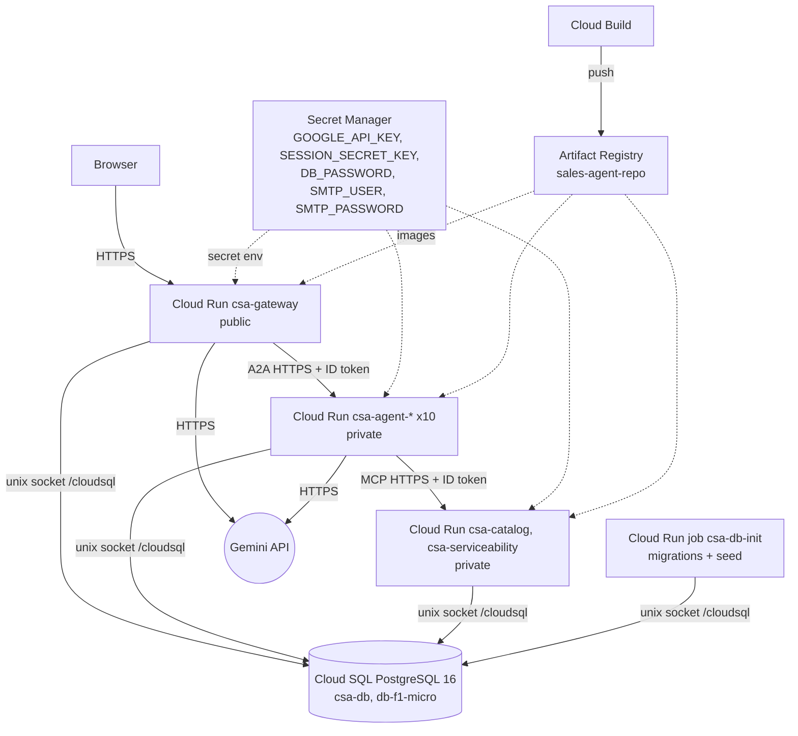

# GCP Cloud Run Deployment Guide

## Overview

The Conversational Sales Agent deploys to Google Cloud as **13 Cloud Run services** plus **Cloud SQL for PostgreSQL 16**:

| Kind | Cloud Run services | Access | Service account |
|---|---|---|---|
| Gateway | `csa-gateway` (UI + SSE API + `sales_journey` workflow) | **Public** (`--allow-unauthenticated`) | `csa-gateway` |
| Agents (10) | `csa-agent-discovery`, `csa-agent-serviceability`, `csa-agent-product`, `csa-agent-offer`, `csa-agent-order`, `csa-agent-payment`, `csa-agent-fulfillment`, `csa-agent-communication`, `csa-agent-greeting`, `csa-agent-faq` | Private; invoker = `csa-gateway` SA | `csa-agents` |
| Tool services (2) | `csa-catalog`, `csa-serviceability` | Private; invoker = `csa-agents` SA | `csa-tools` |
| Migrations | Cloud Run **job** `csa-db-init` (gateway image, `python -m sales_common.migrate --seed`) | — | `csa-gateway` |

Everything is driven by four scripts in `scripts/`, all reading the service manifest [`scripts/services.conf`](scripts/services.conf):

| Script | When | What it does |
|---|---|---|
| `scripts/setup_gcp.sh` | Once (idempotent) | APIs, Artifact Registry, Cloud SQL instance/database/user, secrets, service accounts, IAM |
| `scripts/deploy_cloud.sh` | Every release | Build + push images, run migrations job, deploy tools → agents → gateway, wire URLs, invoker bindings |
| `scripts/shutdown_cloud.sh` | Pause | Gateway private (anonymous → 403) + Cloud SQL stopped |
| `scripts/start_cloud.sh` | Resume | Cloud SQL started + gateway public again; prints the URL |

All four accept `--dry-run`, which prints every `gcloud` command without running it (and works without `gcloud` installed).

## GCP Resources


```mermaid
graph TD
    USER["Browser"] -->|HTTPS| GW["Cloud Run csa-gateway<br/>public"]
    GW -->|A2A HTTPS + ID token| AGENTS["Cloud Run csa-agent-* x10<br/>private"]
    AGENTS -->|MCP HTTPS + ID token| TOOLS["Cloud Run csa-catalog, csa-serviceability<br/>private"]
    GW -->|unix socket /cloudsql| SQL[("Cloud SQL PostgreSQL 16<br/>csa-db, db-f1-micro")]
    AGENTS -->|unix socket /cloudsql| SQL
    TOOLS -->|unix socket /cloudsql| SQL
    JOB["Cloud Run job csa-db-init<br/>migrations + seed"] -->|unix socket /cloudsql| SQL
    GW -->|HTTPS| GEM(("Gemini API"))
    AGENTS -->|HTTPS| GEM
    SM["Secret Manager<br/>GOOGLE_API_KEY, SESSION_SECRET_KEY,<br/>DB_PASSWORD, SMTP_USER, SMTP_PASSWORD"] -.->|secret env| GW
    SM -.-> AGENTS
    SM -.-> TOOLS
    AR["Artifact Registry<br/>sales-agent-repo"] -.->|images| GW
    AR -.-> AGENTS
    AR -.-> TOOLS
    CB["Cloud Build"] -->|push| AR
```

| Resource | Default name | Override |
|---|---|---|
| Project | `conversational-sales-agent` | `PROJECT_ID` |
| Region | `us-central1` | `REGION` |
| Artifact Registry repo | `sales-agent-repo` (images `<region>-docker.pkg.dev/<project>/sales-agent-repo/<cloud_run_name>`) | `AR_REPO` |
| Cloud SQL instance | `csa-db` (PostgreSQL 16, Enterprise, `db-f1-micro`, 10 GB SSD auto-increase) | `SQL_INSTANCE`, `SQL_TIER` |
| Database / user | `csa` / `csa` | `DB_NAME`, `DB_USER` |
| Migrations job | `csa-db-init` | `DB_JOB` |

Gemini is called over the internet (`generativelanguage.googleapis.com`) with `GOOGLE_API_KEY`; it does not run in the containers.

## IAM and Service Accounts

`setup_gcp.sh` creates three service accounts and grants least privilege; `deploy_cloud.sh` adds the per-service invoker bindings.

| Service account | Project roles | Secrets (secretAccessor) | May invoke |
|---|---|---|---|
| `csa-gateway@<project>.iam.gserviceaccount.com` | `roles/cloudsql.client` | `DB_PASSWORD`, `GOOGLE_API_KEY`, `SESSION_SECRET_KEY` | every `csa-agent-*` service |
| `csa-agents@...` | `roles/cloudsql.client` | `DB_PASSWORD`, `GOOGLE_API_KEY`, `SMTP_USER`, `SMTP_PASSWORD` | `csa-catalog`, `csa-serviceability` |
| `csa-tools@...` | `roles/cloudsql.client` | `DB_PASSWORD` | — |

- Agents and tool services are deployed with `--no-allow-unauthenticated`. Callers attach a Google-signed ID token whose audience is the target service URL (`SERVICE_AUTH=gcp_id_token`, `sales_common.auth`); Cloud Run IAM enforces `roles/run.invoker`.
- The gateway is public (`allUsers` invoker). Chat requests are authorized by the gateway's own signed session tokens.

## Secrets

| Secret | Created by `setup_gcp.sh` | Used by | Env var in the container |
|---|---|---|---|
| `GOOGLE_API_KEY` | Prompted (or taken from `$GOOGLE_API_KEY`) | gateway, agents | `GOOGLE_API_KEY` |
| `SESSION_SECRET_KEY` | Generated | gateway | `SESSION_SECRET_KEY` |
| `DB_PASSWORD` | Generated; set as the Cloud SQL user's password | all services, `csa-db-init` | `PGPASSWORD` (libpq/asyncpg read it; the URL has no password) |
| `SMTP_USER` / `SMTP_PASSWORD` | Prompted; empty input skips them | communication agent | `SMTP_USER` / `SMTP_PASSWORD` |

Secret values are read with `read -rs` and never printed. If the SMTP secrets are absent, the communication agent is deployed with `SMTP_ENABLED=false` (simulated delivery).

Rotate a secret by adding a version, then redeploy the services that use it:

```bash
printf '%s' "$NEW_KEY" | gcloud secrets versions add GOOGLE_API_KEY --data-file=- --project=conversational-sales-agent
scripts/deploy_cloud.sh --skip-build --tag <current tag> --skip-migrate
```

After rotating `DB_PASSWORD`, run `scripts/setup_gcp.sh --sync-db-password` to reset the Cloud SQL user's password to the new secret value.

## Environment Variables per Service Type

Set by `deploy_cloud.sh`:

| Variable | Tools | Agents | Gateway | Notes |
|---|:---:|:---:|:---:|---|
| `DATABASE_URL` | ✓ | ✓ | ✓ | `postgresql://csa@/csa?host=/cloudsql/<project>:<region>:csa-db` |
| `PGPASSWORD` (secret `DB_PASSWORD`) | ✓ | ✓ | ✓ | |
| `SERVICE_AUTH=gcp_id_token` | ✓ | ✓ | ✓ | |
| `LOG_LEVEL=INFO` | ✓ | ✓ | ✓ | |
| `USE_MOCK_DATA` | serviceability | | | default `true` |
| `GEMINI_MODEL` | | ✓ | ✓ | default `gemini-3-flash-preview` (override with `GEMINI_MODEL=...`) |
| `GOOGLE_API_KEY` (secret) | | ✓ | ✓ | |
| `PUBLIC_URL` | | ✓ | | the agent's own `https://...run.app` URL, advertised in its agent card |
| `CATALOG_MCP_URL` / `SERVICEABILITY_MCP_URL` | | product / serviceability agent | | `<tool url>/mcp/` (from the `mcp_deps` column) |
| `SMTP_ENABLED`, `SMTP_HOST`, `SMTP_PORT`, `SMTP_FROM_NAME`, `SMTP_USER`, `SMTP_PASSWORD` | | communication | | |
| `SESSION_SECRET_KEY` (secret) | | | ✓ | |
| `AGENT_URL_<A2A_NAME>` | | | ✓ | one per agent, e.g. `AGENT_URL_ORDER_AGENT` |
| `ALLOWED_ORIGINS` | | | ✓ | the gateway's own URL |
| `RUN_MIGRATIONS=false`, `SUGGESTIONS_ENABLED` | | | ✓ | migrations run in the job instead |

Runtime settings: 1 vCPU, 1 GiB memory (catalog: 2 GiB), gen2 execution environment, 300 s timeout, `--min-instances=0` (gateway: `GATEWAY_MIN_INSTANCES`, default 0), `--max-instances=3` (`MAX_INSTANCES`).

---

## Prerequisites

1. **Google Cloud SDK** (`gcloud`): <https://cloud.google.com/sdk/docs/install>
2. **Login and project:**

   ```bash
   gcloud auth login
   gcloud projects create conversational-sales-agent   # or use an existing project (PROJECT_ID=...)
   gcloud billing projects link conversational-sales-agent --billing-account=<BILLING_ACCOUNT_ID>
   ```

3. Your account needs permission to enable APIs and administer Cloud Run, Cloud SQL, Secret Manager, Artifact Registry, Cloud Build and IAM (project Owner is simplest for a demo), including `iam.serviceAccountUser` on the three service accounts.
4. **Docker** is only needed for `--local-docker` builds; the default build runs in Cloud Build.
5. A Gemini API key.

## One-Time Setup

```bash
scripts/setup_gcp.sh --dry-run     # review the plan
scripts/setup_gcp.sh               # create everything (Cloud SQL takes several minutes)
```

It enables `run`, `artifactregistry`, `secretmanager`, `sqladmin`, `cloudbuild` and `iam`; creates the Artifact Registry repository, the Cloud SQL instance, database and user, the secrets and the service accounts; and grants the roles above. Re-running it reports existing resources as present and leaves them alone.

## Deploying

```bash
scripts/deploy_cloud.sh --dry-run          # print the plan, Cloud Build config and gcloud commands
scripts/deploy_cloud.sh                    # full deploy
```

Steps:

1. **Build + push:** one parallel Cloud Build for all selected services (`<service dir>/Dockerfile`, build context = repo root), tagged `<git sha>-<UTC timestamp>` and `latest`.
2. **Migrations + seed:** deploys and executes the Cloud Run job `csa-db-init` (gateway image). Runs on a full deploy (gateway selected) or with `--migrate`; `db/migrations` and `db/seed` files are applied once each.
3. **Tool services**, then 4. **agents** (with MCP URLs and `PUBLIC_URL`), then 5. **the gateway** (with every `AGENT_URL_*`).
6. **Invoker bindings** per service; the script prints all URLs and the e2e command.

### Options

| Option | Effect |
|---|---|
| `--only name[,name...]` | Build and deploy only these services (names from `scripts/services.conf`, e.g. `--only order,gateway`) |
| `--dry-run` | Print everything, run nothing |
| `--migrate` / `--skip-migrate` | Force or skip the `csa-db-init` job (default: run when the gateway is selected) |
| `--skip-build --tag TAG` | Deploy images already pushed with `TAG` (also used for rollback) |
| `--tag TAG` | Use a specific image tag |
| `--local-docker` | Build locally (`linux/amd64`) and `docker push` instead of Cloud Build |

Environment overrides: `PROJECT_ID`, `REGION`, `AR_REPO`, `SQL_INSTANCE`, `GEMINI_MODEL`, `GATEWAY_MIN_INSTANCES`, `MAX_INSTANCES`, `SMTP_ENABLED`, `SMTP_HOST`, `SMTP_PORT`, `SMTP_FROM_NAME`, `USE_MOCK_DATA`, `SUGGESTIONS_ENABLED`.

`--only` for an agent needs its tool services to exist, and `--only gateway` needs all agents to exist (their URLs are read back with `gcloud run services describe`); otherwise the script stops and tells you what to deploy first.

### First Deploy: the `PUBLIC_URL` Two-Pass

An agent must advertise its own URL in its agent card (`PUBLIC_URL`), and the gateway must allow its own URL as a CORS origin (`ALLOWED_ORIGINS`), but Cloud Run assigns the URL only after the first deploy. For a new service, `deploy_cloud.sh` therefore deploys once, reads the URL, and runs a second `gcloud run services update --update-env-vars` to set `PUBLIC_URL` (agents) or `ALLOWED_ORIGINS` (gateway). Later deploys set them directly.

---

## Verifying the Deployment

```bash
GW=$(gcloud run services describe csa-gateway --region=us-central1 --format='value(status.url)')

# 1. Gateway health (checks the database too)
curl -s "$GW/health"
# {"status":"ok","agent":"super_sales_agent","model":"gemini-3-flash-preview"}

# 2. Private services reject anonymous calls (expect 403)
AGENT=$(gcloud run services describe csa-agent-order --region=us-central1 --format='value(status.url)')
curl -s -o /dev/null -w '%{http_code}\n' "$AGENT/.well-known/agent-card.json"

# 3. Agent card as an allowed caller (your user needs run.invoker, or impersonate csa-gateway)
curl -s -H "Authorization: Bearer $(gcloud auth print-identity-token)" "$AGENT/.well-known/agent-card.json"
# "url" must be the agent's own https://...run.app URL, not localhost

# 4. Scripted end-to-end conversation (real Gemini)
venv/bin/python scripts/e2e_test.py --base-url "$GW"

# 5. Open the UI
open "$GW"
```

Migration job status: `gcloud run jobs executions list --job=csa-db-init --region=us-central1`.

## Day-to-Day Operations

```bash
scripts/shutdown_cloud.sh      # pause: remove allUsers from csa-gateway, Cloud SQL activation policy NEVER
scripts/start_cloud.sh         # resume: Cloud SQL ALWAYS, gateway public, prints the URL
scripts/deploy_cloud.sh --only offer            # ship one agent
scripts/deploy_cloud.sh --only catalog,product  # a tool service and its consumer
```

Logs:

```bash
gcloud run services logs tail csa-gateway --region=us-central1
gcloud run services logs read csa-agent-payment --region=us-central1 --limit=100
```

Useful gateway log lines: `Routing turn to <agent>`, `Handoff <from> -> <to>`, `delegation author=... tool=... success=...`.

Database access (Cloud SQL Auth Proxy or Cloud SQL Studio): connect to instance `csa-db`, database `csa`, user `csa`, password from `gcloud secrets versions access latest --secret=DB_PASSWORD`.

## Cost Notes

| Resource | Estimate |
|---|---|
| Cloud SQL `db-f1-micro` (running 24/7) | ~$10/month + storage; **$0 compute while stopped** by `shutdown_cloud.sh` (storage is still billed) |
| Cloud Run (13 services, `min-instances=0`) | Pay per request; services **scale to zero** when idle |
| Gateway `GATEWAY_MIN_INSTANCES=1` (optional) | Removes gateway cold starts; adds an always-on instance cost |
| Artifact Registry | 13 images; the catalog image is the largest (CPU PyTorch + embedding model). Prune old tags periodically |
| Cloud Build | Per build minute (`E2_HIGHCPU_8`) |
| Secret Manager | Cents per month |

Cold starts: each hop (gateway → agent → tool service) can cold-start after idle, so the first turn may take noticeably longer than later turns.

## Troubleshooting

### Agent card URL points to localhost / A2A calls fail after the first deploy

The agent card advertises `PUBLIC_URL`. If the second pass did not run (e.g. the first deploy was interrupted), set it manually and redeploy the gateway:

```bash
URL=$(gcloud run services describe csa-agent-order --region=us-central1 --format='value(status.url)')
gcloud run services update csa-agent-order --region=us-central1 --update-env-vars="PUBLIC_URL=$URL"
```

`create_a2a_app` refuses to start when `PUBLIC_URL` is missing or not an absolute `http(s)` URL.

### MCP calls return HTTP 421 (Misdirected Request)

The `mcp` 2.x server enables DNS-rebinding protection when bound to `127.0.0.1` and rejects `*.run.app` Host headers. The tool services mount the MCP app with `host="0.0.0.0"` to disable that check; keep it when adding a tool service. Also check that `CATALOG_MCP_URL` / `SERVICEABILITY_MCP_URL` end in `/mcp/`.

### `the greenlet library is required` / async session errors

SQLAlchemy's asyncio layer (ADK `DatabaseSessionService`, a2a-sdk task store) needs `greenlet`. It is a dependency of `libs/sales_common`; if an image was built from a custom requirements file, add `greenlet>=3.0`. Also make sure session URLs use `postgresql+asyncpg://` (derived automatically from `DATABASE_URL`).

### 403 between services

- Agent → tool 403: `csa-agents` lacks `roles/run.invoker` on the tool service (redeploy it with `--only <tool>`).
- Gateway → agent 403: same for `csa-gateway` on the agent.
- All services 403 after a pause: expected for the gateway until `scripts/start_cloud.sh`.

### Database connection errors

- Cloud SQL stopped: run `scripts/start_cloud.sh`.
- `password authentication failed`: the `DB_PASSWORD` secret and the Cloud SQL user are out of sync; run `scripts/setup_gcp.sh --sync-db-password`.
- `relation ... does not exist`: migrations did not run; `scripts/deploy_cloud.sh --only gateway --migrate` (or check the `csa-db-init` execution logs).

### Knowledge search returns `available: false`

The catalog image could not stage the embedding model or build the Chroma index. The rest of the catalog works; rebuild the catalog image with network access to Hugging Face (`scripts/deploy_cloud.sh --only catalog`).

### `gcloud config set project` hangs

A quota-project mismatch warning can stall the CLI. The scripts avoid it by exporting `CLOUDSDK_CORE_PROJECT` and passing `--project` to every command.

### 401 in the browser

The token expired (`SESSION_TOKEN_EXPIRY_MIN`) or was revoked; the UI recreates a session automatically. Persistent 401s mean the gateway's `SESSION_SECRET_KEY` changed between instances or revisions.

## Rollback

Every image is kept in Artifact Registry under its tag, and every Cloud Run deploy creates a new revision.

1. **Redeploy a previous image tag** (preferred; keeps env wiring consistent):

   ```bash
   gcloud artifacts docker tags list us-central1-docker.pkg.dev/conversational-sales-agent/sales-agent-repo/csa-agent-order
   scripts/deploy_cloud.sh --only order --skip-build --tag <previous tag> --skip-migrate
   ```

2. **Shift traffic to a previous revision** of one service (fastest):

   ```bash
   gcloud run revisions list --service=csa-gateway --region=us-central1
   gcloud run services update-traffic csa-gateway --region=us-central1 --to-revisions=<revision>=100
   ```

3. **Database:** migrations are forward-only and additive. Take a Cloud SQL backup before releases that add migrations (`gcloud sql backups create --instance=csa-db`) and restore it if a migration must be undone.

The earlier single-container deployment (one Cloud Run service with a GCS-synced SQLite file) is retired; its bucket is no longer used by the current services.
