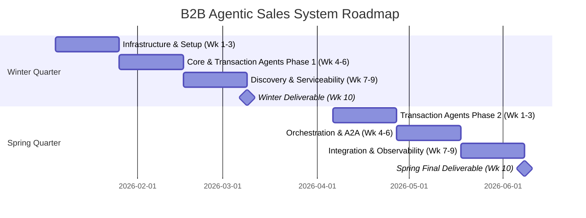

# B2B Agentic Sales Orchestration System
## Academic Milestone Plan & Sales Scenarios

**Drexel University - Senior Design Project**
**Winter Quarter (Jan - Mar 2026) | Spring Quarter (Apr - Jun 2026)**

> For full project documentation, architecture, and agent details, see [README.md](README.md).
> For comprehensive test cases (positive & negative) for each agent, see [Scenarios.md](Scenarios.md).

---

## Agent Development Timeline

| Agent | Winter Qtr | Spring Qtr | Owner |
|-------|------------|------------|-------|
| Super Agent | Basic routing | Full orchestration | Sudhaman |
| Prospect Agent | Complete | - | Aubin |
| Lead Gen Agent | Basic BANT | Enhanced scoring | Aubin |
| Product Agent | Complete | - | Raja |
| Offer Mgmt Agent | Basic routing | Complete | Sudhaman |
| Order Agent | Basic routing | Complete | Raja |
| Payment Agent | Basic routing | Complete | Arun |
| Serviceability Agent | Basic routing | Complete | Raja |
| Service Fulfillment Agent | Basic routing | Scheduling | Arun |
| Customer Comms Agent | Basic notifications | Complete | Raja |

---
## 📅 Project Roadmap & Milestones

### Timeline Overview (2 Quarters)

---
## Academic Milestone Plan

### WINTER QUARTER (January - March 2026)
**Focus: Foundation & Core Agent Development**

#### Weeks 1-3: Infrastructure & Setup
| Task | Deliverable
|------|-------------
| Set up React Frontend with chat interface | Working chat UI 
| Set up FastAPI Backend with SSE | Real-time message streaming 
| Implement ADK Base Class | Logging, memory, tool framework 
| Set up ChromaDB for RAG | Vector database initialized 
| Create mock APIs (CRM, GIS) | JSON-based mock data services 

#### Weeks 4-6: Core Agents (Phase 1)
| Task | Deliverable 
|------|-------------
| Build **Super Agent** with basic routing | Intent classification working 
| Build **Offer Mgmt Agent** | Pricing/bundle logic working 
| Build **Prospect Agent** | Address/name extraction functional 
| Build **Product Agent** with RAG | Can answer product questions 
| Ingest sample product PDFs into ChromaDB | Product Q&A working 

#### Weeks 7-9: Discovery & Serviceability Agents
| Task | Deliverable 
|------|-------------
| Build **Serviceability Agent** | Address validation & product availability 
| Build **Service Fulfillment Agent** | Mock installation scheduling 
| Build **Lead Gen Agent** | Basic BANT scoring logic 
| Implement Scenario 1 (Address lookup - new) | End-to-end flow functional 
| Implement Scenario 5 (Product inquiry) | Product Q&A demo ready 

#### Week 10: Winter Quarter Deliverable
| Task | Deliverable 
|------|-------------
| Integration testing | All Q1 agents working together | All |
| Demo preparation | Scenario 1 & 5 fully functional | All |
| Documentation | Technical documentation updated | All |

**Winter Quarter Demo:**
*A functional Chat UI where a sales agent can:*
- *Ask product questions and get RAG-powered answers*
- *Enter an address and check serviceability with product availability*
- *See available products for serviceable addresses*

---

### SPRING QUARTER (April - June 2026)
**Focus: Transaction Agents & Full Orchestration**

#### Weeks 1-3: Deterministic Agents
| Task | Deliverable
|------|-------------
| Enhance **Offer Mgmt Agent** | Pricing/bundle logic working 
| Build **Payment Agent** | Mock credit check functional 
| Build **Customer Comms Agent** | Basic email/SMS notifications 
| Enhance **Serviceability Agent** | Multi-location support 
| Implement Scenario 2 (Existing customer address) | Upsell flow working 
| Implement Scenario 4 (Existing customer by name) | Customer lookup working 

#### Weeks 4-6: Transaction & Orchestration
| Task | Deliverable 
|------|-------------
| Build **Order Agent** | JSON contract generation 
| Enhance **Customer Comms Agent** | Order, payment, and installation notifications 
| Implement A2A Protocol handshakes | Agents communicate without user input 
| Implement Scenario 3 (New business by name) | Full qualification flow 
| Enable inter-agent communication | Offer Agent <-> Payment Agent working 

#### Weeks 7-9: Integration & Observability
| Task | Deliverable 
|------|-------------
| Implement Scenario 6 (End-to-end order) | Complete sales cycle demo 
| Build basic logging/telemetry dashboard | Agent decision chain visible 
| Full system integration testing | All 10 agents orchestrated 
| Edge case handling | Error handling & guardrails 

#### Week 10: Spring Quarter Final Deliverable
| Task | Deliverable | Owner |
|------|-------------|-------|
| Final integration & bug fixes | Production-ready demo | All |
| Final demo preparation | All 6 scenarios functional | All |
| Final documentation | Complete project documentation | All |
| Presentation preparation | Senior design presentation | All |

**Spring Quarter Final Demo:**
*A fully autonomous demo showcasing:*
- *All 6 sales scenarios working end-to-end*
- *All 10 agents collaborating via A2A protocol*
- *Complete sales cycle: inquiry -> serviceability -> quote -> order -> notifications*
- *Basic observability showing agent decision chains*

---

> For architecture diagrams, agent deep-dives, and technical details, see [README.md](README.md).
> For test scenarios with positive & negative cases, see [Scenarios.md](Scenarios.md).
