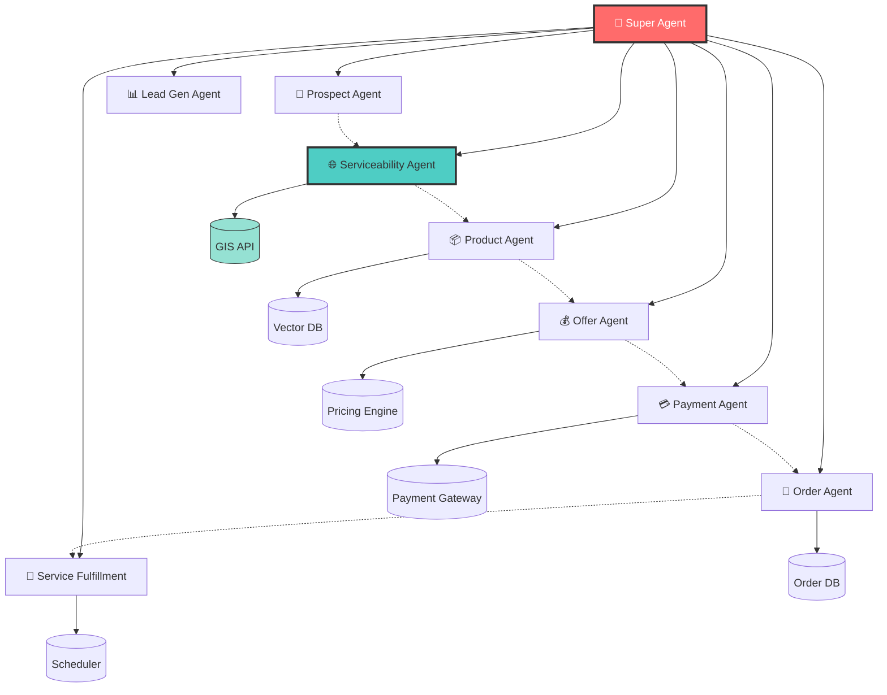

# B2B Agentic Sales Orchestration System
## Sales Scenarios & Academic Milestone Plan

**Drexel University – Senior Design Project**
**Winter Quarter (Jan – Mar 2026) | Spring Quarter (Apr – Jun 2026)**


## Project Overview

This document outlines the sales scenarios and milestone plan for the B2B Conversational Sales Agent multi-agent system. The scope is designed for an academic senior design project demonstrating a functional Multi-Agent System (MAS) with the following **9 agents**:

| Agent | Type | Purpose 
|-------|------|---------
| 🧠 **Super Agent** | Orchestrator | Routes intents, manages conversation flow 
| 👤 **Prospect Agent** | Operational | Extracts customer/company details 
| 📊 **Lead Gen Agent** | Operational | BANT scoring & lead qualification 
| 📦 **Product Agent** | Info/RAG | Retrieves product specs from vector DB 
| 💰 **Offer Mgmt Agent** | Deterministic | Calculates pricing & bundles 
| 🛒 **Order Agent** | Transactional | Manages cart & contract generation
| 💳 **Payment Agent** | Transactional | Mock credit checks
| 🌐 **Serviceability Agent** | Deterministic | Address validation & product availability by location
| 🔧 **Service Fulfillment Agent** | Deterministic | Installation scheduling & provisioning 


## Agent Development Timeline

| Agent | Winter Qtr | Spring Qtr | Owner |
|-------|------------|------------|-------|
| 🧠 Super Agent | ✅ Basic routing | ✅ Full orchestration | Sudhaman |
| 👤 Prospect Agent | ✅ Complete | — | Aubin |
| 📊 Lead Gen Agent | ✅ Basic BANT | ✅ Enhanced scoring | Aubin |
| 📦 Product Agent | ✅ Complete | — | Raja |
| 💰 Offer Mgmt Agent | ✅ Basic routing | ✅ Complete | Sudhaman |
| 🛒 Order Agent | ✅ Basic routing | ✅ Complete | Raja |
| 💳 Payment Agent | ✅ Basic routing| ✅ Complete | Arun |
| 🌐 Serviceability Agent | ✅ Basic routing| ✅ Complete | Raja |
| 🔧 Service Fulfillment Agent | ✅ Basic routing | ✅ Scheduling | Arun |

---


## System Architecture Overview

```
                         B2B AGENTIC SALES SYSTEM ARCHITECTURE
┌──────────────────────────────────────────────────────────────────────────────────┐
│                                                                                  │
│                         👤 HUMAN SALES AGENT                                     │
│                         (Phone with Customer)                                    │
│                                  │                                               │
│                                  ▼                                               │
│                    ┌──────────────────────────┐                                  │
│                    │   🎙️ Speech-to-Text     │                                  │
│                    │   Customer transcription │                                  │
│                    └──────────┬───────────────┘                                  │
│                               │                                                  │
└───────────────────────────────┼──────────────────────────────────────────────────┘
                                │
                                ▼
┌──────────────────────────────────────────────────────────────────────────────────┐
│                          🧠 ORCHESTRATION LAYER                                  │
│                                                                                  │
│                    ┌────────────────────────────┐                                │
│                    │    🧠 SUPER AGENT          │                                │
│                    │  • Intent Classification   │                                │
│                    │  • Agent Routing           │                                │
│                    │  • Response Generation     │                                │
│                    │  • Conversation Context    │                                │
│                    └────────────┬───────────────┘                                │
│                                 │                                                │
└─────────────────────────────────┼────────────────────────────────────────────────┘
                                  │
         ┌────────────────────────┼────────────────────────┐
         │                        │                        │
         ▼                        ▼                        ▼
┌────────────────────┐  ┌────────────────────┐  ┌────────────────────┐
│   🔍 DISCOVERY     │  │  ⚙️ CONFIGURATION   │  │  💰 TRANSACTION    │
│                    │  │                     │  │                    │
│ ┌────────────────┐ │  │ ┌────────────────┐ │  │ ┌────────────────┐ │
│ │ 👤 Prospect    │ │  │ │ 🌐 Serviceability│◄─┼──┤ 💳 Payment     │ │
│ │    Agent       │ │  │ │    Agent        │ │  │ │    Agent       │ │
│ └────────────────┘ │  │ │ **NEW**         │ │  │ └────────────────┘ │
│                    │  │ └────────┬─────────┘ │  │                    │
│ ┌────────────────┐ │  │          ▼           │  │ ┌────────────────┐ │
│ │ 📊 Lead Gen    │ │  │ ┌────────────────┐  │  │ │ 🛒 Order       │ │
│ │    Agent       │ │  │ │ 📦 Product     │  │  │ │    Agent       │ │
│ └────────────────┘ │  │ │    Agent       │  │  │ └────────────────┘ │
│                    │  │ └────────────────┘  │  │                    │
│                    │  │                     │  │ ┌────────────────┐ │
│                    │  │ ┌────────────────┐  │  │ │ 🔧 Service     │ │
│                    │  │ │ 💰 Offer Mgmt  │  │  │ │ Fulfillment    │ │
│                    │  │ │    Agent       │  │  │ └────────────────┘ │
│                    │  │ └────────────────┘  │  │                    │
└──────────┬─────────┘  └──────────┬──────────┘  └──────────┬─────────┘
           │                       │                        │
           └───────────────────────┼────────────────────────┘
                                   │
                                   ▼
┌──────────────────────────────────────────────────────────────────────────────────┐
│                      ⚙️ INFRASTRUCTURE & TOOLS LAYER                             │
│                                                                                  │
│  ┌─────────────┐  ┌─────────────┐  ┌─────────────┐  ┌─────────────┐            │
│  │   CRM API   │  │   GIS/Map   │  │  Vector DB  │  │  Order DB   │            │
│  │   (Mock)    │  │  API (Mock) │  │  (ChromaDB) │  │  (SQLite)   │            │
│  └─────────────┘  └─────────────┘  └─────────────┘  └─────────────┘            │
│                                                                                  │
│  ┌─────────────┐  ┌─────────────┐  ┌─────────────┐  ┌─────────────┐            │
│  │  Pricing    │  │   Payment   │  │  Scheduler  │  │   Logger/   │            │
│  │  Engine     │  │   Gateway   │  │     API     │  │Observability│            │
│  └─────────────┘  └─────────────┘  └─────────────┘  └─────────────┘            │
└──────────────────────────────────────────────────────────────────────────────────┘
```

## 🌐 Serviceability Agent

### Purpose
The **Serviceability Agent** is a deterministic agent responsible for:
1. **Address Validation**: Verifying if a customer location is within the service area
2. **Product Availability by Location**: Determining which cable MSO products (Internet, Ethernet, TV, SD-WAN, Security) are available at that specific address
3. **Technology Mapping**: Identifying the underlying infrastructure (Fiber, Coax, Hybrid) at the location

### Key Responsibilities

| Function | Description | Data Source |
|----------|-------------|-------------|
| **Address Validation** | Parses and validates street address, city, state, ZIP | GIS/Address API |
| **Coverage Check** | Determines if address is within serviceable territory | Coverage Map API |
| **Technology Assessment** | Identifies infrastructure type (FTTP, HFC, DOCSIS 3.1) | Network Inventory |
| **Product Filtering** | Returns only products available for that location/technology | Product Catalog + Coverage DB |

### Example Flow

```
Customer: "Can I get internet at 1234 Market Street, Philadelphia, PA 19104?"

Super Agent → Serviceability Agent

Serviceability Agent:
  1. Validates address format
  2. Queries GIS API: ✅ Address found
  3. Checks coverage map: ✅ In service area
  4. Identifies technology: Fiber (FTTP)
  5. Filters products:
     - ✅ Internet: Up to 10 Gbps
     - ✅ Ethernet: Business class available
     - ✅ TV: Full channel lineup
     - ✅ SD-WAN: Supported
     - ❌ Legacy DOCSIS products: Not available (Fiber location)

Returns: {
  "serviceable": true,
  "technology": "FTTP",
  "available_products": ["Internet_10G", "Ethernet_1G", "TV_Premium", "SDWAN"]
}
```

### Why Separate from Service Fulfillment Agent?

| Concern | Serviceability Agent | Service Fulfillment Agent |
|---------|----------------------|---------------------------|
| **When** | **Pre-sale** - Before quote | **Post-sale** - After order |
| **Function** | Determines **IF** we can serve | Determines **WHEN** we can install |
| **Output** | Boolean + Product List | Installation date + Ticket ID |
| **Determinism** | 100% - Coverage map lookup | 100% - Scheduler API |


## Sales Scenarios (Expanded)

### Scenario 1: Address-Based Lookup (New Prospect)

**User Input:** Agent types an address into the chatbot
**Example:** *"Check serviceability for 123 Main Street, Philadelphia, PA 19104"*

**Flow:**
1. **Super Agent** → Receives input, identifies intent as "serviceability check"
2. **Prospect Agent** → Extracts address details (street, city, zip)
3. **🌐 Serviceability Agent** → **NEW**: Validates address and checks coverage
4. **Decision Point:**
   - **NOT Serviceable** → Return "Address not in service area" message
   - **Serviceable** → Continue to step 5
5. **Product Agent** → Retrieves detailed specs for products available at that location
6. **Offer Mgmt Agent** → Creates a product offering with pricing
7. **Super Agent** → Returns formatted response with available products and pricing

**Agents Demonstrated:** Super Agent, Prospect Agent, **Serviceability Agent**, Product Agent, Offer Mgmt Agent

---

### Scenario 2: Address-Based Lookup (Existing Customer)

**User Input:** Agent types an address that matches an existing customer
**Example:** *"Look up 456 Market Street, Philadelphia, PA 19103"*

**Flow:**
1. **Super Agent** → Receives input, identifies intent as "customer lookup"
2. **Prospect Agent** → Extracts address, queries mock CRM for existing customer
3. **Decision Point:**
   - **Existing Customer Found** → Continue to step 4
   - **Not Found** → Follow Scenario 1 flow (new prospect)
4. **Product Agent** → Retrieves customer's current products/services
5. **🌐 Serviceability Agent** → Checks what additional products are available at their location
6. **Offer Mgmt Agent** → Identifies upsell/cross-sell opportunities based on serviceability
7. **Super Agent** → Returns current services + recommended upgrades with pricing

**Agents Demonstrated:** Super Agent, Prospect Agent, Product Agent, **Serviceability Agent**, Offer Mgmt Agent

---

### Scenario 3: Business Name Lookup (New Prospect)

**User Input:** Agent types a business name into the chatbot
**Example:** *"Find services for Acme Corporation"*

**Flow:**
1. **Super Agent** → Receives input, identifies intent as "business lookup"
2. **Prospect Agent** → Searches mock CRM by business name
3. **Decision Point:**
   - **Business NOT Found** → Continue to step 4
   - **Business Found** → Follow Scenario 4 flow
4. **Super Agent** → Prompts for business address
5. **Prospect Agent** → Extracts provided address
6. **🌐 Serviceability Agent** → Validates address and determines available products
7. **Lead Gen Agent** → Performs basic BANT qualification (mock scoring)
8. **Product Agent** → Retrieves detailed specs for serviceable products
9. **Offer Mgmt Agent** → Creates tailored product offering
10. **Super Agent** → Returns serviceability status + product offering

**Agents Demonstrated:** Super Agent, Prospect Agent, **Serviceability Agent**, Lead Gen Agent, Product Agent, Offer Mgmt Agent

---

### Scenario 4: Business Name Lookup (Existing Customer)

**User Input:** Agent types a business name that exists in the system
**Example:** *"Look up TechStart Inc"*

**Flow:**
1. **Super Agent** → Receives input, identifies intent as "customer lookup"
2. **Prospect Agent** → Searches mock CRM, finds existing customer record
3. **Product Agent** → Retrieves current services for the customer
4. **🌐 Serviceability Agent** → Checks for new product availability at their locations
5. **Lead Gen Agent** → Assesses expansion potential (additional locations, upgrades)
6. **Offer Mgmt Agent** → Generates upsell/bundle recommendations
7. **Super Agent** → Returns customer profile + current services + recommended offerings

**Agents Demonstrated:** Super Agent, Prospect Agent, Product Agent, **Serviceability Agent**, Lead Gen Agent, Offer Mgmt Agent

---

### Scenario 5: Product Information Query

**User Input:** Agent asks about a specific product
**Example:** *"What speeds are available with Business Internet Pro?"*

**Flow:**
1. **Super Agent** → Identifies intent as "product inquiry"
2. **Product Agent** → Queries ChromaDB (RAG) for product specifications
3. **Super Agent** → Returns detailed product information

**Agents Demonstrated:** Super Agent, Product Agent

---

### Scenario 6: End-to-End Order Flow (Demo Scenario)

**User Input:** Complete sales cycle from inquiry to order
**Example:** *"I need internet service for my new office at 789 Tech Park Drive"*

**Flow:**
1. **Super Agent** → Orchestrates full sales flow
2. **Prospect Agent** → Extracts business details and address
3. **Lead Gen Agent** → Qualifies the lead (BANT scoring)
4. **🌐 Serviceability Agent** → **NEW**: Validates address and checks product availability
5. **Product Agent** → Retrieves detailed specs for available products
6. **Offer Mgmt Agent** → Creates pricing quote
7. **Payment Agent** → Performs mock credit check
8. **Order Agent** → Generates order/contract JSON
9. **Service Fulfillment Agent** → Schedules mock installation date
10. **Super Agent** → Returns complete order confirmation

**Agents Demonstrated:** ALL 9 AGENTS

---

## Academic Milestone Plan

### WINTER QUARTER (January – March 2026)
**Focus: Foundation & Core Agent Development**

#### Weeks 1-3: Infrastructure & Setup
| Task | Deliverable | Owner |
|------|-------------|-------|
| Set up React Frontend with chat interface | Working chat UI | Sudhaman |
| Set up FastAPI Backend with SSE | Real-time message streaming | Sudhaman |
| Implement ADK Base Class | Logging, memory, tool framework | Sudhaman |
| Set up ChromaDB for RAG | Vector database initialized | Sudhaman |
| Create mock APIs (CRM, GIS) | JSON-based mock data services | Sudhaman |

#### Weeks 4-6: Core Agents (Phase 1)
| Task | Deliverable | Owner |
|------|-------------|-------|
| Build **Super Agent** with basic routing | Intent classification working | Sudhaman |
| Build **Prospect Agent** | Address/name extraction functional | Sudhaman |
| Build **Product Agent** with RAG | Can answer product questions | Sudhaman |
| Ingest sample product PDFs into ChromaDB | Product Q&A working | Sudhaman |

#### Weeks 7-9: Discovery & Serviceability Agents
| Task | Deliverable | Owner |
|------|-------------|-------|
| Build **🌐 Serviceability Agent** | **Address validation & product availability** | **Raja** |
| Build **Service Fulfillment Agent** | Mock installation scheduling | Sudhaman |
| Build **Lead Gen Agent** | Basic BANT scoring logic | Sudhaman |
| Implement Scenario 1 (Address lookup - new) | End-to-end flow functional | All |
| Implement Scenario 5 (Product inquiry) | Product Q&A demo ready | Sudhaman |

#### Week 10: Winter Quarter Deliverable
| Task | Deliverable | Owner |
|------|-------------|-------|
| Integration testing | All Q1 agents working together | All |
| Demo preparation | **Scenario 1 & 5 fully functional** | All |
| Documentation | Technical documentation updated | All |

**🎯 Winter Quarter Demo:**
*A functional Chat UI where a sales agent can:*
- *Ask product questions and get RAG-powered answers*
- *Enter an address and check serviceability with product availability*
- *See available products for serviceable addresses*

---

### SPRING QUARTER (April – June 2026)
**Focus: Transaction Agents & Full Orchestration**

#### Weeks 1-3: Deterministic Agents
| Task | Deliverable | Owner |
|------|-------------|-------|
| Build **Offer Mgmt Agent** | Pricing/bundle logic working | Sudhaman |
| Build **Payment Agent** | Mock credit check functional | Sudhaman |
| Enhance **Serviceability Agent** | Multi-location support | Raja |
| Implement Scenario 2 (Existing customer address) | Upsell flow working | All |
| Implement Scenario 4 (Existing customer by name) | Customer lookup working | All |

#### Weeks 4-6: Transaction & Orchestration
| Task | Deliverable | Owner |
|------|-------------|-------|
| Build **Order Agent** | JSON contract generation | Sudhaman |
| Implement A2A Protocol handshakes | Agents communicate without user input | Sudhaman |
| Implement Scenario 3 (New business by name) | Full qualification flow | All |
| Enable inter-agent communication | Offer Agent ↔ Payment Agent working | Sudhaman |

#### Weeks 7-9: Integration & Observability
| Task | Deliverable | Owner |
|------|-------------|-------|
| Implement Scenario 6 (End-to-end order) | Complete sales cycle demo | All |
| Build basic logging/telemetry dashboard | Agent decision chain visible | Sudhaman |
| Full system integration testing | All 9 agents orchestrated | All |
| Edge case handling | Error handling & guardrails | All |

#### Week 10: Spring Quarter Final Deliverable
| Task | Deliverable | Owner |
|------|-------------|-------|
| Final integration & bug fixes | Production-ready demo | All |
| Final demo preparation | **All 6 scenarios functional** | All |
| Final documentation | Complete project documentation | All |
| Presentation preparation | Senior design presentation | All |

**🎯 Spring Quarter Final Demo:**
*A fully autonomous demo showcasing:*
- *All 6 sales scenarios working end-to-end*
- *All 9 agents collaborating via A2A protocol*
- *Complete sales cycle: inquiry → serviceability → quote → order*
- *Basic observability showing agent decision chains*

---

## Summary: Scenarios by Quarter

| Scenario | Description | Quarter | Key Agents |
|----------|-------------|---------|------------|
| **1** | Address lookup (new prospect) → Serviceability → Offer | Winter | Serviceability, Product, Offer |
| **5** | Product information query (RAG) | Winter | Product |
| **2** | Address lookup (existing customer) → Upsell | Spring | Serviceability, Product, Offer |
| **3** | Business name lookup (new) → Full qualification | Spring | Serviceability, Lead Gen, Product |
| **4** | Business name lookup (existing) → Upsell | Spring | Serviceability, Product, Offer |
| **6** | End-to-end order flow (all agents) | Spring | ALL 9 AGENTS |

---

## Agent Interaction Map



---

