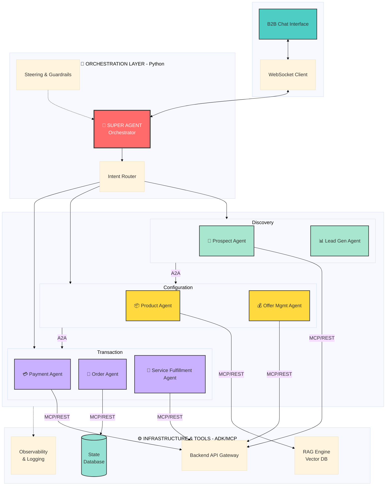
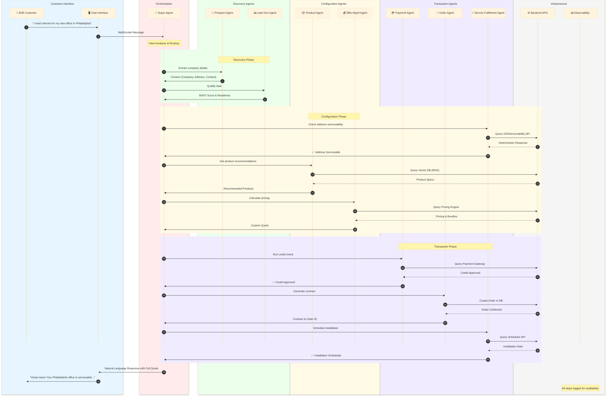
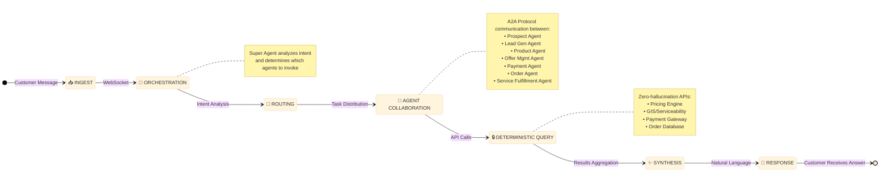
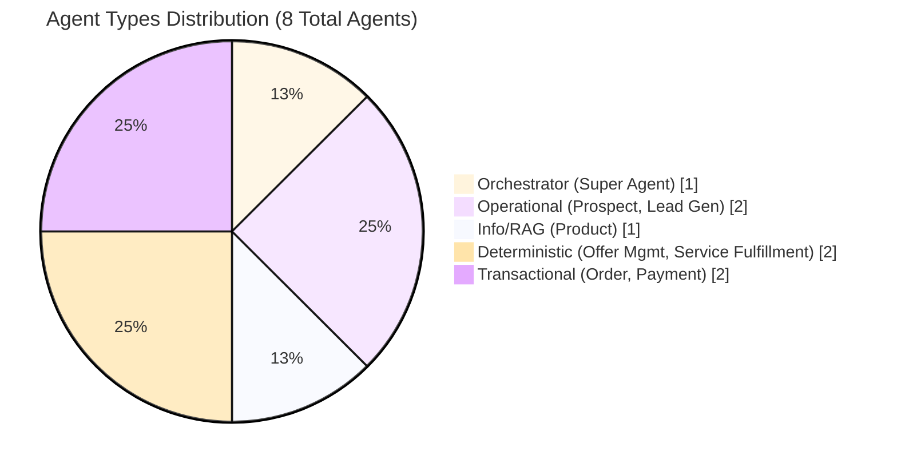
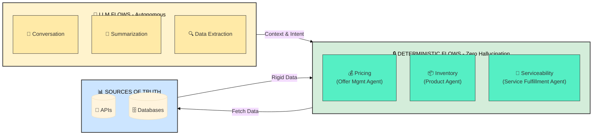
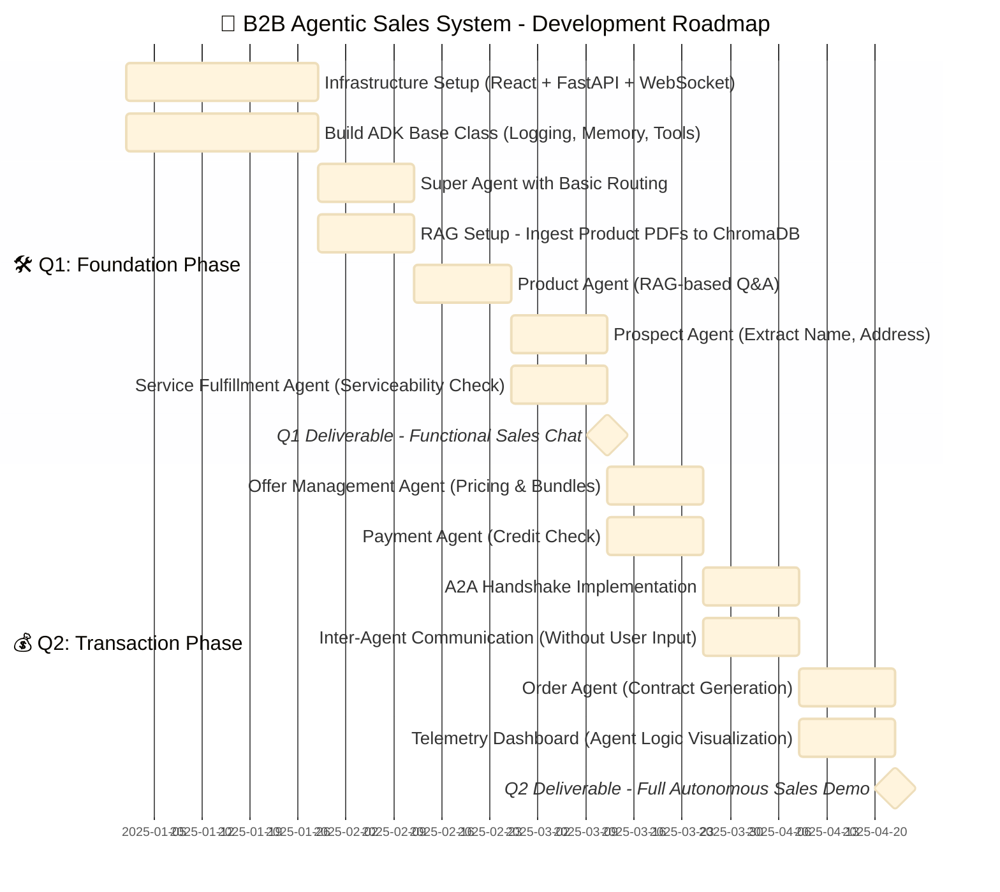

# 🤖 B2B Agentic Sales Orchestration System

[](LICENSE)
[](https://www.python.org/)
[](https://reactjs.org/)
[](https://fastapi.tiangolo.com/)

> An autonomous, multi-agent system (MAS) designed to automate the complex lifecycle of B2B sales using cutting-edge AI orchestration.

---

## 📋 Table of Contents

- [Executive Summary](#-executive-summary)
- [System Architecture](#-system-architecture)
  - [Component Architecture](#component-architecture)
  - [Architecture Diagram](#architecture-diagram)
  - [Data Flow & Lifecycle](#data-flow--lifecycle)
- [Agent Catalog & Roles](#-agent-catalog--roles)
- [Core Design Principles](#-core-design-principles)
  - [Determinism vs. Autonomy](#determinism-vs-autonomy)
  - [Observability & Steering](#observability--steering)
- [Technology Stack](#-technology-stack)
- [Project Roadmap](#-project-roadmap)
- [Getting Started](#-getting-started)
- [Contributing](#-contributing)
- [License](#-license)

---

## 📌 Executive Summary

This project aims to build an **autonomous, multi-agent system (MAS)** designed to automate the complex lifecycle of B2B sales. Unlike traditional linear chatbots, this system utilizes a **Super Agent** to orchestrate a mesh of specialized sub-agents. These agents collaborate to handle:

- 🔍 **Prospect Discovery**
- ⚙️ **Product Configuration**
- 💰 **Quoting & Pricing**
- 📦 **Order Fulfillment**

### Hybrid Cognitive Model

The architecture strictly adheres to a **Hybrid Cognitive Model**:

| Model Type | Description |
|------------|-------------|
| **Autonomous Reasoning** | LLMs drive intent understanding, negotiation, and dynamic routing |
| **Deterministic Execution** | "Sources of Truth" (APIs, Databases) are used for pricing, serviceability, and inventory to ensure **zero-hallucination compliance** |

---

## 🏗️ System Architecture

### Component Architecture

The system is divided into **four distinct layers**:

| Layer | Name | Purpose |
|-------|------|---------|
| 1️⃣ | **Presentation Layer** | Client-facing React interface |
| 2️⃣ | **Orchestration Layer** | Brain - Super Agent coordination |
| 3️⃣ | **Agent Mesh** | Specialized sub-agents |
| 4️⃣ | **Infrastructure Layer** | Data, tools & APIs |

### Architecture Diagram

<div align="center">



</div>

### Detailed System Flow Diagram

The following sequence diagram shows a complete sales flow involving multiple agents:



### Agent Interaction Flow

```mermaid
%%{init: {'theme': 'base', 'themeVariables': { 'fontSize': '16px'}, 'flowchart': {'nodeSpacing': 40, 'rankSpacing': 60, 'curve': 'basis', 'padding': 20}}}%%
flowchart LR
    subgraph Discovery["<br/>🔍 DISCOVERY PHASE<br/><br/>"]
        A["<br/>💬 Customer Intent<br/><br/>"] --> B["<br/>👤 Prospect Agent<br/>Extract Details<br/><br/>"]
        B --> C["<br/>📊 Lead Gen Agent<br/>BANT Scoring<br/><br/>"]
    end
    
    subgraph Configuration["<br/>⚙️ CONFIGURATION PHASE<br/><br/>"]
        C --> D["<br/>📦 Product Agent<br/>Tech Specs & RAG<br/><br/>"]
        D --> E["<br/>💰 Offer Mgmt Agent<br/>Pricing & Bundles<br/><br/>"]
    end
    
    subgraph Transaction["<br/>💰 TRANSACTION PHASE<br/><br/>"]
        E --> F["<br/>💳 Payment Agent<br/>Credit Check<br/><br/>"]
        F --> G["<br/>🛒 Order Agent<br/>Contract & Checkout<br/><br/>"]
        G --> H["<br/>🔧 Service Fulfillment Agent<br/>Schedule Installation<br/><br/>"]
    end
    
    subgraph Output["<br/>✅ OUTPUT<br/><br/>"]
        H --> I["<br/>📋 Confirmed Order<br/>& Installation Date<br/><br/>"]
    end

    style A fill:#e8f4f8,stroke:#333,stroke-width:2px
    style B fill:#a8e6cf,stroke:#333,stroke-width:2px
    style C fill:#a8e6cf,stroke:#333,stroke-width:2px
    style D fill:#ffd93d,stroke:#333,stroke-width:2px
    style E fill:#ffd93d,stroke:#333,stroke-width:2px
    style F fill:#c9b1ff,stroke:#333,stroke-width:2px
    style G fill:#c9b1ff,stroke:#333,stroke-width:2px
    style H fill:#c9b1ff,stroke:#333,stroke-width:2px
    style I fill:#d4edda,stroke:#333,stroke-width:3px
```

<div align="center">



</div>

### Data Flow & Lifecycle

The complete data flow follows these stages:

<div align="center">



</div>

| Stage | Description | Example |
|-------|-------------|---------|
| **1. Ingest** | B2B Customer interacts via the React Chat Interface. Message sent via WebSocket to backend | User types query |
| **2. Orchestration** | Super Agent analyzes the intent | *"I need internet for my new office in Philadelphia"* |
| **3. Routing** | Super Agent identifies required agents | Prospect Agent + Service Fulfillment Agent |
| **4. Agent Collaboration (A2A)** | Agents communicate via A2A protocol | Prospect Agent extracts data → Service Fulfillment Agent checks availability |
| **5. Synthesis** | Results returned to Super Agent for response formulation | Natural language response created |
| **6. Observability** | Every step, thought process, and tool output logged | Full auditability |

---

## 🤖 Agent Catalog & Roles

All agents are developed using a custom **ADK (Agent Development Kit)** ensuring standardized logging and error handling.

| Agent Name | Role | Type | Source of Truth |
|------------|------|------|-----------------|
| 🧠 **Super Agent** | Orchestrator. Manages user state, tone, and hands-off tasks to sub-agents | `Orchestrator` | Session Context |
| 👤 **Prospect Agent** | Identifies customer intent, company details, and contact persona | `Operational` | CRM Mock |
| 📊 **Lead Gen Agent** | Qualifies leads (BANT scoring) and determines sales readiness | `Operational` | Scoring Logic |
| 📦 **Product Agent** | Retrieves technical specs and hardware details | `Info/RAG` | Vector DB (Manuals) |
| 💰 **Offer Mgmt Agent** | Calculates pricing, bundles, and applies discounts | `Deterministic` | Pricing Engine API |
| 🛒 **Order Agent** | Manages the cart, contract generation, and final checkout | `Transactional` | Order DB |
| 💳 **Payment Agent** | Handles credit checks and payment processing | `Transactional` | Payment Gateway |
| 🔧 **Service Fulfillment Agent** | Validates address serviceability and schedules installation | `Deterministic` | GIS/Scheduler API |

### Agent Type Classification

<div align="center">



</div>

---

## 🎯 Core Design Principles

### Determinism vs. Autonomy

To prevent **"hallucinations"** in critical business areas, we separate concerns:

<div align="center">



</div>

| Flow Type | Use Cases | Key Principle |
|-----------|-----------|---------------|
| **LLM Flows (Autonomous)** | Conversation, Summarization, Extracting structured data from unstructured text | Creative & Flexible |
| **Deterministic Flows** | Pricing, Inventory, Serviceability | **MUST** come from rigid APIs - agents are "tool users" that fetch data, not invent it |

### Observability & Steering

| Feature | Description |
|---------|-------------|
| **Agent Steering** | "System Prompts" and "Guardrails" at Super Agent level prevent discussion of competitors or sensitive topics |
| **Structured Logging** | All A2A communication logged in structured JSON format, enabling "replay" of sales to understand agent decisions |

---

## 🛠️ Technology Stack

### Frontend

| Technology | Purpose |
|------------|---------|
|  | Framework - Functional Components, Hooks |
|  | Styling - Rapid, clean UI |
|  | State Management - Chat history |
|  | Communication - Real-time streaming |

### Backend & Agents

| Technology | Purpose |
|------------|---------|
|  | Language |
|  | Framework - WebSockets & REST endpoints |
|  | Agent Development Kit |
| **A2A Protocol** | JSON-RPC style messaging for inter-agent communication |
| **MCP** | Model Context Protocol for connecting agents to local tools |
|  | Dependency isolation |

### Data & Infrastructure

| Technology | Purpose |
|------------|---------|
| **LLM Provider** | Agnostic (Abstracted via API Wrapper) |
|  | RAG - Product Manuals |
|  /  | Transactional DB - Orders/Users |

### Technology Architecture

```mermaid
%%{init: {'theme': 'base', 'themeVariables': { 'fontSize': '16px'}, 'flowchart': {'nodeSpacing': 40, 'rankSpacing': 50, 'padding': 20}}}%%
graph TB
    subgraph Frontend["<br/>🎨 FRONTEND<br/><br/>"]
        React["<br/>React 19<br/>Functional Components<br/><br/>"]
        Tailwind["<br/>Tailwind CSS<br/>Rapid UI<br/><br/>"]
        SocketClient["<br/>Socket.io Client<br/>Real-time Streaming<br/><br/>"]
    end
    
    subgraph Backend["<br/>⚙️ BACKEND & AGENTS<br/><br/>"]
        FastAPI["<br/>FastAPI<br/>WebSockets & REST<br/><br/>"]
        ADK["<br/>Custom ADK<br/>Agent Development Kit<br/><br/>"]
        Python["<br/>Python 3.12+<br/><br/>"]
    end
    
    subgraph Protocols["<br/>🔗 PROTOCOLS<br/><br/>"]
        A2A["<br/>A2A Protocol<br/>JSON-RPC Messaging<br/><br/>"]
        MCP["<br/>MCP Protocol<br/>Tool Connections<br/><br/>"]
        REST["<br/>REST APIs<br/>External Services<br/><br/>"]
    end
    
    subgraph Data["<br/>💾 DATA LAYER<br/><br/>"]
        LLM["<br/>LLM Provider<br/>Agnostic/Abstracted<br/><br/>"]
        Chroma["<br/>ChromaDB<br/>Vector DB for RAG<br/><br/>"]
        SQLite["<br/>SQLite / PostgreSQL<br/>Transactional DB<br/><br/>"]
    end
    
    Frontend --> |"WebSocket"| Backend
    Backend --> Protocols
    Protocols --> Data

    style Frontend fill:#e1f5fe,stroke:#333,stroke-width:2px
    style Backend fill:#fff3e0,stroke:#333,stroke-width:2px
    style Protocols fill:#f3e5f5,stroke:#333,stroke-width:2px
    style Data fill:#e8f5e9,stroke:#333,stroke-width:2px
    style React fill:#61dafb,stroke:#333
    style FastAPI fill:#009688,stroke:#333,color:#fff
    style Python fill:#3776ab,stroke:#333,color:#fff
```

<div align="center">



</div>

---

## 📅 Project Roadmap

### Timeline Overview (2 Quarters)

<div align="center">



</div>

### Quarter 1: Foundation & Discovery Phase

> **Goal:** A working "Sales Assistant" that can chat, identify users, and check service availability.

#### Sprint 1-2: Infrastructure Setup
- [x] Set up React Frontend + FastAPI Backend
- [x] Implement WebSocket streaming
- [x] Build the ADK (Base Class): Logging, Memory, and Tool definitions

#### Sprint 3-4: The Super Agent & RAG
- [ ] Deploy Super Agent with basic routing capabilities
- [ ] Ingest Product PDFs into ChromaDB
- [ ] Build Product Agent (can answer *"What is the speed of Business Internet 1G?"*)

#### Sprint 5-6: Discovery Agents
- [ ] Build Prospect Agent (extracts Name, Address)
- [ ] Build Service Fulfillment Agent (Mock API for *"Is this address serviceable?"*)

#### 🎯 Q1 Deliverable
> A functional Chat UI where a user can ask about products and check if their address is eligible for service.

---

### Quarter 2: Transaction & Orchestration Phase

> **Goal:** A complete "End-to-End" autonomous sales cycle including pricing and ordering.

#### Sprint 1-2: Complex Deterministic Agents
- [ ] Build Offer Management Agent (Logic for bundles/pricing)
- [ ] Build Payment Agent (Mock credit check)

#### Sprint 3-4: Advanced Orchestration (A2A)
- [ ] Implement the "Handshake": `Prospect Agent → Lead Gen → Offer Agent`
- [ ] Enable agents to "talk" without user input
  - *Example: Offer Agent asking Payment Agent if customer has good credit before showing a price*

#### Sprint 5-6: Order Finalization & Observability
- [ ] Build Order Agent to generate a JSON contract
- [ ] Build the Telemetry Dashboard to visualize agent logic chains

#### 🎯 Q2 Deliverable
> A fully autonomous demo where a user enters an address, gets a validated offer, negotiates (within limits), and places a confirmed order.

---

## 🚀 Getting Started

### Prerequisites

```bash
# Python 3.12+
python --version

# Node.js 18+
node --version

# Poetry (recommended)
pip install poetry
```

### Installation

1. **Clone the repository**
   ```bash
   git clone https://github.com/your-org/b2b-agentic-sales.git
   cd b2b-agentic-sales
   ```

2. **Backend Setup**
   ```bash
   cd backend
   poetry install
   poetry run uvicorn main:app --reload
   ```

3. **Frontend Setup**
   ```bash
   cd frontend
   npm install
   npm run dev
   ```

4. **Environment Variables**
   ```bash
   cp .env.example .env
   # Configure your LLM API keys and database connections
   ```

### Project Structure

```
b2b-agentic-sales/
├── 📁 frontend/
│   ├── 📁 src/
│   │   ├── 📁 components/
│   │   ├── 📁 hooks/
│   │   └── 📁 context/
│   └── package.json
├── 📁 backend/
│   ├── 📁 agents/
│   │   ├── super_agent.py
│   │   ├── prospect_agent.py
│   │   ├── product_agent.py
│   │   └── ...
│   ├── 📁 adk/
│   │   └── base_agent.py
│   ├── 📁 tools/
│   └── main.py
├── 📁 data/
│   └── 📁 vector_db/
├── 📁 docs/
└── README.md
```

---

## 🤝 Contributing

We welcome contributions! Please see our [Contributing Guidelines](CONTRIBUTING.md) for details.

1. Fork the repository
2. Create your feature branch (`git checkout -b feature/AmazingFeature`)
3. Commit your changes (`git commit -m 'Add some AmazingFeature'`)
4. Push to the branch (`git push origin feature/AmazingFeature`)
5. Open a Pull Request

---

## 📄 License

This project is licensed under the MIT License - see the [LICENSE](LICENSE) file for details.

---

## 📞 Contact

For questions or support, please open an issue or contact the team.

---

<p align="center">
  <strong>Built with ❤️ for the future of B2B Sales</strong>
</p>

<p align="center">
  
  
  
</p>
