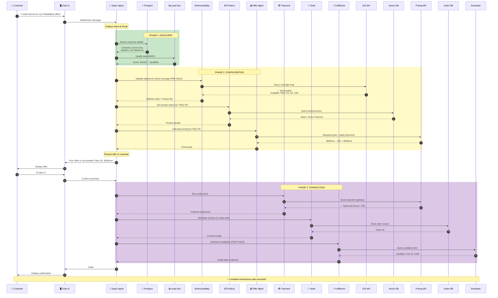
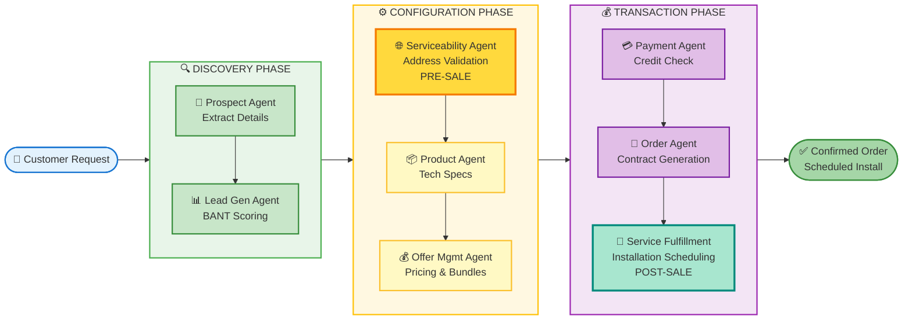
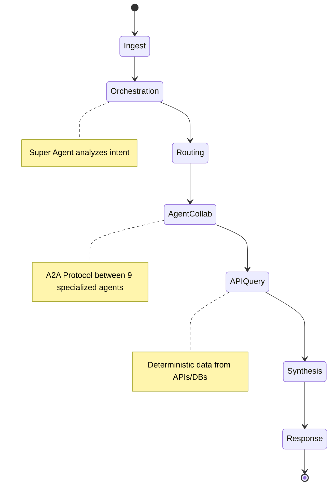
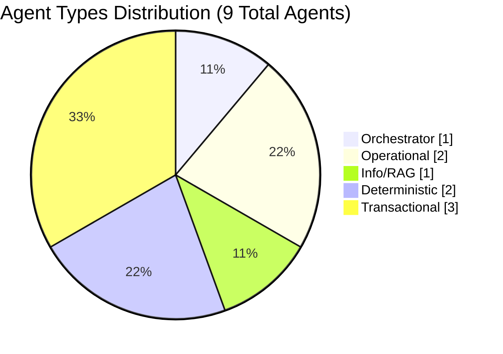
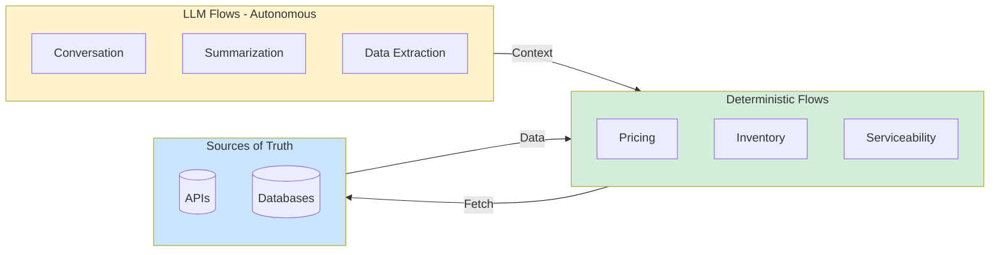
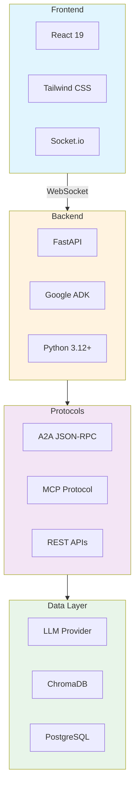
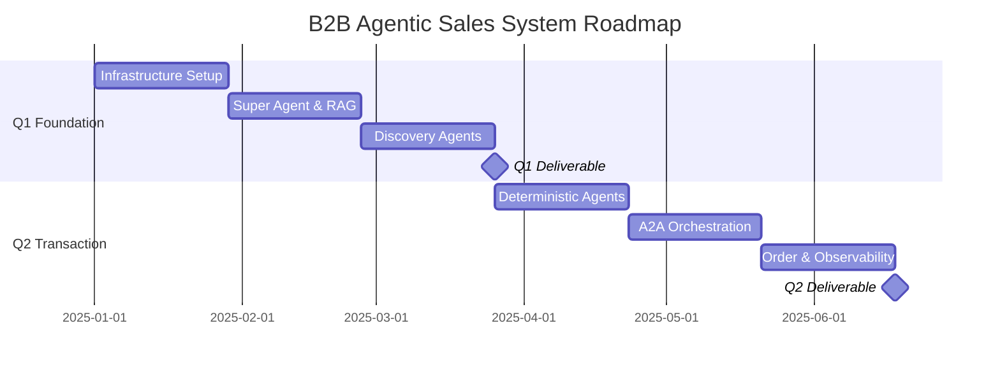

# 🤖 B2B Agentic Sales Orchestration System

[](LICENSE)
[](https://www.python.org/)
[](https://reactjs.org/)
[](https://fastapi.tiangolo.com/)

> An autonomous, multi-agent system (MAS) designed to automate the complex lifecycle of B2B sales using cutting-edge AI orchestration.

---

## 📋 Table of Contents

- [Executive Summary](#-executive-summary)
- [System Architecture](#-system-architecture)
  - [Component Architecture](#component-architecture)
  - [Architecture Diagram](#architecture-diagram)
  - [Data Flow & Lifecycle](#data-flow--lifecycle)
- [Agent Catalog & Roles](#-agent-catalog--roles)
- [Core Design Principles](#-core-design-principles)
  - [Determinism vs. Autonomy](#determinism-vs-autonomy)
  - [Observability & Steering](#observability--steering)
- [Technology Stack](#-technology-stack)
- [Project Roadmap](#-project-roadmap)
- [Getting Started](#-getting-started)
- [Contributing](#-contributing)
- [License](#-license)

---

## 📌 Executive Summary

This project aims to build an **autonomous, multi-agent system (MAS)** designed to automate the complex lifecycle of B2B sales. Unlike traditional linear chatbots, this system utilizes a **Super Agent** to orchestrate a mesh of **9 specialized sub-agents**. These agents collaborate to handle:

- 🔍 **Prospect Discovery & Qualification**
- 🌐 **Address Validation & Serviceability**
- ⚙️ **Product Configuration**
- 💰 **Quoting & Pricing**
- 📦 **Order Fulfillment & Installation Scheduling**

### Hybrid Cognitive Model

The architecture strictly adheres to a **Hybrid Cognitive Model**:

| Model Type | Description |
|------------|-------------|
| **Autonomous Reasoning** | LLMs drive intent understanding, negotiation, and dynamic routing |
| **Deterministic Execution** | "Sources of Truth" (APIs, Databases) are used for pricing, serviceability, and inventory to ensure **zero-hallucination compliance** |

---

## 🏗️ System Architecture

### Component Architecture

The system is divided into **four distinct layers**:

| Layer | Name | Purpose |
|-------|------|---------|
| 1️⃣ | **Presentation Layer** | Client-facing React interface |
| 2️⃣ | **Orchestration Layer** | Brain - Super Agent coordination |
| 3️⃣ | **Agent Mesh** | Specialized sub-agents |
| 4️⃣ | **Infrastructure Layer** | Data, tools & APIs |

### Architecture Diagram

```
╔═════════════════════════════════════════════════════════════════════════════════╗
║                       🖥️  CLIENT LAYER (React + WebSocket)                      ║
║                                                                                 ║
║              ┌─────────────────────────────────────────────┐                   ║
║              │       B2B Chat Interface (React UI)         │                   ║
║              │    • Real-time streaming responses          │                   ║
║              │    • Session state management               │                   ║
║              └────────────────────┬────────────────────────┘                   ║
╚══════════════════════════════════╪══════════════════════════════════════════════╝
                                   │ WebSocket (bidirectional)
                                   ▼
╔═════════════════════════════════════════════════════════════════════════════════╗
║                    🧠  ORCHESTRATION LAYER (Super Agent)                        ║
║                                                                                 ║
║    ┌───────────────────────────────────────────────────────────────────┐       ║
║    │                         🧠 SUPER AGENT                            │       ║
║    │                                                                   │       ║
║    │    • Intent Classification      • Context Management             │       ║
║    │    • Agent Routing              • Response Synthesis             │       ║
║    │    • Guardrails & Compliance    • Error Handling                 │       ║
║    └───────────────────────────┬───────────────────────────────────────┘       ║
╚════════════════════════════════╪═════════════════════════════════════════════════
                                 │
              ┌──────────────────┼──────────────────┐
              │                  │                  │
              ▼                  ▼                  ▼
┏━━━━━━━━━━━━━━━━━━┓  ┏━━━━━━━━━━━━━━━━━━┓  ┏━━━━━━━━━━━━━━━━━━━┓
┃  🔍 DISCOVERY    ┃  ┃ ⚙️ CONFIGURATION  ┃  ┃  💰 TRANSACTION   ┃
┃   AGENTS         ┃  ┃   AGENTS          ┃  ┃   AGENTS          ┃
┃                  ┃  ┃                   ┃  ┃                   ┃
┃ ┌──────────────┐ ┃  ┃ ┌───────────────┐ ┃  ┃ ┌───────────────┐ ┃
┃ │ 👤 Prospect  │ ┃  ┃ │ 🌐 Serviceable│ ┃  ┃ │ 💳 Payment    │ ┃
┃ │    Agent     │ ┃  ┃ │    Agent      │ ┃  ┃ │    Agent      │ ┃
┃ │  (Intent &   │ ┃  ┃ │  (Address     │ ┃  ┃ │  (Credit      │ ┃
┃ │   Details)   │ ┃  ┃ │   Validation) │ ┃  ┃ │   Checks)     │ ┃
┃ └──────────────┘ ┃  ┃ └───────────────┘ ┃  ┃ └───────────────┘ ┃
┃                  ┃  ┃                   ┃  ┃                   ┃
┃ ┌──────────────┐ ┃  ┃ ┌───────────────┐ ┃  ┃ ┌───────────────┐ ┃
┃ │ 📊 Lead Gen  │ ┃  ┃ │ 📦 Product    │ ┃  ┃ │ 🛒 Order      │ ┃
┃ │    Agent     │ ┃  ┃ │    Agent      │ ┃  ┃ │    Agent      │ ┃
┃ │  (BANT       │ ┃  ┃ │  (Tech Specs  │ ┃  ┃ │  (Contract    │ ┃
┃ │   Scoring)   │ ┃  ┃ │   & RAG)      │ ┃  ┃ │   Generation) │ ┃
┃ └──────────────┘ ┃  ┃ └───────────────┘ ┃  ┃ └───────────────┘ ┃
┃                  ┃  ┃                   ┃  ┃                   ┃
┃                  ┃  ┃ ┌───────────────┐ ┃  ┃ ┌───────────────┐ ┃
┃                  ┃  ┃ │ 💰 Offer Mgmt │ ┃  ┃ │ 🔧 Service    │ ┃
┃                  ┃  ┃ │    Agent      │ ┃  ┃ │  Fulfillment  │ ┃
┃                  ┃  ┃ │  (Pricing &   │ ┃  ┃ │  (POST-Sale   │ ┃
┃                  ┃  ┃ │   Bundles)    │ ┃  ┃ │  Scheduling)  │ ┃
┃                  ┃  ┃ └───────────────┘ ┃  ┃ └───────────────┘ ┃
┗━━━━━━━┯━━━━━━━━━━┛  ┗━━━━━━━┯━━━━━━━━━┛  ┗━━━━━━━━┯━━━━━━━━━━┛
         │                     │                     │
         └─────────────────────┼─────────────────────┘
                               │ A2A Protocol (JSON-RPC)
                               ▼
╔═════════════════════════════════════════════════════════════════════════════════╗
║                  ⚙️  INFRASTRUCTURE & DATA LAYER (ADK/MCP)                      ║
║                                                                                 ║
║  ┌─────────────┐  ┌─────────────┐  ┌──────────────┐  ┌─────────────┐          ║
║  │ GIS/Coverage│  │   Vector DB │  │ Pricing APIs │  │  Order DB   │          ║
║  │  Map APIs   │  │  (ChromaDB) │  │   Gateway    │  │ (PostgreSQL)│          ║
║  │             │  │             │  │              │  │             │          ║
║  │ • Address   │  │ • Product   │  │ • Dynamic    │  │ • Contracts │          ║
║  │   Validation│  │   Manuals   │  │   Bundles    │  │ • State     │          ║
║  │ • Service   │  │ • Tech      │  │ • Discounts  │  │ • History   │          ║
║  │   Zones     │  │   Specs     │  │              │  │             │          ║
║  └─────────────┘  └─────────────┘  └──────────────┘  └─────────────┘          ║
║                                                                                 ║
║  ┌────────────────────────────────────────────────────────────────────┐        ║
║  │               📊 Observability & Logging Layer                     │        ║
║  │         • Structured logs  • Agent traces  • Audit trail           │        ║
║  └────────────────────────────────────────────────────────────────────┘        ║
╚═════════════════════════════════════════════════════════════════════════════════╝
```

### Mermaid Architecture Diagram

```mermaid
graph TB
    subgraph Client["🖥️ CLIENT LAYER"]
        UI[B2B Chat Interface<br/>React + WebSocket]
    end

    subgraph Orchestration["🧠 ORCHESTRATION LAYER"]
        SA[SUPER AGENT<br/>Intent Router | Guardrails | Context Manager]
    end

    subgraph Discovery["🔍 DISCOVERY AGENTS"]
        PA[👤 Prospect Agent<br/>Customer Intent & Details]
        LA[📊 Lead Gen Agent<br/>BANT Qualification]
    end

    subgraph Configuration["⚙️ CONFIGURATION AGENTS"]
        SVA[🌐 Serviceability Agent<br/>Address Validation<br/>PRE-SALE]
        ProdA[📦 Product Agent<br/>Technical Specs & RAG]
        OA[💰 Offer Mgmt Agent<br/>Pricing & Bundles]
    end

    subgraph Transaction["💰 TRANSACTION AGENTS"]
        PayA[💳 Payment Agent<br/>Credit Checks]
        OrdA[🛒 Order Agent<br/>Contract Generation]
        SFA[🔧 Service Fulfillment<br/>Installation Scheduling<br/>POST-SALE]
    end

    subgraph Infrastructure["⚙️ INFRASTRUCTURE LAYER"]
        GIS[(GIS/Coverage Map API)]
        RAG[(Vector DB<br/>ChromaDB)]
        PRICE[(Pricing Engine API)]
        DB[(Order Database<br/>PostgreSQL)]
        LOG[📊 Observability & Logging]
    end

    UI <-->|WebSocket| SA
    SA -->|Routes Intent| Discovery
    SA -->|Routes Intent| Configuration
    SA -->|Routes Intent| Transaction

    PA -.->|Extract Details| SA
    LA -.->|BANT Score| SA

    SVA -->|Validate Address| GIS
    ProdA -->|Query Manuals| RAG
    OA -->|Calculate Price| PRICE

    PayA -->|Credit Check| PRICE
    OrdA -->|Store Order| DB
    SFA -->|Schedule Install| GIS

    Discovery -.->|Logs| LOG
    Configuration -.->|Logs| LOG
    Transaction -.->|Logs| LOG

    style SA fill:#ff6b6b,stroke:#333,stroke-width:3px,color:#fff
    style UI fill:#4ecdc4,stroke:#333,stroke-width:2px
    style SVA fill:#ffd93d,stroke:#333,stroke-width:2px
    style SFA fill:#a8e6cf,stroke:#333,stroke-width:2px
    style GIS fill:#95e1d3,stroke:#333,stroke-width:2px
    style RAG fill:#95e1d3,stroke:#333,stroke-width:2px
    style DB fill:#95e1d3,stroke:#333,stroke-width:2px
    style LOG fill:#dfe4ea,stroke:#333,stroke-width:2px
```

---

### Detailed System Flow

```
                                  COMPLETE B2B SALES FLOW
    ═══════════════════════════════════════════════════════════════════════════════

    👤 CUSTOMER              🧠 SUPER AGENT                   ⚙️ BACKEND SYSTEMS
         │                        │                                    │
         │  "I need fiber         │                                    │
         │   internet for my      │                                    │
         │   Philadelphia office" │                                    │
         │ ─────────────────────► │                                    │
         │                        │                                    │
         │                        │  ╔═══════════════════════════╗    │
         │                        │  ║  PHASE 1: DISCOVERY       ║    │
         │                        │  ╠═══════════════════════════╣    │
         │                        │  ║ 👤 Prospect Agent         ║    │
         │                        │  ║    → Extract company name ║    │
         │                        │  ║    → Extract address      ║    │
         │                        │  ║    → Extract contact info ║    │
         │                        │  ║                           ║    │
         │                        │  ║ 📊 Lead Gen Agent         ║    │
         │                        │  ║    → Budget validation    ║    │
         │                        │  ║    → Authority check      ║    │
         │                        │  ║    → Need confirmation    ║    │
         │                        │  ║    → Timeline assessment  ║    │
         │                        │  ║    → BANT Score: 85/100   ║    │
         │                        │  ╚═══════════════════════════╝    │
         │                        │            │                       │
         │                        │            ▼                       │
         │                        │  ╔═══════════════════════════╗    │
         │                        │  ║  PHASE 2: CONFIGURATION   ║    │
         │                        │  ╠═══════════════════════════╣    │
         │                        │  ║ 🌐 Serviceability Agent   ║────┼───► GIS/Coverage API
         │                        │  ║    → Validate address     ║◄───┼──── ✅ Valid Address
         │                        │  ║    → Check service zones  ║────┼───► Coverage Map
         │                        │  ║    → Get available tech   ║◄───┼──── ✅ Fiber Available
         │                        │  ║    [PRE-SALE CHECK]       ║    │     [1G, 5G, 10G]
         │                        │  ║                           ║    │
         │                        │  ║ 📦 Product Agent          ║────┼───► Vector DB (RAG)
         │                        │  ║    → Query for "Fiber 5G" ║◄───┼──── Product Specs
         │                        │  ║    → Get tech specs       ║    │     Features, SLAs
         │                        │  ║                           ║    │
         │                        │  ║ 💰 Offer Mgmt Agent       ║────┼───► Pricing Engine
         │                        │  ║    → Calculate base price ║◄───┼──── Base: $599/mo
         │                        │  ║    → Apply bundles        ║    │     Discount: -10%
         │                        │  ║    → Check promotions     ║◄───┼──── Final: $539/mo
         │                        │  ╚═══════════════════════════╝    │
         │                        │            │                       │
         │  "Great news! Your     │            │                       │
         │   office is serviceable│            │                       │
         │   for Fiber 5G..."     │            │                       │
         │ ◄───────────────────── │            │                       │
         │                        │            │                       │
         │  "I'll take it!"       │            │                       │
         │ ─────────────────────► │            ▼                       │
         │                        │  ╔═══════════════════════════╗    │
         │                        │  ║  PHASE 3: TRANSACTION     ║    │
         │                        │  ╠═══════════════════════════╣    │
         │                        │  ║ 💳 Payment Agent          ║────┼───► Payment Gateway
         │                        │  ║    → Run credit check     ║◄───┼──── ✅ Score: 720
         │                        │  ║    → Verify payment method║◄───┼──── ✅ Approved
         │                        │  ║                           ║    │
         │                        │  ║ 🛒 Order Agent            ║────┼───► Order Database
         │                        │  ║    → Generate contract    ║◄───┼──── Order #12345
         │                        │  ║    → Terms & conditions   ║────┼───► Store Contract
         │                        │  ║    → Create order record  ║    │
         │                        │  ║                           ║    │
         │                        │  ║ 🔧 Service Fulfillment    ║────┼───► Scheduler API
         │                        │  ║    → Schedule install     ║◄───┼──── Available slots
         │                        │  ║    → Assign technician    ║◄───┼──── Tech ID: T-456
         │                        │  ║    [POST-SALE SCHEDULING] ║◄───┼──── Date: Feb 15
         │                        │  ╚═══════════════════════════╝    │
         │                        │                                    │
         │  "Order confirmed!     │                                    │
         │   Installation: Feb 15"│                                    │
         │ ◄───────────────────── │                                    │
         │                        │                                    │

    ═══════════════════════════════════════════════════════════════════════════════
                   📊 All agent interactions logged for compliance & auditability

    KEY DISTINCTION:
    🌐 Serviceability Agent: PRE-SALE address validation & coverage check
    🔧 Service Fulfillment: POST-SALE installation scheduling & coordination
```

### Mermaid Sequence Diagram



### Agent Interaction Flow



### Data Flow & Lifecycle



| Stage | Description | Example |
|-------|-------------|---------|
| **1. Ingest** | B2B Customer interacts via the React Chat Interface. Message sent via WebSocket to backend | User types query |
| **2. Orchestration** | Super Agent analyzes the intent | *"I need internet for my new office in Philadelphia"* |
| **3. Routing** | Super Agent identifies required agents for the request | Prospect Agent → Lead Gen → Serviceability Agent → Product Agent → Offer Agent |
| **4. Agent Collaboration (A2A)** | Agents communicate via A2A protocol in sequence | Prospect Agent extracts data → Serviceability Agent validates address → Product Agent fetches specs → Offer Agent calculates price |
| **5. Synthesis** | Results returned to Super Agent for response formulation | Natural language response created with all details |
| **6. Observability** | Every step, thought process, API call, and tool output logged | Full auditability and replay capability |

---

## 🤖 Agent Catalog & Roles

All agents are developed using **Google's ADK (Agent Development Kit)**, providing standardized agent lifecycle management, tool integration, memory persistence, and structured logging.

### Complete Agent Roster (9 Agents)

| Agent Name | Role | Type | Source of Truth | Phase |
|------------|------|------|-----------------|-------|
| 🧠 **Super Agent** | Orchestrator. Manages user state, tone, routing, and hands-off tasks to sub-agents | `Orchestrator` | Session Context | All |
| 👤 **Prospect Agent** | Identifies customer intent, company details, and contact persona | `Operational` | CRM Mock | Discovery |
| 📊 **Lead Gen Agent** | Qualifies leads (BANT scoring) and determines sales readiness | `Operational` | Scoring Logic | Discovery |
| 🌐 **Serviceability Agent** | **PRE-SALE**: Validates address, checks service coverage, returns available products by location | `Deterministic` | GIS/Coverage Map API | Configuration |
| 📦 **Product Agent** | Retrieves technical specs, hardware details, and feature documentation | `Info/RAG` | Vector DB (Manuals) | Configuration |
| 💰 **Offer Mgmt Agent** | Calculates pricing, applies bundles, and manages promotional discounts | `Deterministic` | Pricing Engine API | Configuration |
| 💳 **Payment Agent** | Handles credit checks, payment authorization, and financial validation | `Transactional` | Payment Gateway | Transaction |
| 🛒 **Order Agent** | Manages cart, contract generation, order creation, and final checkout | `Transactional` | Order DB | Transaction |
| 🔧 **Service Fulfillment Agent** | **POST-SALE**: Schedules installation appointments and coordinates technician dispatch | `Transactional` | Scheduler API | Transaction |

### Key Agent Distinction

**🌐 Serviceability Agent vs 🔧 Service Fulfillment Agent:**

| Aspect | 🌐 Serviceability Agent | 🔧 Service Fulfillment Agent |
|--------|-------------------------|------------------------------|
| **Timing** | PRE-SALE (before quote) | POST-SALE (after order confirmation) |
| **Purpose** | Address validation & coverage check | Installation scheduling & coordination |
| **Input** | Customer address | Confirmed order + Customer availability |
| **Output** | Boolean (serviceable?) + Available products list | Installation date + Technician assignment |
| **Data Source** | GIS/Coverage Map API | Scheduler/Workforce Management API |
| **Decision** | "Can we serve this address?" | "When can we install?" |

### Agent Type Classification



### Spotlight: The Serviceability Agent 🌐

The **Serviceability Agent** is a critical PRE-SALE deterministic agent that prevents wasted effort by validating address eligibility BEFORE any quote is generated.

#### Why It's Essential

In B2B telecommunications sales, not all addresses can receive all services. The Serviceability Agent acts as a gatekeeper to ensure:

1. **Address Validation**: Confirms the physical address exists and is correctly formatted
2. **Coverage Verification**: Checks GIS/coverage maps to determine if service infrastructure reaches the location
3. **Technology Availability**: Returns which specific products (Fiber 1G, 5G, 10G, Coax, etc.) are available at that address
4. **Zone Classification**: Identifies service zones for routing to appropriate regional teams

#### Workflow Position

```
Customer Intent → Prospect Agent → Lead Gen → 🌐 SERVICEABILITY AGENT → Product Agent → Offer Agent
                                                         ↓
                                               ❌ NOT SERVICEABLE
                                               (End conversation gracefully)
```

#### Technical Implementation

| Aspect | Details |
|--------|---------|
| **Trigger** | Invoked after address extraction, before product recommendations |
| **Input** | Structured address object (street, city, state, zip) |
| **API Call** | GIS/Coverage Map API (deterministic lookup) |
| **Output Schema** | `{ serviceable: boolean, availableProducts: string[], serviceZone: string }` |
| **Error Handling** | If API fails, gracefully inform user to contact sales team |
| **Caching** | Address results cached for 24 hours to reduce API load |

#### Example Interaction

```
Customer: "I need internet for 123 Market Street, Philadelphia, PA 19107"

Prospect Agent: Extracts address
Lead Gen Agent: Qualifies lead (BANT: 85/100)
🌐 Serviceability Agent:
    → Query GIS API with address
    ← Response: {
        serviceable: true,
        availableProducts: ["Fiber 1G", "Fiber 5G", "Fiber 10G"],
        serviceZone: "Metro-East-PA"
      }

✅ Result: Proceed to Product Agent for "Fiber 5G" specs

--- ALTERNATIVE SCENARIO ---

🌐 Serviceability Agent:
    → Query GIS API with address
    ← Response: {
        serviceable: false,
        reason: "No fiber infrastructure at location"
      }

❌ Result: "I apologize, but we don't currently service that address.
           Would you like us to notify you when coverage expands to your area?"
```

#### Business Impact

- **Reduces Churn**: Prevents customers from going through entire sales process only to discover service isn't available
- **Saves Time**: Eliminates wasted effort on quotes for non-serviceable addresses
- **Improves CX**: Sets accurate expectations upfront
- **Data-Driven**: Uses authoritative GIS data, not LLM guesses

---

## 🎯 Core Design Principles

### Determinism vs. Autonomy

To prevent **"hallucinations"** in critical business areas, we separate concerns:

```
    ┌────────────────────────────────────────────────────────────────────────┐
    │                    HYBRID COGNITIVE MODEL                              │
    ├────────────────────────────────────────────────────────────────────────┤
    │                                                                        │
    │   🤖 LLM FLOWS (Autonomous)          🔒 DETERMINISTIC FLOWS           │
    │   ─────────────────────────          ─────────────────────────        │
    │                                                                        │
    │   ┌─────────────────────┐            ┌─────────────────────┐          │
    │   │ • Conversation      │            │ • Pricing           │          │
    │   │ • Summarization     │ ────────►  │ • Inventory         │          │
    │   │ • Data Extraction   │  Context   │ • Serviceability    │          │
    │   │ • Intent Analysis   │  & Intent  │ • Credit Checks     │          │
    │   └─────────────────────┘            └──────────┬──────────┘          │
    │                                                 │                      │
    │           Creative & Flexible                   │ Fetch Only           │
    │                                                 ▼                      │
    │                                      ┌─────────────────────┐          │
    │                                      │  📊 SOURCES OF      │          │
    │                                      │     TRUTH           │          │
    │                                      │                     │          │
    │                                      │  • APIs             │          │
    │                                      │  • Databases        │          │
    │                                      │  • External Systems │          │
    │                                      └─────────────────────┘          │
    │                                                                        │
    │   ⚠️  Agents are "tool users" - they FETCH data, never INVENT it      │
    └────────────────────────────────────────────────────────────────────────┘
```



| Flow Type | Use Cases | Key Principle |
|-----------|-----------|---------------|
| **LLM Flows (Autonomous)** | Conversation, Summarization, Extracting structured data from unstructured text | Creative & Flexible |
| **Deterministic Flows** | Pricing, Inventory, Serviceability | **MUST** come from rigid APIs - agents are "tool users" that fetch data, not invent it |

### Observability & Steering

| Feature | Description |
|---------|-------------|
| **Agent Steering** | "System Prompts" and "Guardrails" at Super Agent level prevent discussion of competitors or sensitive topics |
| **Structured Logging** | All A2A communication logged in structured JSON format, enabling "replay" of sales to understand agent decisions |

### Error Handling & Resilience

The system implements defensive patterns to ensure graceful degradation:

| Pattern | Implementation | Purpose |
|---------|----------------|---------|
| **Circuit Breaker** | Wraps all external API calls | Prevents cascade failures when downstream services are unavailable |
| **Retry with Backoff** | Exponential backoff on transient failures | Handles temporary network issues without user impact |
| **Fallback Responses** | Graceful degradation per agent | If Product Agent fails, Super Agent can still provide basic info |
| **Timeout Management** | Configurable per-agent timeouts | Prevents hung conversations from blocking resources |
| **Dead Letter Queue** | Failed transactions logged for retry | Ensures no orders are lost due to transient failures |

```
    ERROR HANDLING FLOW
    ═══════════════════════════════════════════════════════════════

    Agent Request → [Circuit Breaker] → External API
                          │
                    ┌─────┴─────┐
                    │  CLOSED   │ ← Normal operation
                    └─────┬─────┘
                          │ Failures exceed threshold
                          ▼
                    ┌───────────┐
                    │   OPEN    │ ← Fast-fail, no API calls
                    └─────┬─────┘
                          │ After cooldown period
                          ▼
                    ┌───────────┐
                    │ HALF-OPEN │ ← Test with single request
                    └───────────┘
```

---

## 🔐 Security Considerations

> **Note:** This is an academic demo project using mock data. The considerations below outline what a production system would require.

| Area | Demo Implementation | Production Requirement |
|------|---------------------|------------------------|
| **Authentication** | Basic session handling | JWT tokens, OAuth 2.0 |
| **API Credentials** | Environment variables | Secret management (Vault, AWS Secrets) |
| **Data Privacy** | Mock customer data only | Encryption at rest/transit, PII handling |
| **Payment Data** | Simulated credit checks | PCI-DSS compliance, tokenization |

---

## 🧪 Testing Strategy

### Test Pyramid

```
                    ┌─────────────┐
                    │   E2E Tests │  ← Full scenario flows (Scenario 1-6)
                    │    (10%)    │
                    ├─────────────┤
                    │ Integration │  ← Agent-to-Agent communication
                    │    (30%)    │     API mock validation
                    ├─────────────┤
                    │    Unit     │  ← Individual agent logic
                    │    (60%)    │     Intent classification
                    └─────────────┘     Data extraction
```

### Testing by Layer

| Layer | Test Type | Tools | Coverage Target |
|-------|-----------|-------|-----------------|
| **Agents** | Unit Tests | pytest, unittest.mock | 80%+ per agent |
| **A2A Protocol** | Integration Tests | pytest-asyncio | All handshake paths |
| **API Mocks** | Contract Tests | Pact/Schema validation | 100% of mock APIs |
| **Full System** | E2E Scenarios | Playwright + pytest | All 6 scenarios |

### Key Test Scenarios

1. **Happy Path**: All 6 sales scenarios execute successfully
2. **Agent Failure**: Super Agent handles downstream agent unavailability
3. **Invalid Input**: Malformed addresses, non-existent products
4. **Concurrent Users**: Multiple simultaneous conversations (load testing)
5. **State Recovery**: Session resumption after connection drop

---

## ⚠️ Limitations & Scope

### Current Limitations

| Limitation | Rationale | Future Consideration |
|------------|-----------|----------------------|
| **Mock APIs Only** | Academic project scope | Production would integrate real CRM, GIS, Payment systems |
| **Single LLM Provider** | Simplified implementation | Could add provider abstraction for failover |
| **No Multi-language Support** | English-only for demo | i18n framework ready for extension |
| **Limited Concurrent Users** | Not load-tested at scale | Horizontal scaling via Kubernetes |
| **No Voice/Omnichannel** | Text chat only | Architecture supports future voice integration |

### Out of Scope (Academic Project)

- Real payment processing (PCI compliance)
- Production CRM/ERP integrations
- Mobile native applications
- Multi-tenant SaaS deployment
- Real-time inventory synchronization

### Scalability Considerations

For production deployment, consider:

```
    HORIZONTAL SCALING ARCHITECTURE
    ═══════════════════════════════════════════════════════════════

    Load Balancer
         │
         ├──► FastAPI Instance 1 ──► Agent Pool 1
         ├──► FastAPI Instance 2 ──► Agent Pool 2
         └──► FastAPI Instance N ──► Agent Pool N
                      │
                      ▼
              Shared State (Redis)
              Vector DB (ChromaDB Cluster)
              Message Queue (RabbitMQ/Kafka)
```

---

## 🛠️ Technology Stack

### Frontend

| Technology | Purpose |
|------------|---------|
|  | Framework - Functional Components, Hooks |
|  | Styling - Rapid, clean UI |
|  | State Management - Chat history |
|  | Communication - Real-time streaming |

### Backend & Agents

| Technology | Purpose |
|------------|---------|
|  | Language |
|  | Framework - WebSockets & REST endpoints |
|  | Google Agent Development Kit - Multi-agent orchestration framework |
| **A2A Protocol** | JSON-RPC style messaging for inter-agent communication |
| **MCP** | Model Context Protocol for connecting agents to local tools |
|  | Dependency isolation |

### Data & Infrastructure

| Technology | Purpose |
|------------|---------|
| **LLM Provider** | Agnostic (Abstracted via API Wrapper) |
|  | RAG - Product Manuals |
|  /  | Transactional DB - Orders/Users |

### Technology Architecture



---

## 📅 Project Roadmap

### Timeline Overview (2 Quarters)

```
    2025 DEVELOPMENT ROADMAP
    ════════════════════════════════════════════════════════════════════════════
    
    Q1: FOUNDATION PHASE                    Q2: TRANSACTION PHASE
    ─────────────────────                   ───────────────────────
    
    Jan     Feb     Mar     Apr     May     Jun
    │       │       │       │       │       │
    ├───────┴───────┤       │       │       │
    │ Sprint 1-2    │       │       │       │
    │ Infrastructure│       │       │       │
    │ • React + FastAPI     │       │       │
    │ • WebSocket   │       │       │       │
    │ • ADK Base    │       │       │       │
    │               ├───────┴───────┤       │
    │               │ Sprint 3-4    │       │
    │               │ Super Agent   │       │
    │               │ • Routing     │       │
    │               │ • RAG Setup   │       │
    │               │ • Product Agent       │
    │               │               ├───────┴───────┤
    │               │               │ Sprint 5-6    │
    │               │               │ Discovery     │
    │               │               │ • Prospect    │
    │               │               │ • Svc Fulfill │
    │               │               │               │
    ▼               ▼               ▼               │
    ════════════════════════════════╪═══════════════╪═══════════════════════════
                              Q1 DELIVERABLE        │
                              Chat UI with          │
                              Product Q&A &         │
                              Serviceability        │
                                                    │       │       │
                                                    ├───────┴───────┤
                                                    │ Sprint 1-2    │
                                                    │ Deterministic │
                                                    │ • Offer Mgmt  │
                                                    │ • Payment     │
                                                    │               ├───────┴───────┐
                                                    │               │ Sprint 3-4    │
                                                    │               │ A2A Protocol  │
                                                    │               │ • Handshakes  │
                                                    │               │ • Inter-agent │
                                                    │               │               ├───────┐
                                                    │               │               │ Sprint│
                                                    │               │               │ 5-6   │
                                                    │               │               │ Order │
                                                    │               │               │ Telemetry
                                                    ▼               ▼               ▼
                                                    ═════════════════════════════════
                                                                        Q2 DELIVERABLE
                                                                        Full Autonomous
                                                                        Sales Demo
```



### Quarter 1: Foundation & Discovery Phase

> **Goal:** A working "Sales Assistant" that can chat, identify users, and check service availability.

#### Sprint 1-2: Infrastructure Setup
- [x] Set up React Frontend + FastAPI Backend
- [x] Implement WebSocket streaming
- [x] Configure Google ADK: Agent base classes, logging, memory, and tool definitions

#### Sprint 3-4: The Super Agent & RAG
- [ ] Deploy Super Agent with basic routing capabilities
- [ ] Ingest Product PDFs into ChromaDB
- [ ] Build Product Agent (can answer *"What is the speed of Business Internet 1G?"*)

#### Sprint 5-6: Discovery & Serviceability Agents
- [ ] Build Prospect Agent (extracts Name, Address, Contact Info)
- [ ] Build Lead Gen Agent (BANT qualification logic)
- [ ] Build Serviceability Agent (Mock GIS API for *"Is this address serviceable?"*)

#### 🎯 Q1 Deliverable
> A functional Chat UI where a user can ask about products, get qualified as a lead, and check if their address is eligible for service with specific product availability.

---

### Quarter 2: Transaction & Orchestration Phase

> **Goal:** A complete "End-to-End" autonomous sales cycle including pricing and ordering.

#### Sprint 1-2: Complex Deterministic Agents
- [ ] Build Offer Management Agent (Logic for bundles/pricing)
- [ ] Build Payment Agent (Mock credit check)

#### Sprint 3-4: Advanced Orchestration (A2A)
- [ ] Implement the "Handshake": `Prospect Agent → Lead Gen → Offer Agent`
- [ ] Enable agents to "talk" without user input
  - *Example: Offer Agent asking Payment Agent if customer has good credit before showing a price*

#### Sprint 5-6: Order Finalization & Observability
- [ ] Build Order Agent to generate a JSON contract
- [ ] Build the Telemetry Dashboard to visualize agent logic chains

#### 🎯 Q2 Deliverable
> A fully autonomous demo where a user enters an address, gets a validated offer, negotiates (within limits), and places a confirmed order.

---

## 🚀 Getting Started

### Prerequisites

```bash
# Python 3.12+
python --version

# Node.js 18+
node --version

# Poetry (recommended)
pip install poetry
```

### Installation

1. **Clone the repository**
   ```bash
   git clone https://github.com/your-org/b2b-agentic-sales.git
   cd b2b-agentic-sales
   ```

2. **Backend Setup**
   ```bash
   cd backend
   poetry install
   poetry run uvicorn main:app --reload
   ```

3. **Frontend Setup**
   ```bash
   cd frontend
   npm install
   npm run dev
   ```

4. **Environment Variables**
   ```bash
   cp .env.example .env
   # Configure your LLM API keys and database connections
   ```

### Project Structure

```
b2b-agentic-sales/
├── 📁 frontend/
│   ├── 📁 src/
│   │   ├── 📁 components/
│   │   ├── 📁 hooks/
│   │   └── 📁 context/
│   └── package.json
├── 📁 backend/
│   ├── 📁 agents/
│   │   ├── super_agent.py              # 🧠 Orchestrator
│   │   ├── prospect_agent.py           # 👤 Discovery Phase
│   │   ├── lead_gen_agent.py           # 📊 Discovery Phase
│   │   ├── serviceability_agent.py     # 🌐 Configuration Phase (PRE-SALE)
│   │   ├── product_agent.py            # 📦 Configuration Phase
│   │   ├── offer_mgmt_agent.py         # 💰 Configuration Phase
│   │   ├── payment_agent.py            # 💳 Transaction Phase
│   │   ├── order_agent.py              # 🛒 Transaction Phase
│   │   └── service_fulfillment_agent.py # 🔧 Transaction Phase (POST-SALE)
│   ├── 📁 adk/
│   │   └── base_agent.py
│   ├── 📁 tools/
│   │   ├── gis_api.py                  # Coverage map integration
│   │   ├── pricing_engine.py           # Pricing calculations
│   │   └── scheduler_api.py            # Installation scheduling
│   └── main.py
├── 📁 data/
│   └── 📁 vector_db/
├── 📁 docs/
└── README.md
```

---

## 🤝 Contributing

We welcome contributions! Please see our [Contributing Guidelines](CONTRIBUTING.md) for details.

1. Fork the repository
2. Create your feature branch (`git checkout -b feature/AmazingFeature`)
3. Commit your changes (`git commit -m 'Add some AmazingFeature'`)
4. Push to the branch (`git push origin feature/AmazingFeature`)
5. Open a Pull Request

---

## 📄 License

This project is licensed under the MIT License - see the [LICENSE](LICENSE) file for details.

---

## 📞 Contact

For questions or support, please open an issue or contact the team.

---

<p align="center">
  <strong>Built with ❤️ for the future of B2B Sales</strong>
</p>

<p align="center">
  
  
  
</p>
