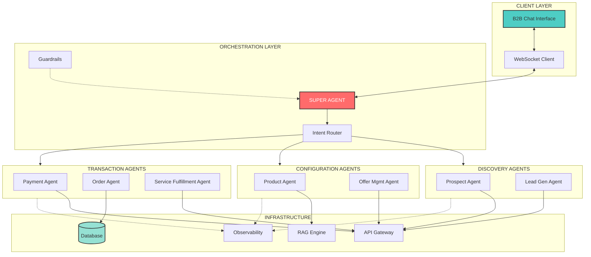
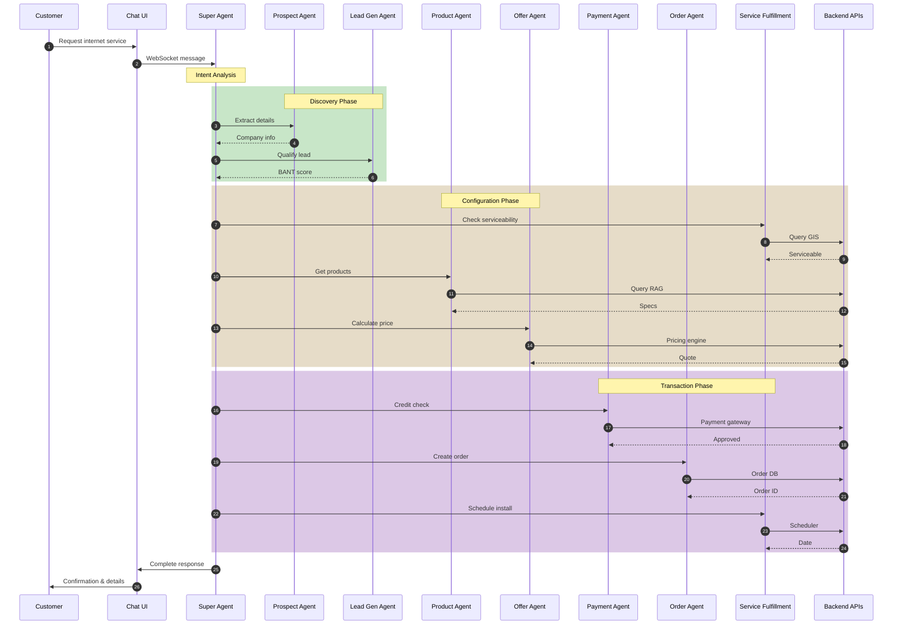
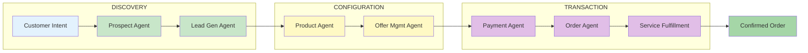
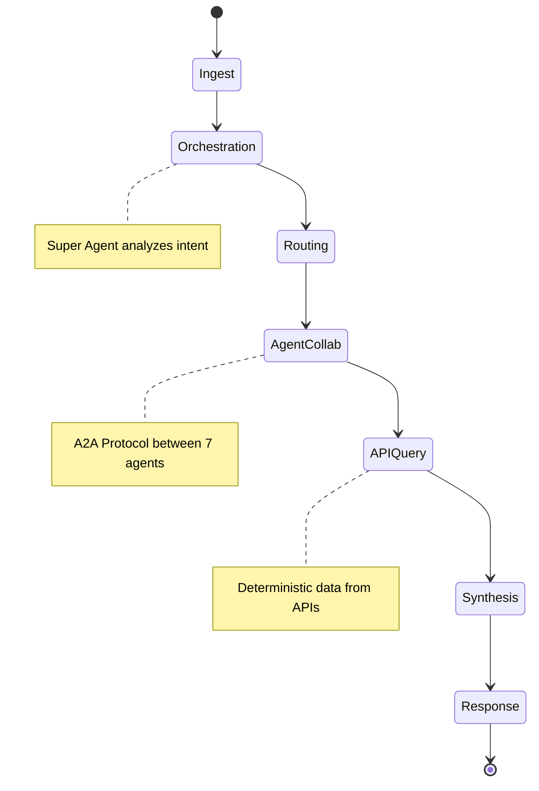
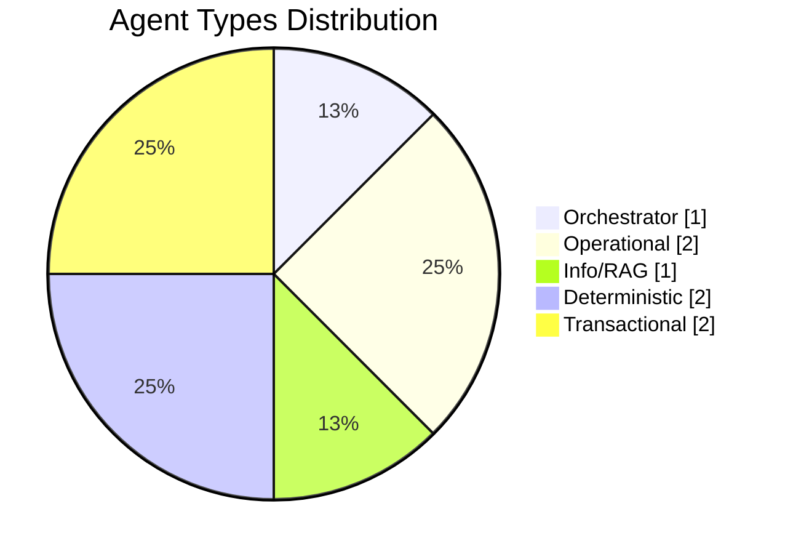
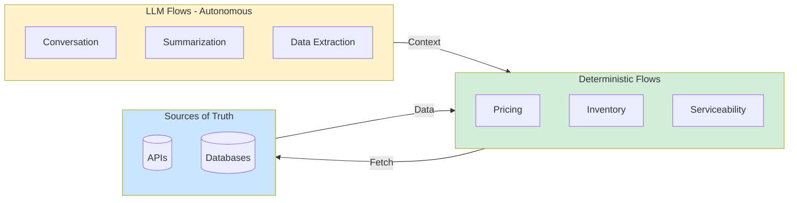
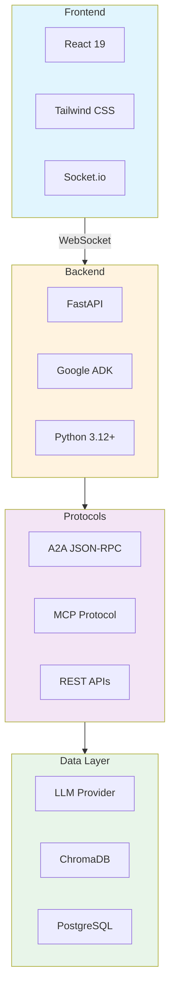
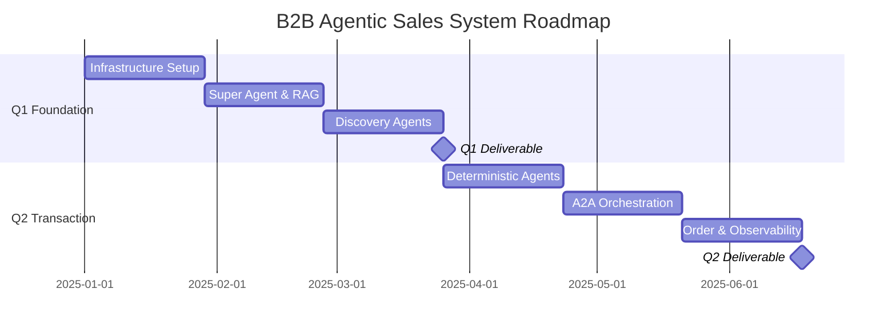

# 🤖 B2B Agentic Sales Orchestration System

[](LICENSE)
[](https://www.python.org/)
[](https://reactjs.org/)
[](https://fastapi.tiangolo.com/)

> An autonomous, multi-agent system (MAS) designed to automate the complex lifecycle of B2B sales using cutting-edge AI orchestration.

---

## 📋 Table of Contents

- [Executive Summary](#-executive-summary)
- [System Architecture](#-system-architecture)
  - [Component Architecture](#component-architecture)
  - [Architecture Diagram](#architecture-diagram)
  - [Data Flow & Lifecycle](#data-flow--lifecycle)
- [Agent Catalog & Roles](#-agent-catalog--roles)
- [Core Design Principles](#-core-design-principles)
  - [Determinism vs. Autonomy](#determinism-vs-autonomy)
  - [Observability & Steering](#observability--steering)
- [Technology Stack](#-technology-stack)
- [Project Roadmap](#-project-roadmap)
- [Getting Started](#-getting-started)
- [Contributing](#-contributing)
- [License](#-license)

---

## 📌 Executive Summary

This project aims to build an **autonomous, multi-agent system (MAS)** designed to automate the complex lifecycle of B2B sales. Unlike traditional linear chatbots, this system utilizes a **Super Agent** to orchestrate a mesh of specialized sub-agents. These agents collaborate to handle:

- 🔍 **Prospect Discovery**
- ⚙️ **Product Configuration**
- 💰 **Quoting & Pricing**
- 📦 **Order Fulfillment**

### Hybrid Cognitive Model

The architecture strictly adheres to a **Hybrid Cognitive Model**:

| Model Type | Description |
|------------|-------------|
| **Autonomous Reasoning** | LLMs drive intent understanding, negotiation, and dynamic routing |
| **Deterministic Execution** | "Sources of Truth" (APIs, Databases) are used for pricing, serviceability, and inventory to ensure **zero-hallucination compliance** |

---

## 🏗️ System Architecture

### Component Architecture

The system is divided into **four distinct layers**:

| Layer | Name | Purpose |
|-------|------|---------|
| 1️⃣ | **Presentation Layer** | Client-facing React interface |
| 2️⃣ | **Orchestration Layer** | Brain - Super Agent coordination |
| 3️⃣ | **Agent Mesh** | Specialized sub-agents |
| 4️⃣ | **Infrastructure Layer** | Data, tools & APIs |

### Architecture Diagram

```
┌─────────────────────────────────────────────────────────────────────────────────┐
│                          🖥️  CLIENT LAYER (React)                               │
│  ┌─────────────────────────────┐    ┌─────────────────────────────┐            │
│  │    B2B Chat Interface       │◄──►│     WebSocket Client        │            │
│  └─────────────────────────────┘    └──────────────┬──────────────┘            │
└────────────────────────────────────────────────────┼────────────────────────────┘
                                                     │
                                                     ▼
┌─────────────────────────────────────────────────────────────────────────────────┐
│                       🧠  ORCHESTRATION LAYER (Python)                          │
│  ┌─────────────────────────────────────────────────────────────────────────┐   │
│  │                         🧠 SUPER AGENT                                   │   │
│  │                    (Orchestrator / Router / Guardrails)                  │   │
│  └─────────────────────────────────────┬───────────────────────────────────┘   │
└────────────────────────────────────────┼────────────────────────────────────────┘
                                         │
           ┌─────────────────────────────┼─────────────────────────────┐
           │                             │                             │
           ▼                             ▼                             ▼
┌─────────────────────┐    ┌─────────────────────┐    ┌─────────────────────┐
│  🔍 DISCOVERY       │    │  ⚙️ CONFIGURATION   │    │  💰 TRANSACTION     │
│                     │    │                     │    │                     │
│ ┌─────────────────┐ │    │ ┌─────────────────┐ │    │ ┌─────────────────┐ │
│ │ 👤 Prospect     │ │    │ │ 📦 Product      │ │    │ │ 💳 Payment      │ │
│ │    Agent        │ │    │ │    Agent        │ │    │ │    Agent        │ │
│ └─────────────────┘ │    │ └─────────────────┘ │    │ └─────────────────┘ │
│ ┌─────────────────┐ │    │ ┌─────────────────┐ │    │ ┌─────────────────┐ │
│ │ 📊 Lead Gen     │ │    │ │ 💰 Offer Mgmt   │ │    │ │ 🛒 Order        │ │
│ │    Agent        │ │    │ │    Agent        │ │    │ │    Agent        │ │
│ └─────────────────┘ │    │ └─────────────────┘ │    │ └─────────────────┘ │
│                     │    │                     │    │ ┌─────────────────┐ │
│                     │    │                     │    │ │ 🔧 Service      │ │
│                     │    │                     │    │ │ Fulfillment     │ │
│                     │    │                     │    │ └─────────────────┘ │
└──────────┬──────────┘    └──────────┬──────────┘    └──────────┬──────────┘
           │                          │                          │
           └──────────────────────────┼──────────────────────────┘
                                      │ A2A Protocol
                                      ▼
┌─────────────────────────────────────────────────────────────────────────────────┐
│                       ⚙️  INFRASTRUCTURE & TOOLS (ADK/MCP)                      │
│                                                                                 │
│  ┌──────────────┐  ┌──────────────┐  ┌──────────────┐  ┌──────────────┐        │
│  │ Backend API  │  │ RAG Engine   │  │ Observability│  │    State     │        │
│  │   Gateway    │  │ (Vector DB)  │  │  & Logging   │  │  Database    │        │
│  └──────────────┘  └──────────────┘  └──────────────┘  └──────────────┘        │
└─────────────────────────────────────────────────────────────────────────────────┘
```

### Mermaid Architecture Diagram



---

### Detailed System Flow

```
                                    COMPLETE B2B SALES FLOW
    ═══════════════════════════════════════════════════════════════════════════

    👤 CUSTOMER                    🧠 SUPER AGENT                    ⚙️ BACKEND
         │                              │                                │
         │  "I need internet for       │                                │
         │   my Philadelphia office"   │                                │
         │ ─────────────────────────►  │                                │
         │                              │                                │
         │                              │  ┌─────────────────────────┐  │
         │                              │  │   DISCOVERY PHASE       │  │
         │                              │  ├─────────────────────────┤  │
         │                              │  │ 👤 Prospect Agent       │  │
         │                              │  │    → Extract details    │  │
         │                              │  │ 📊 Lead Gen Agent       │  │
         │                              │  │    → BANT scoring       │  │
         │                              │  └─────────────────────────┘  │
         │                              │               │                │
         │                              │               ▼                │
         │                              │  ┌─────────────────────────┐  │
         │                              │  │  CONFIGURATION PHASE    │  │
         │                              │  ├─────────────────────────┤  │
         │                              │  │ 🔧 Service Fulfillment  │──┼──► GIS API
         │                              │  │    → Check availability │◄─┼─── ✅ Serviceable
         │                              │  │ 📦 Product Agent        │──┼──► Vector DB
         │                              │  │    → Get products       │◄─┼─── Product Specs
         │                              │  │ 💰 Offer Mgmt Agent     │──┼──► Pricing API
         │                              │  │    → Calculate pricing  │◄─┼─── Quote
         │                              │  └─────────────────────────┘  │
         │                              │               │                │
         │                              │               ▼                │
         │                              │  ┌─────────────────────────┐  │
         │                              │  │   TRANSACTION PHASE     │  │
         │                              │  ├─────────────────────────┤  │
         │                              │  │ 💳 Payment Agent        │──┼──► Payment Gateway
         │                              │  │    → Credit check       │◄─┼─── ✅ Approved
         │                              │  │ 🛒 Order Agent          │──┼──► Order DB
         │                              │  │    → Generate contract  │◄─┼─── Order ID
         │                              │  │ 🔧 Service Fulfillment  │──┼──► Scheduler API
         │                              │  │    → Schedule install   │◄─┼─── Install Date
         │                              │  └─────────────────────────┘  │
         │                              │                                │
         │  "Great news! Your office   │                                │
         │   is serviceable..."        │                                │
         │ ◄─────────────────────────  │                                │
         │                              │                                │

    ═══════════════════════════════════════════════════════════════════════════
                            📊 All steps logged for auditability
```

### Mermaid Sequence Diagram



### Agent Interaction Flow



### Data Flow & Lifecycle



| Stage | Description | Example |
|-------|-------------|---------|
| **1. Ingest** | B2B Customer interacts via the React Chat Interface. Message sent via WebSocket to backend | User types query |
| **2. Orchestration** | Super Agent analyzes the intent | *"I need internet for my new office in Philadelphia"* |
| **3. Routing** | Super Agent identifies required agents | Prospect Agent + Service Fulfillment Agent |
| **4. Agent Collaboration (A2A)** | Agents communicate via A2A protocol | Prospect Agent extracts data → Service Fulfillment Agent checks availability |
| **5. Synthesis** | Results returned to Super Agent for response formulation | Natural language response created |
| **6. Observability** | Every step, thought process, and tool output logged | Full auditability |

---

## 🤖 Agent Catalog & Roles

All agents are developed using **Google's ADK (Agent Development Kit)**, providing standardized agent lifecycle management, tool integration, memory persistence, and structured logging.

| Agent Name | Role | Type | Source of Truth |
|------------|------|------|-----------------|
| 🧠 **Super Agent** | Orchestrator. Manages user state, tone, and hands-off tasks to sub-agents | `Orchestrator` | Session Context |
| 👤 **Prospect Agent** | Identifies customer intent, company details, and contact persona | `Operational` | CRM Mock |
| 📊 **Lead Gen Agent** | Qualifies leads (BANT scoring) and determines sales readiness | `Operational` | Scoring Logic |
| 📦 **Product Agent** | Retrieves technical specs and hardware details | `Info/RAG` | Vector DB (Manuals) |
| 💰 **Offer Mgmt Agent** | Calculates pricing, bundles, and applies discounts | `Deterministic` | Pricing Engine API |
| 🛒 **Order Agent** | Manages the cart, contract generation, and final checkout | `Transactional` | Order DB |
| 💳 **Payment Agent** | Handles credit checks and payment processing | `Transactional` | Payment Gateway |
| 🔧 **Service Fulfillment Agent** | Validates address serviceability and schedules installation | `Deterministic` | GIS/Scheduler API |

### Agent Type Classification



---

## 🎯 Core Design Principles

### Determinism vs. Autonomy

To prevent **"hallucinations"** in critical business areas, we separate concerns:

```
    ┌────────────────────────────────────────────────────────────────────────┐
    │                    HYBRID COGNITIVE MODEL                              │
    ├────────────────────────────────────────────────────────────────────────┤
    │                                                                        │
    │   🤖 LLM FLOWS (Autonomous)          🔒 DETERMINISTIC FLOWS           │
    │   ─────────────────────────          ─────────────────────────        │
    │                                                                        │
    │   ┌─────────────────────┐            ┌─────────────────────┐          │
    │   │ • Conversation      │            │ • Pricing           │          │
    │   │ • Summarization     │ ────────►  │ • Inventory         │          │
    │   │ • Data Extraction   │  Context   │ • Serviceability    │          │
    │   │ • Intent Analysis   │  & Intent  │ • Credit Checks     │          │
    │   └─────────────────────┘            └──────────┬──────────┘          │
    │                                                 │                      │
    │           Creative & Flexible                   │ Fetch Only           │
    │                                                 ▼                      │
    │                                      ┌─────────────────────┐          │
    │                                      │  📊 SOURCES OF      │          │
    │                                      │     TRUTH           │          │
    │                                      │                     │          │
    │                                      │  • APIs             │          │
    │                                      │  • Databases        │          │
    │                                      │  • External Systems │          │
    │                                      └─────────────────────┘          │
    │                                                                        │
    │   ⚠️  Agents are "tool users" - they FETCH data, never INVENT it      │
    └────────────────────────────────────────────────────────────────────────┘
```



| Flow Type | Use Cases | Key Principle |
|-----------|-----------|---------------|
| **LLM Flows (Autonomous)** | Conversation, Summarization, Extracting structured data from unstructured text | Creative & Flexible |
| **Deterministic Flows** | Pricing, Inventory, Serviceability | **MUST** come from rigid APIs - agents are "tool users" that fetch data, not invent it |

### Observability & Steering

| Feature | Description |
|---------|-------------|
| **Agent Steering** | "System Prompts" and "Guardrails" at Super Agent level prevent discussion of competitors or sensitive topics |
| **Structured Logging** | All A2A communication logged in structured JSON format, enabling "replay" of sales to understand agent decisions |

### Error Handling & Resilience

The system implements defensive patterns to ensure graceful degradation:

| Pattern | Implementation | Purpose |
|---------|----------------|---------|
| **Circuit Breaker** | Wraps all external API calls | Prevents cascade failures when downstream services are unavailable |
| **Retry with Backoff** | Exponential backoff on transient failures | Handles temporary network issues without user impact |
| **Fallback Responses** | Graceful degradation per agent | If Product Agent fails, Super Agent can still provide basic info |
| **Timeout Management** | Configurable per-agent timeouts | Prevents hung conversations from blocking resources |
| **Dead Letter Queue** | Failed transactions logged for retry | Ensures no orders are lost due to transient failures |

```
    ERROR HANDLING FLOW
    ═══════════════════════════════════════════════════════════════

    Agent Request → [Circuit Breaker] → External API
                          │
                    ┌─────┴─────┐
                    │  CLOSED   │ ← Normal operation
                    └─────┬─────┘
                          │ Failures exceed threshold
                          ▼
                    ┌───────────┐
                    │   OPEN    │ ← Fast-fail, no API calls
                    └─────┬─────┘
                          │ After cooldown period
                          ▼
                    ┌───────────┐
                    │ HALF-OPEN │ ← Test with single request
                    └───────────┘
```

---

## 🔐 Security Considerations

> **Note:** This is an academic demo project using mock data. The considerations below outline what a production system would require.

| Area | Demo Implementation | Production Requirement |
|------|---------------------|------------------------|
| **Authentication** | Basic session handling | JWT tokens, OAuth 2.0 |
| **API Credentials** | Environment variables | Secret management (Vault, AWS Secrets) |
| **Data Privacy** | Mock customer data only | Encryption at rest/transit, PII handling |
| **Payment Data** | Simulated credit checks | PCI-DSS compliance, tokenization |

---

## 🧪 Testing Strategy

### Test Pyramid

```
                    ┌─────────────┐
                    │   E2E Tests │  ← Full scenario flows (Scenario 1-6)
                    │    (10%)    │
                    ├─────────────┤
                    │ Integration │  ← Agent-to-Agent communication
                    │    (30%)    │     API mock validation
                    ├─────────────┤
                    │    Unit     │  ← Individual agent logic
                    │    (60%)    │     Intent classification
                    └─────────────┘     Data extraction
```

### Testing by Layer

| Layer | Test Type | Tools | Coverage Target |
|-------|-----------|-------|-----------------|
| **Agents** | Unit Tests | pytest, unittest.mock | 80%+ per agent |
| **A2A Protocol** | Integration Tests | pytest-asyncio | All handshake paths |
| **API Mocks** | Contract Tests | Pact/Schema validation | 100% of mock APIs |
| **Full System** | E2E Scenarios | Playwright + pytest | All 6 scenarios |

### Key Test Scenarios

1. **Happy Path**: All 6 sales scenarios execute successfully
2. **Agent Failure**: Super Agent handles downstream agent unavailability
3. **Invalid Input**: Malformed addresses, non-existent products
4. **Concurrent Users**: Multiple simultaneous conversations (load testing)
5. **State Recovery**: Session resumption after connection drop

---

## ⚠️ Limitations & Scope

### Current Limitations

| Limitation | Rationale | Future Consideration |
|------------|-----------|----------------------|
| **Mock APIs Only** | Academic project scope | Production would integrate real CRM, GIS, Payment systems |
| **Single LLM Provider** | Simplified implementation | Could add provider abstraction for failover |
| **No Multi-language Support** | English-only for demo | i18n framework ready for extension |
| **Limited Concurrent Users** | Not load-tested at scale | Horizontal scaling via Kubernetes |
| **No Voice/Omnichannel** | Text chat only | Architecture supports future voice integration |

### Out of Scope (Academic Project)

- Real payment processing (PCI compliance)
- Production CRM/ERP integrations
- Mobile native applications
- Multi-tenant SaaS deployment
- Real-time inventory synchronization

### Scalability Considerations

For production deployment, consider:

```
    HORIZONTAL SCALING ARCHITECTURE
    ═══════════════════════════════════════════════════════════════

    Load Balancer
         │
         ├──► FastAPI Instance 1 ──► Agent Pool 1
         ├──► FastAPI Instance 2 ──► Agent Pool 2
         └──► FastAPI Instance N ──► Agent Pool N
                      │
                      ▼
              Shared State (Redis)
              Vector DB (ChromaDB Cluster)
              Message Queue (RabbitMQ/Kafka)
```

---

## 🛠️ Technology Stack

### Frontend

| Technology | Purpose |
|------------|---------|
|  | Framework - Functional Components, Hooks |
|  | Styling - Rapid, clean UI |
|  | State Management - Chat history |
|  | Communication - Real-time streaming |

### Backend & Agents

| Technology | Purpose |
|------------|---------|
|  | Language |
|  | Framework - WebSockets & REST endpoints |
|  | Google Agent Development Kit - Multi-agent orchestration framework |
| **A2A Protocol** | JSON-RPC style messaging for inter-agent communication |
| **MCP** | Model Context Protocol for connecting agents to local tools |
|  | Dependency isolation |

### Data & Infrastructure

| Technology | Purpose |
|------------|---------|
| **LLM Provider** | Agnostic (Abstracted via API Wrapper) |
|  | RAG - Product Manuals |
|  /  | Transactional DB - Orders/Users |

### Technology Architecture



---

## 📅 Project Roadmap

### Timeline Overview (2 Quarters)

```
    2025 DEVELOPMENT ROADMAP
    ════════════════════════════════════════════════════════════════════════════
    
    Q1: FOUNDATION PHASE                    Q2: TRANSACTION PHASE
    ─────────────────────                   ───────────────────────
    
    Jan     Feb     Mar     Apr     May     Jun
    │       │       │       │       │       │
    ├───────┴───────┤       │       │       │
    │ Sprint 1-2    │       │       │       │
    │ Infrastructure│       │       │       │
    │ • React + FastAPI     │       │       │
    │ • WebSocket   │       │       │       │
    │ • ADK Base    │       │       │       │
    │               ├───────┴───────┤       │
    │               │ Sprint 3-4    │       │
    │               │ Super Agent   │       │
    │               │ • Routing     │       │
    │               │ • RAG Setup   │       │
    │               │ • Product Agent       │
    │               │               ├───────┴───────┤
    │               │               │ Sprint 5-6    │
    │               │               │ Discovery     │
    │               │               │ • Prospect    │
    │               │               │ • Svc Fulfill │
    │               │               │               │
    ▼               ▼               ▼               │
    ════════════════════════════════╪═══════════════╪═══════════════════════════
                              Q1 DELIVERABLE        │
                              Chat UI with          │
                              Product Q&A &         │
                              Serviceability        │
                                                    │       │       │
                                                    ├───────┴───────┤
                                                    │ Sprint 1-2    │
                                                    │ Deterministic │
                                                    │ • Offer Mgmt  │
                                                    │ • Payment     │
                                                    │               ├───────┴───────┐
                                                    │               │ Sprint 3-4    │
                                                    │               │ A2A Protocol  │
                                                    │               │ • Handshakes  │
                                                    │               │ • Inter-agent │
                                                    │               │               ├───────┐
                                                    │               │               │ Sprint│
                                                    │               │               │ 5-6   │
                                                    │               │               │ Order │
                                                    │               │               │ Telemetry
                                                    ▼               ▼               ▼
                                                    ═════════════════════════════════
                                                                        Q2 DELIVERABLE
                                                                        Full Autonomous
                                                                        Sales Demo
```



### Quarter 1: Foundation & Discovery Phase

> **Goal:** A working "Sales Assistant" that can chat, identify users, and check service availability.

#### Sprint 1-2: Infrastructure Setup
- [x] Set up React Frontend + FastAPI Backend
- [x] Implement WebSocket streaming
- [x] Configure Google ADK: Agent base classes, logging, memory, and tool definitions

#### Sprint 3-4: The Super Agent & RAG
- [ ] Deploy Super Agent with basic routing capabilities
- [ ] Ingest Product PDFs into ChromaDB
- [ ] Build Product Agent (can answer *"What is the speed of Business Internet 1G?"*)

#### Sprint 5-6: Discovery Agents
- [ ] Build Prospect Agent (extracts Name, Address)
- [ ] Build Service Fulfillment Agent (Mock API for *"Is this address serviceable?"*)

#### 🎯 Q1 Deliverable
> A functional Chat UI where a user can ask about products and check if their address is eligible for service.

---

### Quarter 2: Transaction & Orchestration Phase

> **Goal:** A complete "End-to-End" autonomous sales cycle including pricing and ordering.

#### Sprint 1-2: Complex Deterministic Agents
- [ ] Build Offer Management Agent (Logic for bundles/pricing)
- [ ] Build Payment Agent (Mock credit check)

#### Sprint 3-4: Advanced Orchestration (A2A)
- [ ] Implement the "Handshake": `Prospect Agent → Lead Gen → Offer Agent`
- [ ] Enable agents to "talk" without user input
  - *Example: Offer Agent asking Payment Agent if customer has good credit before showing a price*

#### Sprint 5-6: Order Finalization & Observability
- [ ] Build Order Agent to generate a JSON contract
- [ ] Build the Telemetry Dashboard to visualize agent logic chains

#### 🎯 Q2 Deliverable
> A fully autonomous demo where a user enters an address, gets a validated offer, negotiates (within limits), and places a confirmed order.

---

## 🚀 Getting Started

### Prerequisites

```bash
# Python 3.12+
python --version

# Node.js 18+
node --version

# Poetry (recommended)
pip install poetry
```

### Installation

1. **Clone the repository**
   ```bash
   git clone https://github.com/your-org/b2b-agentic-sales.git
   cd b2b-agentic-sales
   ```

2. **Backend Setup**
   ```bash
   cd backend
   poetry install
   poetry run uvicorn main:app --reload
   ```

3. **Frontend Setup**
   ```bash
   cd frontend
   npm install
   npm run dev
   ```

4. **Environment Variables**
   ```bash
   cp .env.example .env
   # Configure your LLM API keys and database connections
   ```

### Project Structure

```
b2b-agentic-sales/
├── 📁 frontend/
│   ├── 📁 src/
│   │   ├── 📁 components/
│   │   ├── 📁 hooks/
│   │   └── 📁 context/
│   └── package.json
├── 📁 backend/
│   ├── 📁 agents/
│   │   ├── super_agent.py
│   │   ├── prospect_agent.py
│   │   ├── lead_gen_agent.py
│   │   ├── product_agent.py
│   │   ├── offer_mgmt_agent.py
│   │   ├── payment_agent.py
│   │   ├── order_agent.py
│   │   └── service_fulfillment_agent.py
│   ├── 📁 adk/
│   │   └── base_agent.py
│   ├── 📁 tools/
│   └── main.py
├── 📁 data/
│   └── 📁 vector_db/
├── 📁 docs/
└── README.md
```

---

## 🤝 Contributing

We welcome contributions! Please see our [Contributing Guidelines](CONTRIBUTING.md) for details.

1. Fork the repository
2. Create your feature branch (`git checkout -b feature/AmazingFeature`)
3. Commit your changes (`git commit -m 'Add some AmazingFeature'`)
4. Push to the branch (`git push origin feature/AmazingFeature`)
5. Open a Pull Request

---

## 📄 License

This project is licensed under the MIT License - see the [LICENSE](LICENSE) file for details.

---

## 📞 Contact

For questions or support, please open an issue or contact the team.

---

<p align="center">
  <strong>Built with ❤️ for the future of B2B Sales</strong>
</p>

<p align="center">
  
  
  
</p>
