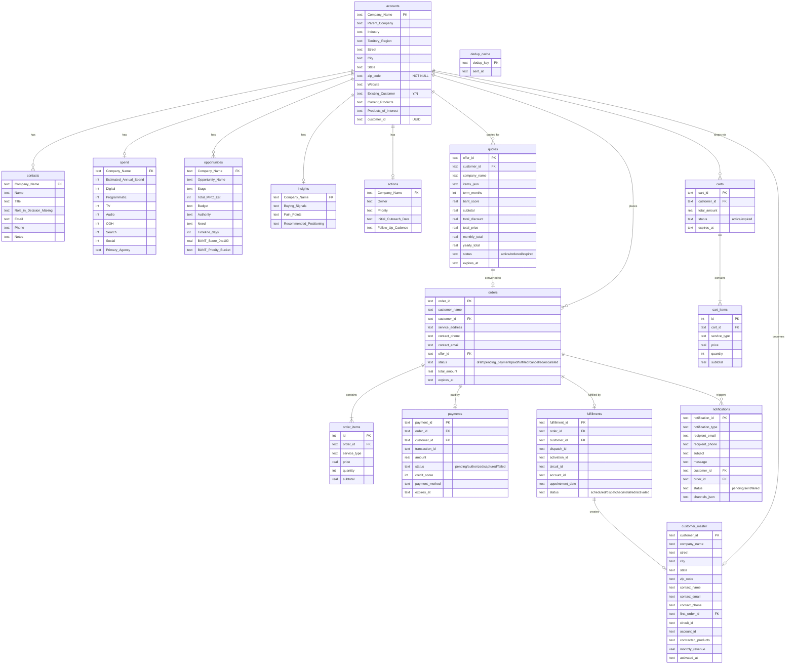

# B2B Conversational Sales Agent

A multi-agent orchestration system for end-to-end B2B telecom sales conversations, built on Google ADK with Gemini.

**Drexel University – Senior Design Project — Winter/Spring 2026**

---

## What This Project Is

This repository implements a **multi-agent orchestration system** — a hierarchical architecture where a central **SuperAgent** coordinates 10 specialized sub-agents to automate the full B2B telecom sales lifecycle, from initial prospect discovery through order fulfillment.

Built on **Google ADK (Agent Development Kit)** with **Google Gemini** as the backbone LLM, the system enforces a strict separation between:

- **LLM-driven reasoning** — intent classification, conversational routing, natural language generation
- **Deterministic tool execution** — database lookups, pricing calculations, address validation, payment processing

The LLM decides *what* to do; critical business data (addresses, prices, orders) is always sourced from deterministic tools, never hallucinated.

---

## Architecture


*Interactive version: open [architecture.html](./architecture.html) in your browser*

```
User → React Client → FastAPI → ADK Runner → SuperAgent → Sub-Agent → Tools → Infrastructure
```

Responses stream back to the browser via Server-Sent Events (SSE).

### Architectural Layers

```
┌─────────────────────────────────────────────────────────┐
│  PRESENTATION    React 19 + FastAPI (SSE Streaming)     │
├─────────────────────────────────────────────────────────┤
│  ORCHESTRATION   SuperAgent (Router + Session State)    │
├───────────┬───────────┬─────────────────────────────────┤
│ DISCOVERY │   CONFIG  │  TRANSACTION                    │
│ Discovery │ Service-  │ Order · Payment · Fulfillment   │
│ Greeting  │ ability   │ Customer Communications         │
│ FAQ       │ Product   │                                 │
│           │ Offer Mgmt│                                 │
├───────────┴───────────┴─────────────────────────────────┤
│  INFRASTRUCTURE  SQLite · GIS API · Pricing · Scheduler │
└─────────────────────────────────────────────────────────┘
```

### Design Principles

| Principle | Implementation |
|-----------|----------------|
| **Separation of concerns** | Each agent owns exactly one domain |
| **Zero-hallucination for critical data** | Addresses, prices, orders always come from deterministic tools |
| **Router-only orchestrator** | SuperAgent classifies intent and delegates — never generates user-facing text |
| **Temperature-stratified agents** | Conversational agents use temp 0.7; transactional agents use temp 0.0 |
| **Structured data contracts** | Tools return JSON (not prose) to prevent LLM rephrasing of critical values |
| **Importlib isolation** | Sub-agents loaded without triggering `__init__.py` to avoid ADK parent-binding conflicts |

### How Agents Communicate

```
User Message → SuperAgent (intent analysis)
                  │
                  ├─ transfer_to_agent("discovery_agent")
                  │       └─ Discovery calls tools → returns JSON → responds to user
                  │
                  ├─ transfer_to_agent("serviceability_agent")
                  │       └─ Serviceability validates address via GIS → responds
                  │
                  └─ transfer_to_agent("offer_management_agent")
                          └─ Offer Mgmt computes pricing → returns quote JSON
```

- **Delegation is ADK-native** — SuperAgent declares `sub_agents=[...]` and ADK handles the handoff
- **No custom protocol** — ADK's built-in delegation replaces A2A or message queues
- **Session state is shared** — all agents read/write to ADK's session context, enabling multi-turn flows
- **Chained handoffs** — after DiscoveryAgent registers a company, the orchestrator auto-routes to ServiceabilityAgent

---

## Agent Architecture

### Super Agent / Sub-Agent Hierarchy

The system implements a **hierarchical orchestration pattern** where a root SuperAgent delegates to 10 specialized sub-agents using ADK's native `sub_agents=[]` mechanism:

```
                         ┌─────────────────────┐
                         │     SuperAgent       │
                         │  (Root Orchestrator) │
                         │                      │
                         │  • Intent Analysis   │
                         │  • Routing Rules     │
                         │  • Session State     │
                         │  • Guardrails        │
                         └──────────┬───────────┘
                                    │
           ┌────────────────────────┼────────────────────────┐
           │                        │                        │
   ┌───────▼────────┐     ┌────────▼────────┐     ┌────────▼─────────┐
   │   DISCOVERY     │     │  CONFIGURATION  │     │   TRANSACTION    │
   │   CLUSTER       │     │  CLUSTER        │     │   CLUSTER        │
   ├─────────────────┤     ├─────────────────┤     ├──────────────────┤
   │ GreetingAgent   │     │ Serviceability  │     │ OrderAgent       │
   │  └ phone script │     │  Agent          │     │  └ carts, orders │
   │                 │     │  └ GIS/coverage  │     │                  │
   │ DiscoveryAgent  │     │                 │     │ PaymentAgent     │
   │  └ prospect DB  │     │ ProductAgent    │     │  └ credit, auth  │
   │                 │     │  └ catalog+RAG   │     │                  │
   │ FAQAgent        │     │                 │     │ ServiceFulfill.  │
   │  └ knowledge    │     │ OfferManagement │     │  └ scheduling    │
   │    base         │     │  └ pricing,     │     │  └ dispatch      │
   │                 │     │    quotes       │     │  └ activation    │
   │                 │     │                 │     │                  │
   │                 │     │                 │     │ CustomerComms    │
   │                 │     │                 │     │  └ notifications │
   └─────────────────┘     └─────────────────┘     └──────────────────┘
```

### Agent Registry

| Agent | Cluster | DB Tables Owned | Infrastructure |
|-------|---------|----------------|----------------|
| **SuperAgent** | Orchestrator | — (routes only) | ADK Runner |
| **GreetingAgent** | Discovery | — | Static content |
| **DiscoveryAgent** | Discovery | `accounts`, `contacts`, `spend`, `opportunities`, `insights`, `actions` | Unified SQLite |
| **FAQAgent** | Discovery | — | Knowledge base |
| **ServiceabilityAgent** | Configuration | — (stateless) | GIS API (mock) |
| **ProductAgent** | Configuration | — | JSON Catalog + ChromaDB |
| **OfferManagementAgent** | Configuration | `quotes` | Unified SQLite |
| **OrderAgent** | Transaction | `carts`, `cart_items`, `orders`, `order_items` | Unified SQLite |
| **PaymentAgent** | Transaction | `payments` | Unified SQLite + Payment Gateway |
| **ServiceFulfillmentAgent** | Transaction | `fulfillments`, `customer_master` | Unified SQLite + Scheduler |
| **CustomerCommunicationAgent** | Transaction | `notifications`, `dedup_cache` | Unified SQLite + SMTP |

### Agent Routing Priority

SuperAgent routes user messages in this priority order:

| Priority | Intent Pattern | Target Agent |
|----------|---------------|--------------|
| 1 | Company/business identification | DiscoveryAgent |
| 2 | Address validation, coverage check | ServiceabilityAgent |
| 3 | Product catalog, specs, SLA questions | ProductAgent |
| 4 | Pricing, quotes, discounts | OfferManagementAgent |
| 5 | Cart, checkout, order placement | OrderAgent |
| 6 | Payment, credit check | PaymentAgent |
| 7 | Installation, scheduling, activation | ServiceFulfillmentAgent |
| 8 | Send notification, show history | CustomerCommunicationAgent |
| 9 | Greetings ("Hi", "Hello") | GreetingAgent |
| 10 | Policy, SLA, general questions | FAQAgent |

---

## Unified Database Architecture

All agents share a **single SQLite database** (`sales_agent.db`) with WAL mode and foreign key enforcement. This replaces the earlier per-agent database design (separate `discover_prospecting_clean.db`, `orders.db`, `quotes.db`, `notifications.db`) with a consolidated schema of **17 tables across 7 domains**.

```
┌──────────────────────────────────────────────────────────────────────────┐
│                     sales_agent.db  (SQLite + WAL)                       │
├──────────────┬───────────┬───────────┬──────────┬────────┬──────────────┤
│  DISCOVERY   │   OFFER   │   ORDER   │ PAYMENT  │FULFILL │    COMMS     │
│  (6 tables)  │ (1 table) │ (4 tables)│(1 table) │(1 tbl) │  (2 tables)  │
│              │           │           │          │        │              │
│ accounts     │ quotes    │ carts     │ payments │fulfill-│ notifications│
│ contacts     │           │ cart_items│          │ ments  │ dedup_cache  │
│ spend        │           │ orders    │          │        │              │
│ opportunities│           │ order_    │          │        │              │
│ insights     │           │   items   │          │        │              │
│ actions      │           │           │          │        │              │
├──────────────┴───────────┴───────────┴──────────┴────────┴──────────────┤
│                 CUSTOMER DOMAIN (1 table — post-fulfillment only)        │
│                              customer_master                             │
└──────────────────────────────────────────────────────────────────────────┘
```

**Configuration:** Set `SALES_AGENT_DB_PATH` environment variable to override the default path (`SuperAgent/data/sales_agent.db`).

### Entity Relationship Diagram



### How Entities Are Updated Along the Sales Conversation

The table below maps each conversation stage to the database operations performed. Each row represents a user turn that triggers one or more agent actions:

| Stage | Conversation Trigger | Agent | Tables Written | Operation |
|-------|---------------------|-------|---------------|-----------|
| **1. Greeting** | "Hi, I need internet for my office" | GreetingAgent | — | No DB writes. Returns phone script. |
| **2. Discovery** | "We're VoiceStream Networks at 123 Main St, Boston" | DiscoveryAgent | `accounts` | **INSERT** new company record with address, zip code, customer_id (UUID). |
| | *(agent asks for contact info)* | DiscoveryAgent | `contacts` | **INSERT** contact with name, title, email (required), phone (required). |
| | *(agent runs BANT qualification)* | DiscoveryAgent | `opportunities`, `insights` | **INSERT** opportunity with BANT scores; **INSERT** buying signals and pain points. |
| **3. Serviceability** | "Yes, check if we're serviceable" | ServiceabilityAgent | — | No DB writes. Stateless GIS/coverage lookup returns available infrastructure. |
| **4. Product** | "Show me Fiber 5G specs" | ProductAgent | — | No DB writes. Catalog tools read from hardcoded `PRODUCT_CATALOG` dict; RAG (`search_product_knowledge`) reads from ChromaDB vector store for documentation-level questions only. |
| **5. Quote** | "Give me pricing for Fiber 5G + SD-WAN" | OfferManagementAgent | `quotes` | **INSERT** quote with offer_id, items_json, pricing breakdown, term, discounts, totals. Status: `active`. Expires in 30 days. |
| **6. Order** | "Proceed with this quote" | OrderAgent | `carts`, `cart_items`, `orders`, `order_items` | **INSERT** cart + cart items from quote. **INSERT** order + order items. **UPDATE** `quotes.status` → `ordered`. Order status: `pending_payment`. Expires in 48h. |
| **7. Payment** | "Process payment" | PaymentAgent | `payments`, `orders` | **INSERT** payment record with credit score, authorization. **UPDATE** `orders.status` → `paid`. |
| **8. Scheduling** | "Schedule installation" | ServiceFulfillmentAgent | `fulfillments` | **INSERT** fulfillment record with appointment date. Status: `scheduled`. |
| **9. Dispatch** | *(triggered by scheduling)* | ServiceFulfillmentAgent | `fulfillments` | **UPDATE** dispatch_id, status → `dispatched`. |
| **10. Installation** | *(technician completes)* | ServiceFulfillmentAgent | `fulfillments` | **UPDATE** status → `installed`. |
| **11. Activation** | "Activate service" | ServiceFulfillmentAgent | `fulfillments`, `customer_master`, `accounts`, `orders` | **UPDATE** fulfillment with circuit_id, account_id, status → `activated`. **INSERT** `customer_master` record. **UPDATE** `accounts.Existing_Customer` → `Y`. **UPDATE** `orders.status` → `fulfilled`. |
| **Cross-cutting** | *(after each lifecycle event)* | CustomerCommunicationAgent | `notifications`, `dedup_cache` | **INSERT** notification (order confirmation, payment receipt, install reminder, activation notice). **INSERT** dedup key to prevent duplicates. |

### Entity Lifecycle State Machines

```
Quote:      active ──→ ordered ──→ (done)
                 └──→ expired (TTL: 30 days)

Cart:       active ──→ (consumed by order)
                 └──→ expired (TTL: 24 hours)

Order:      draft ──→ pending_payment ──→ paid ──→ fulfilled
                 │                    └──→ cancelled (TTL: 48h)
                 └──→ escalated (stuck >7 days)

Payment:    pending ──→ authorized ──→ captured
                 └──→ failed

Fulfillment: scheduled ──→ dispatched ──→ installed ──→ activated

Account:    Existing_Customer=N ──→ Existing_Customer=Y (on activation)
```

### Table-to-Agent Access Matrix

| Table | Discovery | Offer | Order | Payment | Fulfillment | Comms | DB Lifecycle |
|-------|:---------:|:-----:|:-----:|:-------:|:-----------:|:-----:|:------------:|
| **accounts** | R/W | — | — | — | R/W | — | R |
| **contacts** | R/W | — | — | — | — | — | R |
| **spend** | R | — | — | — | — | — | — |
| **opportunities** | R | — | — | — | — | — | — |
| **insights** | R/W | — | — | — | — | — | — |
| **actions** | R | — | — | — | — | — | — |
| **quotes** | — | R/W | W | — | — | — | W |
| **carts** | — | — | R/W | — | — | — | W |
| **cart_items** | — | — | R/W | — | — | — | — |
| **orders** | — | — | R/W | R/W | R/W | — | R/W |
| **order_items** | — | — | R/W | — | R | — | — |
| **payments** | — | — | — | R/W | — | — | R |
| **fulfillments** | — | — | — | — | R/W | — | R |
| **customer_master** | — | — | — | — | W | — | R |
| **notifications** | — | — | — | — | — | R/W | — |
| **dedup_cache** | — | — | — | — | — | R/W | — |

> **R** = SELECT, **W** = INSERT/UPDATE. **DB Lifecycle** = background `cleanup_stale_records()` for TTL enforcement.

---

## Example Conversation Flows

### Discovery → Serviceability

```
User: "We're Crane.io at 123 Main St, Philadelphia PA"
  ↓ SuperAgent routes to DiscoveryAgent
  ↓ Discovery looks up company → adds to database (JSON)
  ↓ "Welcome! Would you like a serviceability check?"

User: "Yes"
  ↓ SuperAgent routes to ServiceabilityAgent
  ↓ Serviceability validates address via GIS API
  ↓ "✅ Serviceable with Fiber 1G/5G/10G"
```

### Product → Offer → Order

```
User: "Fiber 5G pricing with SD-WAN?"
  ↓ ProductAgent → Catalog lookup
  ↓ OfferAgent → Pricing calculation (JSON quote)
  ↓ "Quote #12345: $X,XXX/month"

User: "Proceed"
  ↓ OrderAgent → Create cart + order
  ↓ PaymentAgent → Credit check + authorization
  ↓ FulfillmentAgent → Schedule installation
  ↓ "Order confirmed! Install: Feb 20, 9 AM"
```

---

## 🗃️ RAG / ChromaDB Knowledge Base

The **ProductAgent** has **two independent data sources** — it is important to understand which is used when:

| Data Source | Tools | When Used |
|-------------|-------|-----------|
| **`PRODUCT_CATALOG` dict** (hardcoded in `product_tools.py`) | `get_product_by_id`, `list_available_products`, `compare_products`, `search_products_by_criteria`, `suggest_alternatives`, `get_best_value_product` | Product lookups, comparisons, filtering by speed/category |
| **ChromaDB vector store** (RAG) | `search_product_knowledge` | Documentation-level questions: SLA specifics, installation requirements, codec details, use-case fit |

> **Key nuance:** "Compare Fiber 1G vs 5G" or "Show me Fiber 5G details" → reads from the **hardcoded catalog dict**, NOT RAG. RAG is only invoked when the LLM determines the question needs documentation-level depth beyond the structured catalog (e.g., "What codec does Business Voice use?" or "Is coax suitable for a medical practice?").

### How RAG Works

When a customer asks a question like *"What is the uptime SLA for Business Fiber 10G?"* or *"Is coax suitable for a medical practice?"*, the ProductAgent calls the `search_product_knowledge` tool instead of a catalog tool. That tool performs a semantic similarity search over the vector store and returns the most relevant documentation chunks as context, which the agent uses to compose a grounded, accurate answer.

```
User question
  → ProductAgent decides: call search_product_knowledge()
  → Query encoded to 384-dim vector (sentence-transformers)
  → ChromaDB cosine similarity search → top 3 matching chunks
  → Formatted as [Source N: filename — section] context block
  → Agent reads context → composes natural-language response
```

### Initial Setup — Populate the Vector Store

```bash
pip install chromadb>=0.5.0 sentence-transformers>=2.7.0
cd ProductAgent
python scripts/ingest_knowledge.py
```

> **Note:** `ProductAgent/data/embeddings/` is in `.gitignore` — each developer runs ingestion locally after checkout. The embedding model (`all-MiniLM-L6-v2`, ~87MB) is auto-downloaded from HuggingFace on first run and cached at `~/.cache/huggingface/hub/`.

### RAG Pipeline — Detailed Flow

#### Files on Disk

```
ProductAgent/
├── data/
│   ├── product_docs/              ← 5 markdown knowledge files (858 lines total)
│   │   ├── fiber_internet.md      (SLAs, install process, use cases)
│   │   ├── coax_internet.md
│   │   ├── voice_services.md
│   │   ├── sd_wan.md
│   │   └── mobile_services.md
│   └── embeddings/                ← ChromaDB vector store output (3.2 MB, gitignored)
│       ├── chroma.sqlite3
│       └── <uuid>/                (HNSW binary vector data)
│
.hf_models/                        ← Embedding model (87 MB, gitignored, project root)
└── sentence-transformers/
    └── all-MiniLM-L6-v2/
        ├── model.safetensors      (neural network weights)
        ├── tokenizer.json         (WordPiece tokenizer)
        └── config.json            (architecture)
```

#### Local Development

1. **Model download** (one-time): `SentenceTransformer('all-MiniLM-L6-v2')` auto-downloads 87 MB to `~/.cache/huggingface/hub/` on first use
2. **Ingestion** (one-time or when docs change): `python ProductAgent/scripts/ingest_knowledge.py`
   - Reads `.md` files → splits by `##`/`###` headings → encodes chunks to 384-dim vectors → stores in ChromaDB
3. **Runtime**: First `search_product_knowledge()` call loads model from HF cache + opens ChromaDB. Subsequent calls reuse the singleton.

#### Docker / Cloud Run

1. **Build time**: `COPY ProductAgent/ ./ProductAgent/` brings pre-built embeddings. `COPY .hf_models/... /app/.hf_models/...` brings model files. **No Python/ingestion runs at build.**
2. **Runtime**: Model loads from `/app/.hf_models/all-MiniLM-L6-v2` (disk), ChromaDB opens from `/app/ProductAgent/data/embeddings/`. No network needed.

#### Why COPY Instead of RUN at Build Time?

Running `SentenceTransformer(...)` during `docker build` requires PyTorch initialization. On ARM Macs building linux/amd64 images via QEMU, this takes **10+ minutes**. COPY'ing raw files is instant.

| Step | Local Dev | Docker |
|------|-----------|--------|
| Model source | `~/.cache/huggingface/hub/` | `/app/.hf_models/all-MiniLM-L6-v2` (COPY'd) |
| Embeddings created | `python scripts/ingest_knowledge.py` | Never — COPY'd from local |
| Network needed | First model download only | Never |

### Embedding Model — Docker vs Local

The embedding model loading is environment-aware to avoid slow QEMU emulation during Docker builds:

| Environment | Model Source | Latency |
|-------------|-------------|---------|
| **Docker (Cloud Run)** | Pre-copied files at `/app/.hf_models/all-MiniLM-L6-v2` | 0s (COPY'd at build) |
| **Local dev** | HuggingFace cache (`~/.cache/huggingface/hub/`) | 0s (already cached) |
| **Fresh clone** | Auto-download from HuggingFace Hub | ~10s (one-time) |

**For Docker deployments:** The `.hf_models/` directory must exist locally (gitignored, 87MB). Set it up once:
```bash
mkdir -p .hf_models/sentence-transformers/all-MiniLM-L6-v2
cp -RLp ~/.cache/huggingface/hub/models--sentence-transformers--all-MiniLM-L6-v2/snapshots/*/* \
  .hf_models/sentence-transformers/all-MiniLM-L6-v2/
```

This avoids running Python/PyTorch under QEMU during `docker build` (which takes 10+ min on ARM Macs building linux/amd64 images).

---

## Sales Conversation Flow

Typical end-to-end flow:

1. **Discovery** — collect business/location context
2. **Serviceability** — verify address + infrastructure constraints
3. **Product** — recommend technically compatible products
4. **Offer Management** — compute quote JSON (pricing + discounts + totals)
5. **Order** — cart/checkout and contract creation
6. **Payment** — credit check + authorization
7. **Fulfillment** — schedule installation and activation
8. **Customer Comms** — confirmation and reminder notifications

---

## Technology Stack

| Layer | Technology |
|-------|-----------|
| Frontend | React 19 + Vite + Tailwind CSS |
| Backend | FastAPI + Python 3.12+ |
| Agent Framework | Google ADK 1.20.0+ |
| LLM | Gemini 3 Flash Preview (configured via `GEMINI_MODEL`) |
| Streaming | Server-Sent Events (SSE) |
| Database | SQLite (unified `sales_agent.db` — 17 tables, WAL mode) |
| Deployment | GCP Cloud Run |

---

## Repository Layout

```
ConversationalSalesAgent/
├── AGENTS.md                        # Complete architecture and standards guide
├── CLAUDE.md                        # Claude Code instructions
├── Scenarios.md                     # Test cases and conversation flows
├── GCP_DEPLOY.md                    # GCP Cloud Run deployment guide
├── Dockerfile                       # Multi-stage container build
├── entrypoint.sh                    # Container startup + GCS DB sync
├── SuperAgent/
│   ├── client/                      # React frontend
│   ├── server/                      # FastAPI backend
│   ├── super_agent/                 # ADK orchestrator + sub-agent wrappers
│   ├── start_servers.sh             # Local dev startup script
│   ├── start_cloud.sh               # Scale Cloud Run service up
│   ├── shutdown_cloud.sh            # Scale Cloud Run service to zero
│   └── deploy_cloud.sh              # Build, push, and redeploy to Cloud Run
├── DiscoveryAgent/
├── ServiceabilityAgent/
├── ProductAgent/
├── OfferManagement/
├── OrderAgent/
├── PaymentAgent/
├── ServiceFulfillmentAgent/
└── CustomerCommunicationAgent/
```

---

## Getting Started (Local)

### Prerequisites

- Python 3.12+
- Node.js 18+
- Gemini API key

### Using the Startup Script (Recommended)

```bash
# 1. Configure environment
cd SuperAgent/server
cp .env.example .env
# Edit .env: set GOOGLE_API_KEY and GEMINI_MODEL

# 2. Run both servers
cd ..
./start_servers.sh
```

The script auto-detects your `.venv`, cleans up stale processes on ports 8000 and 3000, starts the FastAPI backend and React frontend, and sets up per-agent log splitting.

- Frontend: `http://localhost:3000`
- Backend health: `http://localhost:8000/health`

### View Logs

```bash
tail -f SuperAgent/logs/backend.log
tail -f SuperAgent/logs/agents/discovery_agent.log
tail -f SuperAgent/logs/agents/serviceability_agent.log
```

### Stop Servers

```bash
pkill -9 -f 'uvicorn main:app'
pkill -9 -f 'vite'
```

### Manual Startup

```bash
# Backend
cd SuperAgent/server
pip install -e ..
cp .env.example .env
uvicorn main:app --reload --host 0.0.0.0 --port 8000

# Frontend (separate terminal)
cd SuperAgent/client
npm install
npm run dev
```

---

## GCP Cloud Run Deployment

See [GCP_DEPLOY.md](./GCP_DEPLOY.md) for the full deployment guide including:

- One-time GCP project setup (project, APIs, bucket, secrets, IAM)
- Building and pushing the Docker image
- Deploying to Cloud Run
- Day-to-day operations (`start_cloud.sh`, `shutdown_cloud.sh`, `deploy_cloud.sh`)
- Estimated cost (~$6–21/month with min-instances=0)

---

## Documentation

| File | Purpose |
|------|---------|
| [AGENTS.md](./AGENTS.md) | Complete multi-agent system guide and ADK standards |
| [SuperAgent/README.md](./SuperAgent/README.md) | Runtime, API reference, and orchestration details |
| [GCP_DEPLOY.md](./GCP_DEPLOY.md) | GCP Cloud Run deployment guide |
| [Scenarios.md](./Scenarios.md) | Test cases and end-to-end conversation flows |
| Each `<Agent>/AGENTS.md` | Individual agent documentation |
