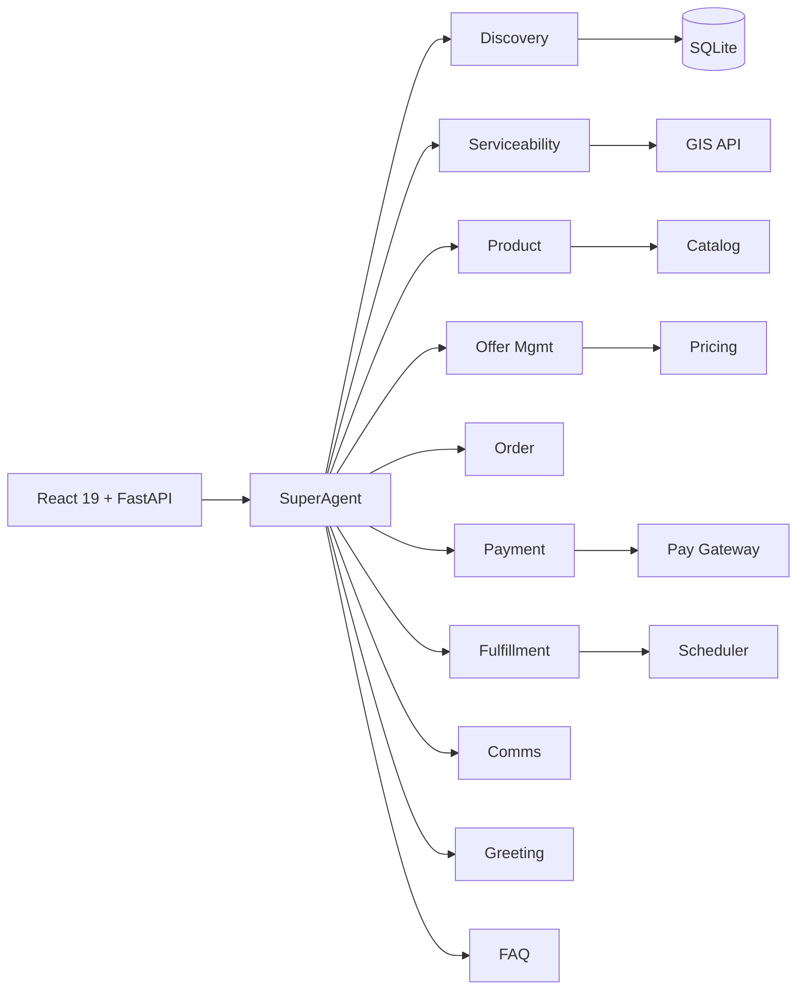
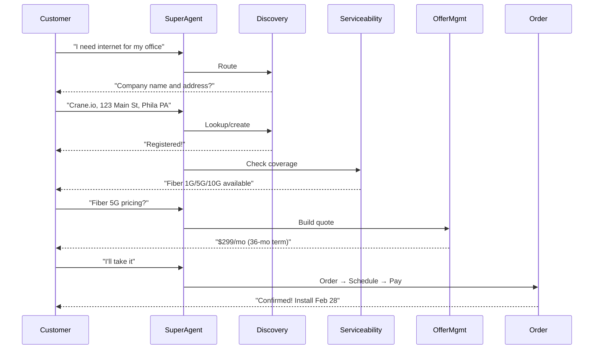

# B2B Conversational Sales Agent

### Senior Design — Winter Quarter Progress Report

<div class="pt-4 text-sm opacity-70">
Drexel University · March 4, 2026
</div>

<div class="abs-br m-6 text-xl">
  <a href="https://github.com/sudhamanc/ConversationalSalesAgent" target="_blank" class="slidev-icon-btn">
    <carbon:logo-github />
  </a>
</div>

---
transition: fade-out
---

# Team

| Member | Role | Key Contributions |
|--------|------|-------------------|
| **Sudhaman Chandrasekaran** | Agent Developer | SuperAgent orchestrator, OfferManagement, system integration, ADK architecture |
| **Raja (rgbarathan752)** | Agent Developer | ProductAgent, ServiceabilityAgent, OrderAgent, CustomerCommsAgent |
| **Arun Mohan** | Agent Developer | PaymentAgent, ServiceFulfillmentAgent |
| **Aubin** | Agent Developer | DiscoveryAgent (Prospect DB), Lead Generation Agent |

<br>

**GitHub:** [github.com/sudhamanc/ConversationalSalesAgent](https://github.com/sudhamanc/ConversationalSalesAgent)

---

# What is Multi-Agent Orchestration?

A system where **multiple specialized AI agents** collaborate under a **central orchestrator** — each agent owns one domain and reasons independently within it.

<v-clicks>

- **Not a chatbot with tools** — each agent has its own prompt, tools, and model config
- **Router-only orchestrator** — SuperAgent classifies intent and delegates, never answers directly
- **Deterministic execution** — critical data (addresses, prices, orders) comes from tools, not the LLM
- **Temperature stratification** — conversational agents at 0.7, deterministic agents at 0.0
- **Structured data contracts** — tools return JSON to prevent LLM hallucination across handoffs

</v-clicks>

---

# Project Overview

A **multi-agent orchestration system** for B2B telecom sales — 10 specialized agents coordinated by a SuperAgent to automate the full sales lifecycle.

<v-clicks>

- **Problem:** B2B telecom sales involves 8+ handoff steps, each requiring domain expertise
- **Solution:** 10 autonomous agents orchestrated by a SuperAgent using Google ADK
- **Stack:** Google Gemini LLM · Google ADK · FastAPI · React 19 · SQLite
- **Key insight:** Separate LLM reasoning (orchestration) from deterministic execution (tools/APIs)

</v-clicks>

---

# Architecture Diagram



---

# Conversation Flow



---

# Code: SuperAgent — The Root Orchestrator

The SuperAgent is the central brain. It routes every user message to the correct sub-agent.

```python {all|1-2|4-5|7-14|16-23|all}
from google.adk.agents import Agent
from google.genai import types

# All 10 sub-agents imported
from .sub_agents.discovery import discovery_agent
# ... (serviceability, product, offer, order, payment, fulfillment, comms, greeting, faq)

root_agent = Agent(
    name="super_sales_agent",
    model="gemini-2.0-flash",              # Google Gemini LLM
    instruction=ORCHESTRATOR_INSTRUCTION,   # Routing rules (see next slide)
    description="B2B Sales Orchestrator",
    sub_agents=[                            # ADK handles delegation natively
        discovery_agent, serviceability_agent, product_agent,
        offer_management_agent, payment_agent, order_agent,
        service_fulfillment_agent, customer_communication_agent,
        greeting_agent, faq_agent,
    ],
    generate_content_config=types.GenerateContentConfig(
        temperature=0.7,        # Creative for conversation
        top_p=0.9,              # Nucleus sampling
        top_k=40,               # Token selection breadth
        max_output_tokens=2048,
    ),
)
```

---
layout: two-cols
layoutClass: gap-8
---

# Code: Orchestrator Prompt (Routing Rules)

The SuperAgent's prompt defines **priority-ordered routing rules** — it acts purely as a router, never generating its own responses.

```python {all|3-5|7-10|12-15}
ORCHESTRATOR_INSTRUCTION = """
You are the central orchestrator for a 
B2B sales system. Your ONLY job is to 
route each request to the correct 
specialist sub-agent.

ROUTING RULES (priority order):
1. Company identification → discovery_agent
2. Address / coverage → serviceability_agent
3. Product specs → product_agent
4. Pricing / quotes → offer_management_agent
5. Cart / orders → order_agent
6. Payment → payment_agent
7. Installation → service_fulfillment_agent
8. Notifications → customer_communication_agent
9. Greetings → greeting_agent
10. FAQ → faq_agent

You MUST ALWAYS call transfer_to_agent.
You MUST NOT generate any text response.
"""
```

::right::

### Key Design Decisions

<v-clicks>

- **Router-only pattern** — SuperAgent never talks to the user directly
- **Priority ordering** — discovery before product, product before pricing
- **Automatic chaining** — after discovery → auto-route to serviceability
- **ADK delegation** — `transfer_to_agent` is an ADK-native function

</v-clicks>

---

# Code: Sub-Agent — Deterministic Agent Pattern

Sub-agents like ServiceabilityAgent use **temperature 0.0** for deterministic, tool-based responses.

```python {all|1-3|5-6|8-16|18-22|all}
from google.adk.agents import Agent
from google.genai import types
from .tools.gis_tools import check_service_availability

# Hardcoded name — never read from .env to avoid conflicts
GEMINI_MODEL = os.getenv("GEMINI_MODEL")

serviceability_agent = Agent(
    name="serviceability_agent",            # Hardcoded, not from env var
    model=GEMINI_MODEL,
    instruction=SERVICEABILITY_INSTRUCTION, # Domain-specific prompt
    description="PRE-SALE address validation & coverage check",
    tools=[
        validate_and_parse_address,         # Address parsing
        check_service_availability,         # GIS / coverage lookup
        get_infrastructure_by_technology,   # Tech-specific details
    ],
    generate_content_config=types.GenerateContentConfig(
        temperature=0.0,   # Deterministic — no hallucination
        top_p=0.1,         # Very focused sampling
        top_k=10,          # Minimal token variation
        max_output_tokens=2048,
    ),
)
```

---
layout: two-cols
layoutClass: gap-8
---

# Code: Tool Pattern (FunctionTool)

Tools are **deterministic functions** — no LLM calls inside them. They return **structured JSON** to prevent hallucination across agent handoffs.

```python {all|1-4|6-16|all}
# Tools return JSON, not prose text
# This prevents the LLM from rephrasing
# or hallucinating critical data like
# addresses and zip codes

def search_companies(
    company_name: str = None,
) -> str:
    """Search the prospecting database."""
    results = db.search_companies(company_name)
    return json.dumps({
        "found": len(results),
        "companies": [{
            "company_name": c['Company Name'],
            "address": {
                "street": c['Street'],
                "city": c['City'],
                "state": c['State'],
                "zip_code": c['zip_code']
            }
        } for c in results]
    })
```

::right::

### Why JSON Tool Outputs?

<v-clicks>

- **Problem:** LLMs rephrase text, changing digits
  - Tool returns `"19103"` → LLM says `"19106"`
- **Solution:** Structured JSON with explicit fields
- **Result:** Zero hallucination on addresses, prices, codes
- **Gemini** parses JSON from tools natively

</v-clicks>

<br>

### Temperature Guide

| Agent Type | Temp | Why |
|-----------|------|-----|
| SuperAgent | 0.7 | Conversational routing |
| Greeting/FAQ | 0.7 | Natural language |
| Serviceability | 0.0 | Deterministic lookup |
| Product | 0.0 | Catalog-exact data |
| Payment | 0.0 | Financial accuracy |

---

# Code: Importlib Isolation for Sub-Agents

**Problem:** ADK enforces one parent per agent. Importing a sub-agent normally triggers its `__init__.py`, binding it to the wrong parent.

```python {all|1-6|8-16|18-22|all}
# SuperAgent/super_agent/sub_agents/discovery/agent.py
# Loads DiscoveryAgent WITHOUT triggering its __init__.py

import importlib.util
import sys
import types as pytypes

# Stub parent packages to prevent __init__.py execution
for pkg_name in ["bootstrap_agent", "bootstrap_agent.sub_agents",
                  "bootstrap_agent.sub_agents.discovery"]:
    if pkg_name not in sys.modules:
        stub = pytypes.ModuleType(pkg_name)
        stub.__path__ = [os.path.join(DISCOVERY_BASE, *pkg_name.split("."))]
        sys.modules[pkg_name] = stub

# Load the agent module in isolation — fresh, unbound instance
agent_spec = importlib.util.spec_from_file_location(
    "bootstrap_agent.sub_agents.discovery.discovery_agent",
    os.path.join(DISCOVERY_PKG, "discovery_agent.py"),
)
agent_mod = importlib.util.module_from_spec(agent_spec)
agent_spec.loader.exec_module(agent_mod)

discovery_agent = agent_mod.discovery_agent  # Fresh instance for SuperAgent
```

---

# Progress Made — Winter Quarter

<div class="grid grid-cols-2 gap-6">
<div>

### Completed (Weeks 1–9)

| Component | Status |
|-----------|--------|
| React 19 + Vite Chat UI | ✅ Done |
| FastAPI + SSE Backend | ✅ Done |
| SuperAgent Orchestrator | ✅ Done |
| DiscoveryAgent + SQLite DB | ✅ Done |
| ServiceabilityAgent + GIS | ✅ Done |
| ProductAgent + Catalog | ✅ Done |
| OfferManagement + Pricing | ✅ Done |
| OrderAgent + Cart/Contracts | ✅ Done |
| PaymentAgent + Credit Check | ✅ Done |
| ServiceFulfillmentAgent | ✅ Done |
| CustomerCommsAgent | ✅ Done |
| GreetingAgent + FAQAgent | ✅ Done |

</div>
<div>

### Key Milestones

<v-clicks>

- **Feb 2** — Repo created, README, architecture docs
- **Feb 7** — BootStrapAgent template, MilestonePlan
- **Feb 10** — SuperAgent + FastAPI + SSE + React UI
- **Feb 11** — DiscoveryAgent with SQLite prospect DB
- **Feb 13** — Serviceability + Product agents integrated
- **Feb 15** — Multi-turn coordination: instruction chaining + JSON data integrity pattern
- **Feb 17** — Payment + Service Fulfillment integrated
- **Feb 21** — Offer Management, Order, Comms agents
- **Feb 26** — Full 10-agent orchestration working
- **40+ commits** across the team

</v-clicks>

</div>
</div>

---

# Progress vs. Initial Goals — Honest Accounting

<div class="grid grid-cols-2 gap-6">
<div>

### Ahead of Schedule ✅

- All **10 agents** built and integrated (goal was 6–7 by end of Winter)
- Full **end-to-end sales flow** working (was a Spring goal)
- **Multi-turn coordination** pattern developed and tested
- **React UI with SSE streaming** — real-time agent responses
- **Structured JSON tool outputs** — solved cross-agent hallucination

</div>
<div>

### Remaining / Deferred to Spring ⬜

- ChromaDB / RAG for product Q&A (replaced by in-repo catalog — simpler, works well)
- Agent-to-Agent (A2A) protocol — using ADK native delegation instead
- Observability dashboard — logging infrastructure is in place but no UI
- Persistent quote/order databases — currently in-memory
- Edge case handling & comprehensive error recovery
- Full integration testing across all 6 sales scenarios

</div>
</div>

<br>

> **Overall assessment:** We are **ahead of the original milestone plan** for Winter Quarter. All core agents are functional. The Spring Quarter focus shifts to hardening, persistence, observability, and the final demo.

---

# Research & Background

### What the work is based on

<v-clicks>

- **Google ADK (Agent Development Kit)** — discovered through Google Cloud AI documentation; ADK's native multi-agent delegation was the key architectural choice
- **Google Gemini API** — first-class integration with ADK; `gemini-2.0-flash` chosen for speed/cost balance
- **Telecom domain knowledge** — team members work at Comcast, giving direct familiarity with B2B sales workflows, serviceability checks, product catalogs, and fulfillment pipelines
- **Academic research** — reviewed LLM multi-agent patterns (ReAct, Chain-of-Thought), decided on hierarchical orchestration over sequential pipelines
- **Senior colleagues at Comcast** — provided guidance on realistic sales scenarios and data modeling for the prospect database
- **AI Agent Catalog** — surveyed 50+ agent frameworks before selecting ADK (see `docs/AI_AGENT_CATALOG.md`)

</v-clicks>

---

# How the Code Was Written

### Human + AI Collaboration

<v-clicks>

- **Architecture & design decisions** — made by the team (humans), based on ADK documentation and telecom domain expertise
- **AI-assisted coding** — GitHub Copilot and Claude were used for:
  - Boilerplate generation (ADK agent scaffolding, FastAPI endpoints)
  - Debugging importlib isolation issues
  - Writing comprehensive prompt instructions
  - Database schema design and migration scripts
- **Human-written core logic** — routing rules, tool implementations, agent coordination strategies, and integration testing
- **All code reviewed** by team members before merging
- **4 commits attributed to "Claude"** and **3 to "copilot-swe-agent"** out of 40+ total — AI was a tool, not the author

</v-clicks>

<br>

> We believe in transparent attribution. AI tools accelerated development significantly but every design decision and integration was human-driven.

---

# Who Did What

<div class="grid grid-cols-2 gap-4">
<div>

### Sudhaman Chandrasekaran
- SuperAgent orchestrator + routing logic
- OfferManagementAgent pricing engine
- FastAPI server + SSE streaming
- Integration of all 10 sub-agents
- Multi-turn coordination strategy
- Documentation (AGENTS.md, CLAUDE.md)
- **38 commits** (as Sudhaman / Sudha)

### Raja (rgbarathan752)
- ProductAgent with catalog data
- ServiceabilityAgent + GIS tools
- OrderAgent cart management
- CustomerCommsAgent notifications
- **20 commits**

</div>
<div>

### Arun Mohan
- PaymentAgent — credit checks & authorization
- ServiceFulfillmentAgent — scheduling & activation
- Payment gateway integration
- **4 commits**

### Aubin
- DiscoveryAgent — prospect database (SQLite)
- Lead Generation Agent — BANT qualification
- Database schema & migration scripts
- Company data seeding
- **10 commits**

</div>
</div>

---

# Tech Stack Summary

| Layer | Technology | Purpose |
|-------|-----------|---------|
| **LLM** | Google Gemini 2.0 Flash | Autonomous reasoning, intent analysis |
| **Agent Framework** | Google ADK 1.20+ | Multi-agent orchestration, tool integration |
| **Backend** | Python 3.12 + FastAPI | Agent logic, REST + SSE streaming |
| **Frontend** | React 19 + Vite + Tailwind | Chat UI with real-time message display |
| **Database** | SQLite | Prospect data, order storage |
| **Agent Communication** | ADK Sub-Agent Delegation | Native inter-agent routing (no custom protocol) |
| **AI Assistants** | GitHub Copilot, Claude | Development acceleration |

---
layout: center
class: text-center
---

# Questions?

**GitHub:** [github.com/sudhamanc/ConversationalSalesAgent](https://github.com/sudhamanc/ConversationalSalesAgent)

<div class="pt-8 text-sm opacity-60">
Drexel University · Senior Design · Winter Quarter 2026
</div>
