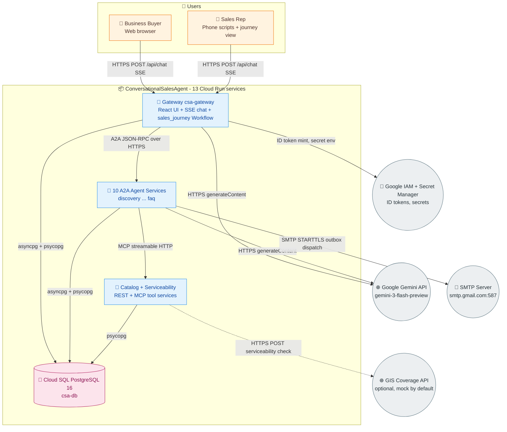
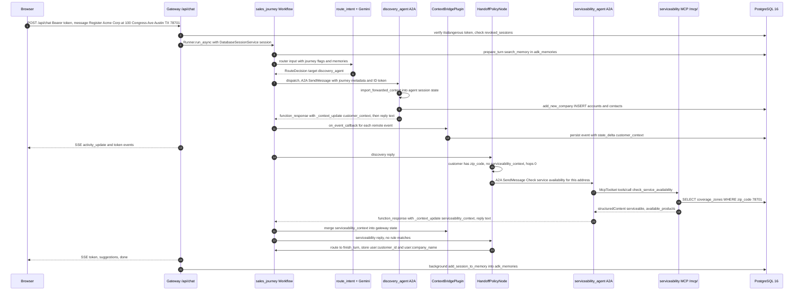
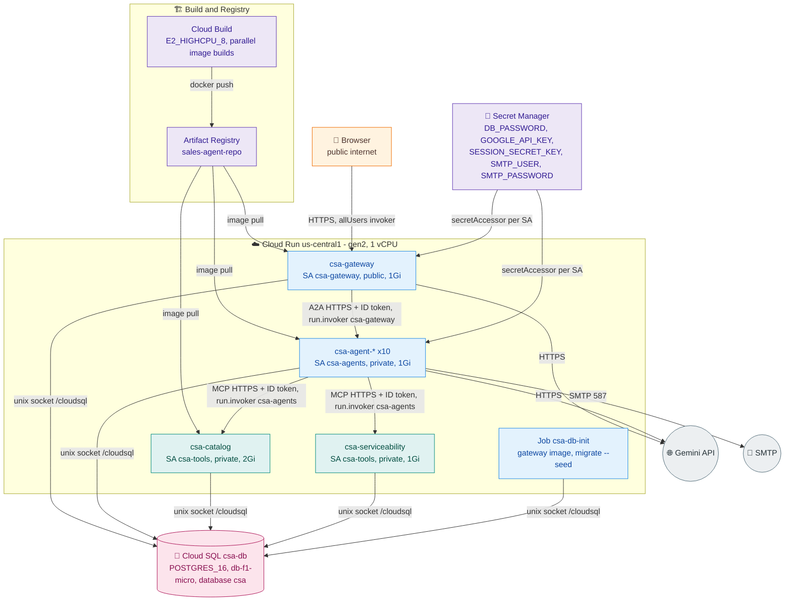

# ConversationalSalesAgent Architecture Brief

> **Scope:** Target architecture after the ADK 2.x / A2A / MCP rewrite (openspec changes `adk2-workflow-orchestration`, `a2a-agent-services`, `catalog-serviceability-mcp`, `multi-service-scripts`). The baseline single-container design is summarized in [Architecture Evolution](#architecture-evolution).

## Table of Contents

- [Overview](#overview)
  - [Architecture Evolution](#architecture-evolution)
- [Problem Definitions & Business Context](#problem-definitions--business-context)
  - [Problem Statement](#problem-statement)
  - [Business Context](#business-context)
  - [Architectural Drivers](#architectural-drivers)
- [C4 System Context Diagram](#c4-system-context-diagram)
- [System Overview](#system-overview)
  - [C4 Container Diagram](#c4-container-diagram)
  - [C4 Container Diagram Explanation](#c4-container-diagram-explanation)
  - [Request Flow Sequence](#request-flow-sequence)
  - [Technology Stack](#technology-stack)
- [System Data Models](#system-data-models)
  - [Data Model ER Diagram](#data-model-er-diagram)
  - [Data Model Explanation](#data-model-explanation)
- [API Endpoints](#api-endpoints)
  - [Core API Routes](#core-api-routes)
- [Deployment Architecture](#deployment-architecture)
  - [Local Deployment](#local-deployment)
  - [GCP Cloud Run Deployment](#gcp-cloud-run-deployment)
- [Known Architectural Risks](#known-architectural-risks)
- [Document Metadata](#document-metadata)

## Overview

ConversationalSalesAgent is a B2B conversational sales assistant for a broadband/telecom provider. A business buyer, or an inside-sales rep reading generated phone scripts, chats with one React web UI. Behind it, a Google ADK 2.x system walks the prospect through the full quote-to-activation journey:

1. **Greeting** and product overview (`greeting_agent`)
2. **Discovery**: company lookup/registration, contacts, BANT qualification (`discovery_agent`)
3. **Serviceability**: address validation and network coverage (`serviceability_agent` over the serviceability MCP server)
4. **Product**: catalog lookup, comparison, RAG over product documents (`product_agent` over the catalog MCP server)
5. **Offer management**: deterministic pricing, bundle/term/BANT discounts, quotes (`offer_management_agent`)
6. **Order**: cart, order creation, contract generation (`order_agent`)
7. **Service fulfillment**: installation scheduling, equipment, activation (`service_fulfillment_agent`)
8. **Payment**: credit check, payment method, authorization, invoicing (`payment_agent`)
9. **Customer communication**: notification outbox dispatch and history (`customer_communication_agent`)
10. **FAQ**: policies, SLAs, support topics (`faq_agent`)

The system is now a set of **13 independently deployable services plus PostgreSQL**:

- **Gateway** (`SuperAgent/`): FastAPI, the built React UI, and the ADK 2.x `sales_journey` **Workflow graph**. Per turn it runs `prepare_turn`, an LLM router (`route_intent`, structured `RouteDecision` output), `dispatch`, one remote agent node, and a deterministic `HandoffPolicyNode`. It is the only public service.
- **10 A2A agent services**: each domain agent is an ADK `Agent` exposed with `to_a2a(...)` through `sales_common.a2a_server.create_a2a_app`. Each publishes an Agent Card at `/.well-known/agent-card.json` and keeps its own ADK sessions and A2A tasks in PostgreSQL.
- **2 REST + MCP tool services** (`services/catalog`, `services/serviceability`): deterministic tools served both as a FastAPI REST API under `/api/v1` and as an MCP `MCPServer` at `/mcp/` (streamable HTTP).
- **PostgreSQL 16**: the single system of record, holding business tables, the notification outbox, catalog and coverage data, ADK sessions, A2A tasks, and long-term memory.

All business-critical values (addresses, prices, IDs, coverage) come from deterministic tools backed by PostgreSQL or ChromaDB, never from free LLM generation. LLM judgment is limited to intent routing and each agent's conversational replies.

### Architecture Evolution

| Concern | Baseline (commit `b3cb18a`) | Target (this brief) |
|---|---|---|
| Deployment unit | One container (`Dockerfile` + `entrypoint.sh`), one Cloud Run instance | 13 Cloud Run services + Cloud Run job `csa-db-init`; `docker-compose.yml` locally |
| Agent coupling | `importlib` isolation wrappers in `SuperAgent/super_agent/sub_agents/*`, 7 `sys.modules` cross-calls | One A2A service per agent; the gateway calls agents only through `RemoteA2aAgent`; no cross-package imports |
| Orchestration | ADK 1.x root `LlmAgent` with `transfer_to_agent`, 3 `after_agent_callback` handoff hacks, synthetic "Proceed to payment" re-run | ADK 2.10 `Workflow` graph with an LLM router node and a data-driven `HandoffPolicyNode` |
| Data store | Shared SQLite `sales_agent.db`, synced to GCS | PostgreSQL 16 (Cloud SQL), versioned migrations `db/migrations/001-004`, seeds in `db/seed/` |
| Sessions and auth | `InMemorySessionService`, in-memory token registry | `DatabaseSessionService` on PostgreSQL; stateless `itsdangerous` signed tokens with a `revoked_sessions` table |
| Memory and context | None | `PostgresMemoryService` (`adk_memories`, full-text search), event compaction, Gemini context caching |
| Catalog and coverage | Python dicts duplicated in ProductAgent, OfferManagement and ServiceabilityAgent | `products` and `coverage_zones` tables behind REST + MCP services |
| Cross-agent notifications | Direct in-process calls into CustomerCommunicationAgent | Transactional outbox in `notifications`, dispatched by the communication service |
| Service-to-service security | Not applicable (single process) | Private Cloud Run services; Google-signed ID tokens and `roles/run.invoker` |

## Problem Definitions & Business Context

### Problem Statement

**Business problems (unchanged by the rewrite):**

- **Slow, fragmented B2B sales cycles.** Qualifying a business prospect, checking address serviceability, pricing a multi-product bundle, and booking installation normally span several teams and systems: CRM, GIS, pricing engine, order management, scheduling and billing.
- **Hallucination risk in LLM sales assistants.** A single general-purpose LLM invents prices, speeds, ZIP codes and order IDs, but sales commitments must be exact.
- **Monolithic prompts do not scale.** One agent holding every tool suffers from prompt bloat and poor intent separation. Each domain, such as pricing or fulfillment, needs its own rules and owners.

**Why the rewrite was needed (baseline limitations):**

- **Monolith scaling limits.** All ten agents were loaded into one Python process and shipped as one image. No agent could be deployed or scaled on its own, and Cloud Run was pinned to a single instance.
- **SQLite as the shared store.** Nineteen tables in one SQLite file had cross-domain writes (Payment to `orders`, Fulfillment to `orders`/`accounts`, Order to `quotes`). The file was persisted by periodic GCS sync, which is last-writer-wins, loses data on crash, and cannot support more than one instance.
- **`importlib` coupling.** Isolation wrappers and seven `sys.modules` cross-calls tied agents together at import time. When a module was absent the calls failed silently, and Payment and Fulfillment fell back to in-memory simulation.
- **In-memory sessions.** `InMemorySessionService`, the token registry and journey state were lost on every restart and could not be shared across instances.
- **Fragile orchestration.** An LLM-only coordinator plus three `after_agent_callback` handoff hacks and a synthetic server-side "Proceed to payment" re-run made handoffs non-deterministic.
- **Duplicated reference data.** The 16-SKU catalog was copied in three agents, and the coverage data lived in a Python dict. No non-agent client could reuse either.

### Business Context

- **Primary Users**
  - Business buyers (SMB and enterprise IT or operations contacts) self-serving via web chat
  - Inside-sales reps using generated phone scripts (`greeting_agent`) and the journey sidebar
  - Demo and evaluation audiences (the academic "Game Day" demo, which uses mock data only)
  - Internal systems that can now reuse the catalog and serviceability REST/MCP services
- **Use Cases**
  - Identify or register a company and qualify it with a BANT score
  - Validate a service address and show available infrastructure, speeds and SKUs
  - Browse and compare products (Fiber 1G/5G/10G, Coax, Voice, SD-WAN, Mobile) and search product knowledge
  - Generate a discounted quote, build a cart, place an order, and generate a contract
  - Schedule installation, process payment, activate service, and send notifications
  - Resume a conversation after a gateway restart or on another instance, and recall a returning browser's company
- **Non-Functional Requirements**
  - **Accuracy:** zero hallucination for deterministic data (tools plus structured JSON; temperature 0.0 for the router and transactional agents)
  - **Streaming UX:** SSE event contract (`token`, `activity_update`, `structured_card`, `cart_update`, `suggestions`, `done`, `error`) is unchanged for the React client
  - **Durability:** sessions, A2A tasks, memory and business data live in PostgreSQL, and any gateway instance can serve any session
  - **Scalability:** every service is stateless apart from PostgreSQL and scales independently on Cloud Run (scale-to-zero by default)
  - **Security:** only the gateway is public; tools and agents require Google ID tokens; secrets are held in Secret Manager; Gemini safety settings are `BLOCK_LOW_AND_ABOVE` on four harm categories; the rate limit is 20 req/min and 200 req/hr per session
  - **Cost:** Cloud SQL `db-f1-micro`, services scale to zero, and `shutdown_cloud.sh` pauses the stack
  - **Compliance:** not PCI-DSS compliant; mock PII only
- **Integration Points** (implemented programmatic integrations only)
  - **Google Gemini API** via ADK / `google-genai` (`GOOGLE_API_KEY`, `GEMINI_MODEL` with no default), called by the gateway router, the suggestion generator, and all 10 agents
  - **SMTP** (default `smtp.gmail.com:587`, STARTTLS) from the communication service's outbox dispatcher when `SMTP_ENABLED=true`; otherwise delivery is simulated
  - **Cloud SQL for PostgreSQL 16** through the `/cloudsql/<connection>` Unix socket, used by all 13 services and the `csa-db-init` job
  - **Optional upstream GIS API** (`POST {GIS_API_URL}/serviceability/check`, Bearer `GIS_API_KEY`) from the serviceability service when `USE_MOCK_DATA=false`; the default is the seeded `coverage_zones` table
  - **Google metadata server / IAM** to mint ID tokens for service-to-service calls (`SERVICE_AUTH=gcp_id_token`)

### Architectural Drivers

| Driver | Design response |
|---|---|
| Exact business data | Deterministic tools returning JSON dicts; REST and MCP share one `core.py` per tool service |
| Independent deploy and scale per domain | One A2A service per agent (`create_a2a_app`), one Dockerfile each, `scripts/services.conf` manifest |
| Deterministic handoffs | `HandoffPolicyNode` rules evaluated on gateway state; the LLM is used only for intent classification |
| Remote agents cannot return state | `_context_update` envelopes on tool results, merged by `ContextBridgePlugin` |
| Durable, horizontally scalable state | PostgreSQL for sessions (`DatabaseSessionService`), tasks (`DatabaseTaskStore`) and memory |
| One source of truth for SKUs and coverage | `products` and `coverage_zones` tables behind the catalog and serviceability services |
| No cross-service imports | Notification outbox and `sales_common.repositories` replace the `sys.modules` calls |
| Least-privilege cloud access | Three service accounts, `roles/run.invoker` graph, per-secret `secretAccessor` |

## C4 System Context Diagram

**Legend:** orange = people, blue = this system's services, pink = datastore, grey = external services. The dashed edge is disabled by default (`USE_MOCK_DATA=true`). Only the gateway is reachable from the internet; agents and tools require a Google-signed ID token.

## System Overview

### C4 Container Diagram

```mermaid
graph TD
    BROWSER["👤 Browser<br/>React 19 SPA"]

    subgraph GWBOX ["🎯 Gateway csa-gateway :8000 - SuperAgent/"]
        API["FastAPI server<br/>/api/session, /api/chat SSE, /health"]
        WF["sales_journey Workflow<br/>prepare_turn, dispatch, finish_turn"]
        ROUTER["route_intent<br/>LlmAgent, RouteDecision schema"]
        HP["HandoffPolicyNode<br/>deterministic handoff rules"]
        CB["ContextBridgePlugin<br/>merges _context_update"]
    end

    subgraph AGENTBOX ["🤖 A2A Agent Services :8201-8210 - to_a2a + DatabaseSessionService, each calls Gemini"]
        DISC["discovery_agent :8201"]
        SVCA["serviceability_agent :8202"]
        PROD["product_agent :8203"]
        OFFER["offer_management_agent :8204"]
        ORDER["order_agent :8205"]
        PAY["payment_agent :8206"]
        FUL["service_fulfillment_agent :8207"]
        COMM["customer_communication_agent :8208<br/>+ outbox dispatcher"]
        GREET["greeting_agent :8209"]
        FAQ["faq_agent :8210"]
    end

    subgraph TOOLBOX ["🧰 REST + MCP Tool Services"]
        CAT["catalog :8101<br/>/api/v1 + /mcp/, ChromaDB RAG"]
        SVC["serviceability :8102<br/>/api/v1 + /mcp/, address + coverage"]
    end

    PG[("💾 PostgreSQL 16<br/>business tables, products, coverage_zones,<br/>sessions, events, a2a_tasks, adk_memories")]
    GEMINI(("🌐 Gemini API"))
    SMTP(("📧 SMTP"))
    GIS(("🌐 GIS API<br/>optional"))

    BROWSER -->|HTTPS POST /api/chat, SSE stream| API
    API -->|Runner.run_async| WF
    WF -->|router input| ROUTER
    ROUTER -->|HTTPS generateContent| GEMINI
    WF -->|A2A JSON-RPC| DISC & SVCA & PROD & OFFER & ORDER
    WF -->|A2A JSON-RPC| PAY & FUL & COMM & GREET & FAQ
    WF -->|agent reply| HP
    CB -->|state_delta| WF
    SVCA -->|MCP streamable HTTP| SVC
    PROD -->|MCP streamable HTTP| CAT
    SVC -.->|HTTPS| GIS
    COMM -->|SMTP STARTTLS| SMTP
    API -->|asyncpg sessions, psycopg tokens| PG
    DISC & OFFER & ORDER & PAY & FUL & COMM -->|psycopg tools, asyncpg sessions| PG
    SVCA & PROD & GREET & FAQ -->|asyncpg sessions, a2a_tasks| PG
    CAT & SVC -->|psycopg| PG

    classDef user fill:#fff3e0,stroke:#ef6c00,color:#4e342e
    classDef gateway fill:#e3f2fd,stroke:#1e88e5,color:#0d47a1
    classDef agent fill:#ede7f6,stroke:#5e35b1,color:#311b92
    classDef tool fill:#e0f2f1,stroke:#00897b,color:#004d40
    classDef database fill:#fce4ec,stroke:#ad1457,color:#880e4f
    classDef external fill:#eceff1,stroke:#546e7a,color:#263238
    class BROWSER user
    class API,WF,ROUTER,HP,CB gateway
    class DISC,SVCA,PROD,OFFER,ORDER,PAY,FUL,COMM,GREET,FAQ agent
    class CAT,SVC tool
    class PG database
    class GEMINI,SMTP,GIS external
```

**Legend:** orange = user, blue = gateway components, violet = A2A agent services, teal = REST + MCP tool services, pink = PostgreSQL, grey = external. The dashed edge is used only when `USE_MOCK_DATA=false`.

### C4 Container Diagram Explanation

**Gateway (`SuperAgent/`, Cloud Run `csa-gateway`, the only public service)**

- `server/main.py` serves the built React client from `client/dist`, the session and chat APIs, and `/health`. On startup it fails fast when `GEMINI_MODEL` or `SESSION_SECRET_KEY` is missing, runs migrations when `RUN_MIGRATIONS=true`, and starts an hourly `sales_common.maintenance.cleanup_stale_records()` task (expire quotes and carts, cancel timed-out orders, escalate stuck paid orders).
- `server/runtime.py` builds one ADK `Runner` with the gateway `App`, a `DatabaseSessionService` (`postgresql+asyncpg://`) and a `PostgresMemoryService`.
- `super_agent/workflow.py` defines the `sales_journey` graph: `START -> prepare_turn -> (fast: dispatch | llm: route_intent -> dispatch) -> <agent node> -> handoff_policy -> (serviceability_agent | payment_agent | end -> finish_turn)`.
  - `prepare_turn` records the message, resets `handoff_hops`, searches memory, and builds a compact router input (`last_agent`, a 400-character reply excerpt, journey flags, memories, company name). Pure greetings take the fast path with no LLM call.
  - `route_intent` is an `Agent(mode="single_turn", output_schema=RouteDecision, include_contents="none")` at temperature 0 with a cache-friendly `static_instruction`.
  - `dispatch` validates the target against `registry.AGENTS` (unknown targets fall back to `faq_agent`) and writes `last_agent` and `a2a_outbound_message`.
  - `HandoffPolicyNode` (a `google.adk.workflow.Node` subclass) applies two data rules with at most 2 hops. After `discovery_agent`, when a customer has a ZIP code but no matching `serviceability_context`, it routes to `serviceability_agent`. After `service_fulfillment_agent`, when `appointment_confirmed_order` is set, payment is not done and the order is payable, it routes to `payment_agent`.
  - `finish_turn` stores `user:customer_id` and `user:company_name` for returning browsers.
- `super_agent/agent.py` wraps the graph in an ADK `App` (`sales_common.adk_app.build_app`). It enables `EventsCompactionConfig` (interval 8, overlap 2, 60k-token threshold, retain 10 events) and `ContextCacheConfig` (10 intervals, TTL 1800 s, min 4096 tokens), and registers the `ContextBridgePlugin`.
- The domain nodes are `RemoteA2aAgent`s built by `sales_common.a2a_client.remote_agent`. Each resolves its card from `AGENT_URL_<NAME>` + `/.well-known/agent-card.json`, forwards the gateway session id as the A2A context id, and sends only `a2a_outbound_message` as the message. Journey context, transcript and user profile travel as A2A request metadata.

**A2A agent services (10 private Cloud Run services `csa-agent-*`)**

- Every `server.py` is `app = create_a2a_app(root_agent)`. That call builds the ADK `App` (compaction + cache), a `Runner` with `DatabaseSessionService`, an a2a-sdk `DatabaseTaskStore` (table `a2a_tasks`), and the `to_a2a(...)` Starlette app with the agent card derived from `PUBLIC_URL`, plus `GET /healthz`.
- Every agent attaches `before_agent_callback=import_forwarded_context`, which copies the forwarded journey keys, `journey_transcript` and `user_profile` into its own session state. It also attaches `after_tool_callback=export_context_delta`, which appends `_context_update` to tool results that changed a journey key.
- **Tool placement:**
  - Six agents run deterministic tools in-process against PostgreSQL through `sales_common.db` (psycopg pool): discovery, offer management, order, payment, service fulfillment, and customer communication.
  - `serviceability_agent` and `product_agent` hold no tools. They consume the tool services through `McpToolset` (streamable HTTP, 15 s timeout, 300 s tool-list cache).
  - `greeting_agent` and `faq_agent` are prompt-only.
- `customer_communication_agent` also runs the outbox dispatcher in its lifespan. Every `NOTIFY_POLL_SECONDS` (default 10) it claims `notifications` rows with `status='pending'` using `FOR UPDATE SKIP LOCKED`, de-duplicates them via `dedup_cache`, and sends email by SMTP or simulates delivery.

**REST + MCP tool services (private `csa-catalog`, `csa-serviceability`)**

- Each service has the layers `app.py` (FastAPI `/api/v1`), `mcp_server.py` (`MCPServer` mounted at `/mcp` with `stateless_http=True`, `json_response=True`), `core.py` (pure functions returning pydantic models), and `repository.py` (psycopg).
- **catalog:** 8 MCP tools over the `products` table plus ChromaDB RAG (`all-MiniLM-L6-v2` embeddings, index baked into the image).
- **serviceability:** 6 MCP tools over `coverage_zones`, address validation and normalization, and an optional GIS client.

**PostgreSQL 16** is the single system of record: migration-managed business tables, ADK-created session tables, and a2a-sdk task storage. Table ownership is documented in `db/README.md`.

### Request Flow Sequence

Critical use case: **company registration with an automatic serviceability handoff in one turn.**

**Flow notes:**

- Steps 7 and 16 are separate A2A calls. The remote context id is the gateway session id, so each agent keeps one stable remote session per gateway session.
- Remote agents cannot return `state_delta` across A2A. Their `function_response` parts carry `_context_update`, and `ContextBridgePlugin` writes it into the gateway event's `state_delta` before `HandoffPolicyNode` reads state.
- `api/sse.py` (`EventMapper`) emits `token` only for events authored by domain agents and de-duplicates repeated final texts per author. `activity_update`, `cart_update` and `structured_card` payloads are derived from tool responses.
- Retryable Gemini errors (`429`, `503`) are retried up to 3 times (2 s, 5 s, 10 s) when no domain event has been seen yet. Otherwise the client receives a service-specific `error` event followed by `done`.

### Technology Stack

**Runtime & Languages:**

- Python 3.12 (`python:3.12-slim` images; `requires-python >=3.11`)
- Google ADK 2.10.0 (`google-adk[a2a,mcp,db]==2.10.0`): `Workflow`, `Node`, `App`, `RemoteA2aAgent`, `to_a2a`, `McpToolset`, `DatabaseSessionService`
- a2a-sdk 1.2 (JSON-RPC server/client, `DatabaseTaskStore`)
- mcp 2.2 (`mcp.server.mcpserver.MCPServer`, streamable HTTP transport)
- FastAPI (>=0.115; 0.141 in the dev venv) with uvicorn, and pydantic 2
- google-genai 2.x (router and suggestion generation), httpx
- React 19, Vite 6, Tailwind CSS 3.4 (built in a Node 20 stage of the gateway image)

**Data Storage:**

- PostgreSQL 16 (`postgres:16` locally; Cloud SQL `POSTGRES_16`, `db-f1-micro`, instance `csa-db`)
- SQLAlchemy 2.1 + asyncpg 0.31 + greenlet 3 for ADK sessions, A2A tasks and memory
- psycopg 3.3 + psycopg_pool for deterministic tools, migrations and token revocation
- ChromaDB 1.5 persistent index at `CHROMA_PATH` (catalog service only)

**Infrastructure:**

- Docker: one image per service, built from the repository root; non-root user `10001`
- Google Cloud Run (gen2, 1 vCPU; 1 GiB, or 2 GiB for catalog), 13 services + Cloud Run job `csa-db-init`
- Cloud SQL, Secret Manager, Artifact Registry (`sales-agent-repo`), Cloud Build (`E2_HIGHCPU_8`)
- Docker Compose (local), `scripts/*.sh` driven by `scripts/services.conf`

**AI/ML Services:**

- Google Gemini (`GEMINI_MODEL`, default in scripts `gemini-3-flash-preview`) for the router and all 10 agents
- sentence-transformers `all-MiniLM-L6-v2` embeddings on CPU-only PyTorch (catalog image only)
- ADK context compaction, Gemini context caching, and `PostgresMemoryService` full-text memory

**Monitoring & Security:**

- Python logging to stdout (Cloud Logging) with a `[service]` prefix; masked DB URLs; delegation audit log in `ContextBridgePlugin`
- `/health` and `/healthz` endpoints (503 when PostgreSQL is unreachable) used by compose health checks
- Browser sessions: `itsdangerous.URLSafeTimedSerializer` signed tokens (`{sid, uid}`, 60 min default) and a `revoked_sessions` table
- Service-to-service: Google-signed ID tokens (`SERVICE_AUTH=gcp_id_token`, cached 55 min) with Cloud Run `roles/run.invoker`
- Per-session in-memory token-bucket rate limit (20/min, 200/h, burst 5), CORS allow-list, Gemini safety settings

## System Data Models

### Data Model ER Diagram

One PostgreSQL 16 database (`csa`) holds four groups of tables:

- the migration-managed sales schema (`001_sales_schema.sql`, 19 tables)
- the catalog (`002_catalog.sql`)
- platform tables (`003_platform.sql`)
- coverage (`004_coverage.sql`)

Library-created tables sit beside them: ADK `sessions`, `events`, `app_states`, `user_states` and `adk_internal_metadata`, plus a2a-sdk `a2a_tasks`. The diagram shows the core entities. `spend`, `insights`, `actions`, `payment_rate_limit`, `app_states` and `adk_internal_metadata` are omitted for readability.

```mermaid
erDiagram
    accounts {
        text company_name PK "column Company Name"
        text customer_id "CUST id, indexed"
        text zip_code
        text industry "column Industry"
        text existing_customer
        text created_at "ISO-8601 TEXT"
    }
    contacts {
        text company_name FK "column Company Name"
        text name
        text email
        text role_in_decision_making
    }
    opportunities {
        text company_name FK
        text stage
        float bant_score_0to100
        text bant_priority_bucket
    }
    quotes {
        text offer_id PK
        text customer_id
        text items_json "JSON line items"
        float total_price
        float monthly_total
        text status "active, ordered, expired"
        text expires_at "created plus 30 days"
    }
    carts {
        text cart_id PK
        text customer_id
        float total_amount
        text status
        text expires_at "created plus 24 h"
    }
    cart_items {
        bigint id PK
        text cart_id FK
        text service_type "SKU id"
        float price
        int quantity
    }
    orders {
        text order_id PK
        text customer_id
        text offer_id FK
        text status "draft, pending_payment, paid, cancelled, escalated"
        float total_amount
        text expires_at "created plus 48 h"
    }
    order_items {
        bigint id PK
        text order_id FK
        text service_type
        float subtotal
    }
    payments {
        text payment_id PK
        text order_id FK
        text idempotency_key UK
        float amount
        text status "initiated, processing, completed, failed"
        int credit_score
    }
    payment_events {
        text event_id PK
        text payment_id FK
        text from_status
        text to_status
    }
    customer_payment_methods {
        text method_id PK
        text customer_id
        text token UK "tokenized, no PAN"
        text last_four
    }
    fulfillments {
        text fulfillment_id PK
        text order_id FK
        text appointment_date
        text circuit_id
        text status "scheduled, dispatched, activated"
    }
    customer_master {
        text customer_id PK
        text company_name
        text first_order_id FK
        text contracted_products "JSON list"
        float monthly_revenue
    }
    notifications {
        text notification_id PK "NTF id"
        text notification_type
        text recipient_email
        text metadata_json "JSON template and args"
        text customer_id
        text order_id
        text status "pending, sent, simulated, failed"
        int attempts
    }
    dedup_cache {
        text dedup_key PK
        text sent_at
    }
    products {
        text product_id PK "uppercase SKU"
        text product_name
        text category
        text technology
        text speeds "JSONB"
        text features "JSONB"
        boolean available
        float unit_price "NUMERIC 10,2 internal only"
        text family
    }
    coverage_zones {
        text zip_code PK "5 digits"
        text city
        text state
        boolean serviceable
        text infrastructure_type
        text infrastructure "JSONB"
        int max_speed_mbps
        text available_products "JSONB SKU ids"
    }
    sessions {
        varchar app_name PK
        varchar user_id PK "web:uuid4"
        varchar id PK
        text state "JSON session state"
        datetime update_time
    }
    events {
        varchar id PK
        varchar app_name FK
        varchar user_id FK
        varchar session_id FK
        varchar invocation_id
        text event_data "JSON content and actions"
        datetime timestamp
    }
    user_states {
        varchar app_name PK
        varchar user_id PK
        text state "JSON user scope keys"
    }
    adk_memories {
        bigint id PK
        text app_name
        text user_id
        text session_id
        text event_id "unique per app and user"
        text text
        text tsv "TSVECTOR, GIN index"
    }
    revoked_sessions {
        text session_id PK
        datetime revoked_at
    }
    a2a_tasks {
        varchar id PK
        varchar context_id "gateway session id"
        text status "JSON TaskStatus"
        text history "JSON messages"
        text artifacts "JSON"
    }

    accounts ||--o{ contacts : "has"
    accounts ||--o{ opportunities : "qualified by"
    accounts ||--o{ quotes : "customer_id logical ref"
    quotes ||--o{ orders : "converted to"
    carts ||--o{ cart_items : "contains"
    orders ||--o{ order_items : "contains"
    orders ||--o{ payments : "paid by"
    payments ||--o{ payment_events : "audited by"
    accounts ||--o{ customer_payment_methods : "customer_id logical ref"
    orders ||--o{ fulfillments : "fulfilled by"
    orders ||--o| customer_master : "first order activates"
    orders ||--o{ notifications : "order_id outbox rows"
    products }o--o{ coverage_zones : "SKU ids in available_products"
    products }o--o{ quotes : "SKU ids in items_json"
    sessions ||--o{ events : "has"
    sessions }o--|| user_states : "shares user scope"
    sessions ||--o{ adk_memories : "saved to memory"
    sessions ||--o| revoked_sessions : "revoked by"
    sessions ||--o{ a2a_tasks : "context_id per agent"
```

### Data Model Explanation

**Table ownership (writer services, from `db/README.md`):**

| Tables | Owner | Other writers (to be removed by `mcp-remaining-domains`) |
|---|---|---|
| `accounts`, `contacts`, `spend`, `opportunities`, `insights`, `actions` | `discovery_agent` | `service_fulfillment_agent` (`accounts`) |
| `quotes` | `offer_management_agent` | `order_agent` (status via `sales_common.repositories.quotes.mark_ordered`), gateway maintenance (expiry) |
| `carts`, `cart_items`, `orders`, `order_items` | `order_agent` | `payment_agent`, `service_fulfillment_agent` (`orders.status`), gateway maintenance |
| `payments`, `payment_events`, `payment_rate_limit`, `customer_payment_methods` | `payment_agent` | none |
| `fulfillments`, `customer_master` | `service_fulfillment_agent` | none |
| `notifications`, `dedup_cache` | `customer_communication_agent` (dispatcher) | all producers insert `pending` rows (outbox) |
| `products` | catalog service | none |
| `coverage_zones` | serviceability service | none |
| `adk_memories`, `revoked_sessions` | gateway | none |
| `sessions`, `events`, `app_states`, `user_states`, `a2a_tasks` | every agent service + gateway | rows keyed by app name |

**Data flow and formats:**

- **Sales schema.** It was ported mechanically from SQLite:
  - `?` placeholders became `%s`
  - `INSERT OR REPLACE` became `ON CONFLICT`
  - identity columns replaced `AUTOINCREMENT`
  - timestamps stay ISO-8601 `TEXT`
  - Discovery keeps quoted legacy column names such as `"Company Name"`

  Most cross-domain links are logical (`customer_id`, `company_name`). The declared foreign keys are: `cart_items`/`order_items` to their parents, `orders.offer_id` to `quotes`, `payments`/`fulfillments` to `orders`, `payment_events` to `payments`, and `customer_master.first_order_id` to `orders`. A partial unique index (`uq_payments_order`) allows only one `processing`/`completed` payment per order.
- **Notification outbox.** Offer, order, payment, fulfillment and gateway maintenance call `sales_common.notifications.enqueue(...)` inside their own business transaction. It inserts a `notifications` row with `status='pending'` and `metadata_json = {"template": <type>, "args": {...}}`. The communication service's dispatcher claims pending rows with `FOR UPDATE SKIP LOCKED`, renders them with its own templates, and marks them `sent`, `simulated` or `failed`. `dedup_cache` suppresses duplicate sends.
- **Catalog and coverage.** `products` (16 SKUs) and `coverage_zones` (one row per ZIP) are seeded from `db/seed/002_catalog.sql` and `db/seed/003_coverage.sql`, which were generated from the legacy Python dicts. JSONB holds speeds, features, infrastructure, and available SKU lists. `unit_price` and `family` are internal and are never disclosed by the catalog API.
- **Vector data.** Product documents in `services/catalog/data/product_docs/*.md` are embedded with `all-MiniLM-L6-v2` into a persistent ChromaDB index. The index is baked into the catalog image, read-only, and served by `search_product_knowledge` and `GET /api/v1/knowledge/search`.
- **ADK sessions and state.** Each service's `DatabaseSessionService` keys sessions by `(app_name, user_id, id)`. In the gateway, `user_id` is `web:<csa_uid>` from the browser's localStorage, and `id` is the server-generated session id. Agent services key their own sessions by A2A context id, which is the gateway session id.
- **Journey context state keys (gateway session scope):**
  - the five shared journey keys `customer_context`, `serviceability_context`, `offer_context`, `order_context` and `payment_context`, forwarded to agents as A2A metadata and returned through `_context_update`
  - workflow bookkeeping keys `turn_user_message`, `handoff_hops`, `last_agent`, `last_reply`, `transcript` (at most 2,000 characters), `a2a_outbound_message`, `appointment_confirmed_order` and `installation_scheduled_order`
  - user-scope keys `user:customer_id` and `user:company_name` (stored in `user_states`, visible to later sessions of the same browser)
  - agent-side keys `journey_transcript`, `user_profile` and `gateway_session_id`, written by `import_forwarded_context`
- **Long-term memory.** After each completed turn the gateway calls `PostgresMemoryService.add_session_to_memory` in the background. It upserts non-partial text events into `adk_memories`, de-duplicated on `(app_name, user_id, event_id)`. `prepare_turn` searches memory with `websearch_to_tsquery` ranking over the generated `tsv` column (GIN index), always filtered by `(app_name, user_id)` and limited to 5 results.
- **Migrations.** `python -m sales_common.migrate --seed` applies `db/migrations/*.sql` and `db/seed/*.sql` in lexical order, one transaction per file, under a PostgreSQL advisory lock. Applied files are recorded in `schema_migrations` and `seed_versions`.

## API Endpoints

### Core API Routes

**Public API Endpoints (gateway `csa-gateway`, `--allow-unauthenticated`):**

- `POST /api/session` - Create a session. Optional body `{"client_id": "<uuid4>"}`; returns `{session_id, token}` and creates the ADK session (USER_FACING)
- `DELETE /api/session` - Revoke the caller's session (`Authorization: Bearer <token>`); inserts into `revoked_sessions` (USER_FACING)
- `POST /api/chat` - SSE chat turn. Body `{"message": "..."}` with a maximum of 4,000 characters, plus the Bearer token; streams `token`, `activity_update`, `structured_card`, `cart_update`, `suggestions`, `done` and `error` events. Returns 401 on a bad token and 429 on rate limit (USER_FACING)
- `GET /health` (alias `GET /healthz`) - Liveness plus a PostgreSQL ping; 503 when degraded (USER_FACING / ops)
- `GET /api/session/health` - Session API liveness (USER_FACING / ops)
- `GET /api/debug/session` - The caller's own ADK session state; available only when `DEBUG=true` and requires the Bearer token (developer only)
- `POST /api/client-log` - Browser console forwarding to `logs/frontend.log` (Bearer token required, rate-limited, control characters stripped; `LOG_DIR` overrides the directory)
- `GET /assets/*`, `GET /{path}` - Built React SPA (`client/dist`)

**Internal API Endpoints: A2A agent services (private, `roles/run.invoker` for `csa-gateway` SA):**

Every agent service built by `create_a2a_app` exposes the same three routes:

- `GET /.well-known/agent-card.json` - Agent Card: name, description, skills, and the RPC URL derived from `PUBLIC_URL` (SYSTEM_INTERNAL)
- `POST /` - A2A JSON-RPC 2.0 endpoint (`SendMessage` / `SendStreamingMessage` / `GetTask`, plus the legacy `message/send` aliases). Request metadata carries `journey.context`, `journey.session_ref`, `journey.transcript` and `journey.user_profile` (SYSTEM_INTERNAL)
- `GET /healthz` - 200 or 503 depending on the PostgreSQL ping (SYSTEM_INTERNAL)

| A2A agent name | Service | Local port | Tool surface |
|---|---|---|---|
| `discovery_agent` | `csa-agent-discovery` | 8201 | In-process PostgreSQL tools: `search_companies`, `get_company_profile`, `add_new_company`, `add_new_contact`, BANT qualification |
| `serviceability_agent` | `csa-agent-serviceability` | 8202 | `McpToolset` from `SERVICEABILITY_MCP_URL` |
| `product_agent` | `csa-agent-product` | 8203 | `McpToolset` from `CATALOG_MCP_URL` |
| `offer_management_agent` | `csa-agent-offer` | 8204 | In-process pricing tools (`generate_offer_quote`, `find_best_bundle_offer`, `get_quote_details`) |
| `order_agent` | `csa-agent-order` | 8205 | Cart and order tools |
| `payment_agent` | `csa-agent-payment` | 8206 | Credit, payment and billing tools |
| `service_fulfillment_agent` | `csa-agent-fulfillment` | 8207 | Scheduling, equipment, installation and activation tools |
| `customer_communication_agent` | `csa-agent-communication` | 8208 | Notification tools + outbox dispatcher |
| `greeting_agent` | `csa-agent-greeting` | 8209 | None (prompt-only) |
| `faq_agent` | `csa-agent-faq` | 8210 | None (prompt-only) |

**Data Processing: catalog service (`csa-catalog`, private, invoker `csa-agents` SA):**

- `GET /api/v1/products?category=` - List available products (category aliases accepted)
- `GET /api/v1/products/search?speed=&technology=` - Numeric speed and technology search
- `GET /api/v1/products/best-value?category=` - Highest-throughput product in a category (no budget parameter: pricing is not disclosed by the catalog)
- `GET /api/v1/categories` - Product categories
- `POST /api/v1/products/compare` - Compare 2 to 5 products; names the fastest
- `GET /api/v1/products/ID` - Product detail by case-insensitive id; never includes price fields
- `GET /api/v1/products/ID/alternatives?criteria=` - Alternative products
- `GET /api/v1/knowledge/search?q=&top_k=` - ChromaDB RAG passages (`available: false` when the index is down)
- `POST /mcp/` - MCP streamable HTTP (stateless, JSON responses) with 8 tools: `list_available_products`, `get_product_by_id`, `search_products_by_criteria`, `get_product_categories`, `compare_products`, `suggest_alternatives`, `get_best_value_product`, `search_product_knowledge`
- `GET /healthz`

**Data Processing: serviceability service (`csa-serviceability`, private, invoker `csa-agents` SA):**

- `POST /api/v1/addresses/validate` - Parse and validate a free-form US address
- `POST /api/v1/addresses/normalize` - Normalize a structured address
- `POST /api/v1/serviceability/check` - Coverage lookup from `coverage_zones`, or the GIS API when `USE_MOCK_DATA=false`; returns `serviceable`, infrastructure, `max_speed_mbps` and `available_products`
- `GET /api/v1/infrastructure/TECHNOLOGY?zone=` - Infrastructure details by technology (`zone` is documented as ignored)
- `GET /api/v1/coverage-zones` - Coverage zone summary
- `POST /mcp/` - MCP streamable HTTP with 6 tools: `validate_and_parse_address`, `normalize_address`, `extract_zip_code`, `check_service_availability`, `get_infrastructure_by_technology`, `get_coverage_zones`
- `GET /healthz`

**Authentication & User Management:**

- **Browser to gateway:** `Authorization: Bearer <itsdangerous URLSafeTimedSerializer token>` over `{sid, uid}` with salt `csa-session-v1` and a maximum age of `SESSION_TOKEN_EXPIRY_MIN` (default 60). The token is verifiable by any gateway instance and is rejected when its `sid` is in `revoked_sessions`.
- **Service to service:** with `SERVICE_AUTH=gcp_id_token`, `sales_common.auth` attaches a Google-signed ID token whose audience is the target base URL. It is applied through the `ServiceAuth` httpx auth flow on `RemoteA2aAgent` (card fetch and JSON-RPC) and the `header_provider` on `McpToolset`. With `SERVICE_AUTH=none` (local compose), no credentials are sent.

**AI/ML Integration:**

- `POST https://generativelanguage.googleapis.com/.../models/GEMINI_MODEL:generateContent` (and streaming) - Router, suggestions and all agents via ADK / google-genai, with HTTP retries of 3 attempts and a 2 s initial delay (EXTERNAL)
- Gemini context caching (`cachedContents`) for stable `static_instruction` prefixes of at least 4,096 tokens (EXTERNAL)

## Deployment Architecture

`scripts/services.conf` is the single service manifest (`name|dir|module|port|kind|cloud_run_name|a2a_name|mcp_deps`). `start_local.sh`, `stop_local.sh` and `deploy_cloud.sh` iterate it in dependency order (tools, then agents, then gateway), and `docker-compose.yml` mirrors it. Every image builds from the repository root on `python:3.12-slim` with `pip install ./libs/sales_common ./<ServiceDir>`, runs as non-root user `10001`, and starts `uvicorn <module>:app --port ${PORT}`. The gateway image adds a Node 20 stage for the React build and bundles `db/` so it can run migrations. The catalog image adds CPU-only PyTorch, pre-stages `all-MiniLM-L6-v2`, and builds the Chroma index at build time.

### Local Deployment

| Mode | Command | Topology |
|---|---|---|
| Containers | `cp .env.example .env && docker compose up --build` | `postgres:16` (volume `pgdata`), one-shot `db-init` (`python -m sales_common.migrate --seed` in the gateway image), `catalog` :8101, `serviceability` :8102, 10 agents :8201-8210, `gateway` :8000. All run on the private bridge network `csa` with `SERVICE_AUTH=none`; only the gateway port is published. Health checks poll `/healthz`, and the gateway waits for all agents to be healthy. |
| Native processes | `scripts/setup_local.sh` then `scripts/start_local.sh [--only ...]` | venv with editable installs, migrations + seed, services started in manifest order against `DATABASE_URL`, Vite dev UI on :3000. Logs go to `logs/<name>.log` and PIDs to `logs/pids/`. `stop_local.sh` kills only recorded PIDs. |
| Database ops | `scripts/db.sh migrate / seed / reset --yes` | `reset` requires `--yes` |
| Verification | `pytest tests/integration` with `TEST_DATABASE_URL` | `test_local_stack.py` starts 2 tools + 10 agents + gateway as processes on ports 18xxx with real PostgreSQL, A2A and MCP, and a scripted fake LLM. It asserts agent cards, MCP tools, and that journey context crosses A2A back into the gateway session. |

### GCP Cloud Run Deployment

**One-time setup (`scripts/setup_gcp.sh [--dry-run]`):**

- Enables the run, artifactregistry, secretmanager, sqladmin, cloudbuild and iam APIs.
- Creates the Artifact Registry repo `sales-agent-repo` and the Cloud SQL PostgreSQL 16 instance `csa-db` (`db-f1-micro`, ENTERPRISE edition) with database and user `csa`.
- Creates secrets:
  - `DB_PASSWORD` and `SESSION_SECRET_KEY` are generated
  - `GOOGLE_API_KEY` is prompted with hidden input
  - `SMTP_USER` and `SMTP_PASSWORD` are optional
- Creates the service accounts `csa-gateway`, `csa-agents` and `csa-tools`.

**Deploy (`scripts/deploy_cloud.sh [--only ...] [--dry-run] [--tag ...]`):**

1. One parallel Cloud Build pushes every selected image to Artifact Registry.
2. The Cloud Run job `csa-db-init` runs `python -m sales_common.migrate --seed` (gateway image, 600 s timeout, no retries).
3. The tool services deploy first; their URLs are read back with `gcloud run services describe`.
4. The agents deploy with `CATALOG_MCP_URL` / `SERVICEABILITY_MCP_URL` (`<url>/mcp/`), `GEMINI_MODEL` and `PUBLIC_URL`. New services get a second `services update` pass once their URL is known.
5. The gateway deploys with `AGENT_URL_<NAME>` for each agent, `ALLOWED_ORIGINS`, `RUN_MIGRATIONS=false` and `GATEWAY_MIN_INSTANCES` (default 0).

All services get `--add-cloudsql-instances`, `DATABASE_URL` on the `/cloudsql/<conn>` socket without a password (libpq and asyncpg read `PGPASSWORD`, injected from secret `DB_PASSWORD`), `SERVICE_AUTH=gcp_id_token`, `--timeout=300` and `--min-instances=0`.

**IAM invoker graph and secrets:**

| Principal | `roles/run.invoker` on | `roles/cloudsql.client` | Secrets (`secretAccessor`) |
|---|---|---|---|
| `allUsers` | `csa-gateway` (removed by `shutdown_cloud.sh`) | none | none |
| `csa-gateway` SA | 10 `csa-agent-*` services | yes | `DB_PASSWORD`, `GOOGLE_API_KEY`, `SESSION_SECRET_KEY` |
| `csa-agents` SA | `csa-catalog`, `csa-serviceability` | yes | `DB_PASSWORD`, `GOOGLE_API_KEY`, `SMTP_USER`, `SMTP_PASSWORD` |
| `csa-tools` SA | none | yes | `DB_PASSWORD` |

**Pause and resume:** `scripts/shutdown_cloud.sh` removes the public `allUsers` invoker from the gateway and sets the Cloud SQL activation policy to `NEVER`. `scripts/start_cloud.sh` reverses both. Cloud Run services scale to zero on their own.

## Known Architectural Risks

| # | Risk | Impact | Mitigation / follow-up |
|---|---|---|---|
| 1 | **Shared database schema.** One PostgreSQL database; cross-domain writes remain (Payment and Fulfillment update `orders`, Fulfillment updates `accounts`, Order updates `quotes`) | Schema changes couple services; no per-service isolation or independent scaling of data | Ownership is documented in `db/README.md`; single-writer APIs are planned in `mcp-remaining-domains`, then per-service databases |
| 2 | **ID generation (resolved).** `ORD-`, `CUST-`, `CART-`, `INV-` and `PLAN-` ids used salted `hash() % 1000` | Fixed: `sales_common.ids.new_id` (random 32-bit suffix) for ids; `stable_number` (SHA-256) for the simulated credit score | Regression tests in `OrderAgent/tests` and `PaymentAgent/tests` |
| 3 | **Per-instance rate limit.** The token bucket in `middleware/rate_limiter.py` is in memory | The effective limit multiplies with gateway instances, and counters reset on restart | Move to a shared store (PostgreSQL or Memorystore) or Cloud Armor rate limiting |
| 4 | **RAG model download at build time.** The catalog image pulls CPU PyTorch and `all-MiniLM-L6-v2` from external indexes during `docker build` | Builds depend on PyPI, the PyTorch index and Hugging Face availability; the image is large and needs 2 GiB | Vendor the model into an internal artifact or bucket (`EMBEDDING_MODEL_PATH` already supports pre-staged files) |
| 5 | **Experimental ADK 2.x features.** The design relies on `Workflow`/`Node`, event compaction, context caching, `to_a2a`, and the `RemoteA2aAgent` `context_builder` and metadata provider | Upgrades may change behaviour; `RemoteA2aAgent` ignores node input, which required the `a2a_outbound_message` workaround | Pin `google-adk==2.10.0`; unit and integration tests cover the workflow, `App` config and the A2A round trip |
| 6 | **Remaining in-process domain tools.** Discovery, offer, order, payment, fulfillment and communication tools still run inside LLM agent containers; OfferManagement keeps its own `PRODUCT_PRICE_BOOK` | No reuse by non-agent clients; price drift versus `products.unit_price` | Planned change `mcp-remaining-domains`: `crm`, `pricing`, `orders`, `payments`, `fulfillment` and `notifications` REST + MCP services |
| 7 | **Latency and cold starts.** Each turn adds a router LLM call and one to three A2A hops, and each agent opens an MCP session. 13 services scale to zero | First-turn latency after idle; slower multi-hop turns | Greeting fast path, context caching, `min-instances` configurable for the gateway, single region |
| 8 | **Outbox delay and context envelope.** Notifications wait up to `NOTIFY_POLL_SECONDS`. `_context_update` is visible to the agent's model | Delayed emails; slight prompt noise | 10 s default poll; the key is documented as internal in agent instructions |
| 9 | **`POST /api/client-log` (resolved)** previously accepted unauthenticated writes | Fixed: requires a session token, has its own per-session rate limit, strips control characters | Regression tests in `SuperAgent/tests/test_api.py` |

## Document Metadata

| Field | Value |
|---|---|
| Document | ConversationalSalesAgent Architecture Brief |
| Scope | Target architecture after ADK 2.x / A2A / MCP rewrite (openspec changes `adk2-workflow-orchestration`, `a2a-agent-services`, `catalog-serviceability-mcp`, `multi-service-scripts`) |
| Baseline | Single container, SQLite, `importlib` isolation, ADK 1.x (commit `b3cb18a`); see [Architecture Evolution](#architecture-evolution) |
| Sources analysed | `openspec/changes/*`, `docs/agent-service-guide.md`, `libs/sales_common/`, `SuperAgent/super_agent/`, `SuperAgent/server/`, `services/catalog/`, `services/serviceability/`, the 10 agent directories, `db/migrations/001-004`, `db/README.md`, `scripts/`, `docker-compose.yml`, Dockerfiles, `tests/integration/test_local_stack.py` |
| Generated with | `architecture-brief` skill v0.5.2 |
| Date | 2026-09-30 |
| Related | `AGENTS.md`, `GCP_DEPLOY.md`, `db/README.md`, `docs/agent-service-guide.md`, `openspec/changes/mcp-remaining-domains/` |
