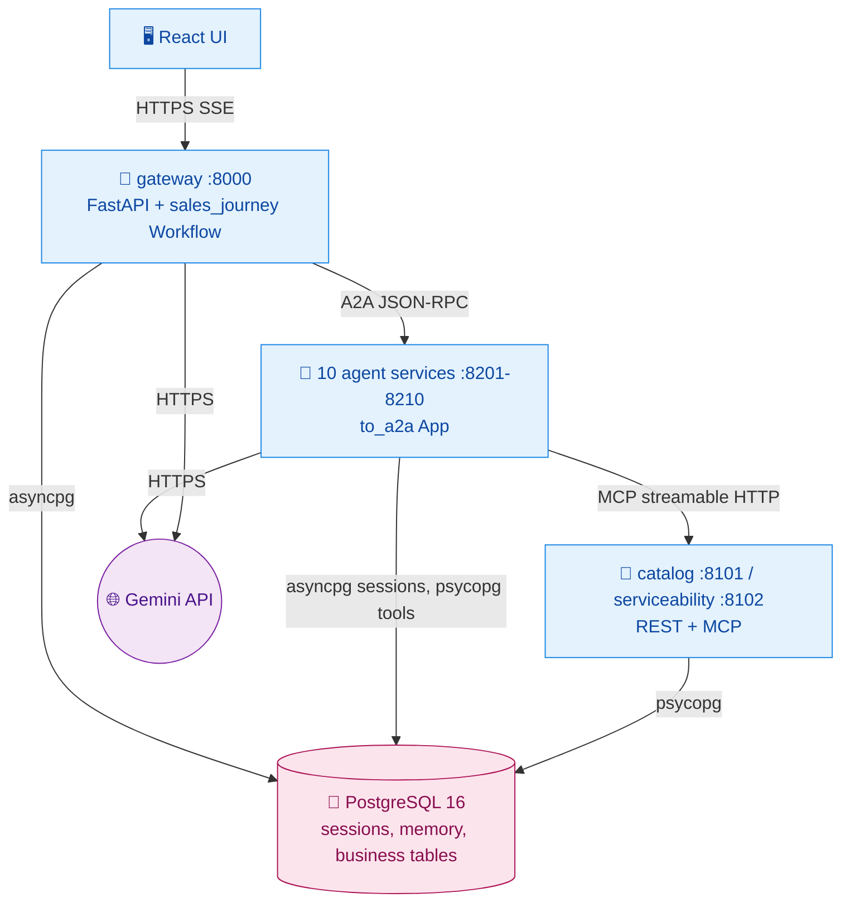

# Design: A2A Agent Services

## Context

See proposal.md. Coupling inventory (from code analysis, baseline commit `b3cb18a`):
- 10 importlib wrappers
- 7 `sys.modules` cross-calls:
  - Order → CustomerComm, Order → Offer `mark_quote_ordered`
  - Payment → CustomerComm, Offer → CustomerComm, Fulfillment → CustomerComm (3 call sites)
  - Discovery → `check_customer_state`
  - SuperAgent cleanup → CustomerComm
- 19 SQLite tables with cross-domain writes: Payment → `orders`, Fulfillment → `orders`/`accounts`, Order → `quotes`
- Payment and Fulfillment silently fall back to in-memory simulation when no DB path is set

## Goals / Non-Goals

**Goals:** independent deploy/scale per agent; zero shared-process state; one migration-managed PostgreSQL; no silent fallbacks.

**Non-Goals:** per-service databases; message brokers; changing agent business logic beyond the SQL dialect and cross-call replacement.

## Decisions

### D1. Runtime topology



| Service | Dir | Local port | A2A name |
|---|---|---|---|
| gateway | `SuperAgent/` | 8000 | — |
| discovery | `DiscoveryAgent/` | 8201 | `discovery_agent` |
| serviceability | `ServiceabilityAgent/` | 8202 | `serviceability_agent` |
| product | `ProductAgent/` | 8203 | `product_agent` |
| offer management | `OfferManagement/` | 8204 | `offer_management_agent` |
| order | `OrderAgent/` | 8205 | `order_agent` |
| payment | `PaymentAgent/` | 8206 | `payment_agent` |
| service fulfillment | `ServiceFulfillmentAgent/` | 8207 | `service_fulfillment_agent` |
| customer communication | `CustomerCommunicationAgent/` | 8208 | `customer_communication_agent` |
| greeting | `GreetingAgent/` | 8209 | `greeting_agent` |
| faq | `FAQAgent/` | 8210 | `faq_agent` |

### D2. Agent service skeleton (ADK Bootstrap Template + server)

```text
OrderAgent/
├── pyproject.toml          # depends on sales-common (path dep) + google-adk[a2a,db]==2.10.0
├── Dockerfile              # build context = repo root; installs libs/sales_common then the agent
├── order_agent/
│   ├── __init__.py         # exports root_agent (no side effects beyond construction)
│   ├── agent.py            # build_agent(model=None) -> Agent; root_agent = build_agent()
│   ├── prompts.py
│   ├── tools/
│   └── server.py           # app = sales_common.a2a_server.create_a2a_app(root_agent, ...)
└── tests/
```

`sales_common.a2a_server.create_a2a_app(agent)`:
1. Builds `App` (compaction + cache, from `sales_common.adk_app`) and `Runner(app=..., session_service=DatabaseSessionService(SESSION_DB_URL))`.
2. Builds `DatabaseTaskStore(create_async_engine(SESSION_DB_URL))` from `a2a.server.tasks`.
3. Calls `to_a2a(agent, host/port/protocol parsed from PUBLIC_URL, runner=..., task_store=...)`.
4. Adds `/healthz`.

`build_agent()` attaches `before_agent_callback=import_forwarded_context` and `after_tool_callback=export_context_delta` (chained with any agent-specific callbacks). Names are hardcoded. There are no `load_dotenv()` calls in agent code; a container gets its env from compose/Cloud Run.

- **Outbound message (implementation finding):** `RemoteA2aAgent` used as a workflow node ignores its node input and, by default, replays the caller's session history (other agents' turns as quoted context). `sales_common.a2a_client` therefore installs a `context_builder` that sends only the text the orchestrator wrote to state key `a2a_outbound_message` (set by `dispatch` and `HandoffPolicyNode`).
- **Discovery layout:** the used agent lives at `DiscoveryAgent/bootstrap_agent/sub_agents/discovery/`. It moves to `DiscoveryAgent/discovery_agent/` (with `git mv`), together with the `lead_gen/qualification_tools.py` it imports. The unused bootstrap root/test sub-agents and deploy scaffolding stay in `BootStrapAgent/` as the template.
- **Greeting/FAQ** move to `GreetingAgent/greeting_agent/` and `FAQAgent/faq_agent/` (no tools).

### D3. PostgreSQL data access

- `sales_common.db`: a `psycopg_pool.ConnectionPool(DATABASE_URL)` (sync; ADK runs sync tools in a thread). It provides `get_conn()`, `fetch_one/fetch_all/execute` helpers returning dict rows, and a `transaction()` context manager.
- Migrations: `db/migrations/NNN_*.sql` plus `sales_common.migrate` (a `schema_migrations` table, one transaction per file). Run by the gateway on startup (`RUN_MIGRATIONS=true` locally) and by a one-off Cloud Run job in cloud.
- Dialect translation of tools:

  | SQLite | PostgreSQL |
  |---|---|
  | `?` placeholders | `%s` |
  | `INSERT OR REPLACE` / `INSERT OR IGNORE` | `ON CONFLICT` |
  | `datetime('now')` | `db.now_iso()` parameter (timestamps stay ISO TEXT) |
  | `AUTOINCREMENT` | `GENERATED ALWAYS AS IDENTITY` |
  | `PRAGMA` | removed |

  Legacy Discovery column names with spaces (`"Company Name"`) are kept as quoted identifiers to limit prompt/tool churn.
- Seed: `db/seed/001_sales_data.sql` generated once from `SuperAgent/data/sales_agent.db` by `scripts/export_sqlite_seed.py`. The generated SQL is committed and the SQLite files are retained only as historical source. Idempotent via `ON CONFLICT DO NOTHING`.
- **Alternative considered:** SQLAlchemy ORM rewrite. Rejected as too large; raw SQL with psycopg keeps the port mechanical.

### D4. Replacing `sys.modules` cross-calls

| Call | Replacement |
|---|---|
| X → CustomerComm `send_*` | `sales_common.notifications.enqueue(type, *, recipient_email, recipient_phone, args, customer_id, order_id, channels, conn)` inserts `notifications(status='pending')` in the caller's transaction |
| CustomerComm delivery | Background dispatcher task in the communication service: `SELECT … FOR UPDATE SKIP LOCKED` batches every `NOTIFY_POLL_SECONDS` (default 10), dedup via `dedup_cache`, SMTP or simulated |
| Order → Offer `mark_quote_ordered` | `sales_common.repositories.quotes.mark_ordered(conn, offer_id, order_id)` |
| Discovery → `check_customer_state` | `sales_common.repositories.customer_state.check_customer_state(customer_id)` |
| Gateway cleanup | `sales_common.maintenance.cleanup_stale_records()`, run hourly by the gateway; notifications via the outbox |

### D5. Service authentication

`sales_common.auth.service_headers(audience)`:
- returns `{}` when `SERVICE_AUTH=none`
- otherwise fetches an ID token via `google.oauth2.id_token.fetch_id_token` (cached until 5 minutes before expiry)

Where it is applied:
- **RemoteA2aAgent:** `A2aRemoteAgentConfig(request_interceptors=[...])` for requests, and `A2aCardRequestConfig(headers=...)` for card fetch
- **McpToolset:** `header_provider`
- **Cloud Run:** services deploy with `--no-allow-unauthenticated`; the gateway service account gets `roles/run.invoker` on each agent and tool service

## Risks / Trade-offs

- **[Latency: one A2A hop + router per turn] → Mitigation:** keep services in one region; `min-instances=1` recommended for the gateway only.
- **[Outbox delay up to poll interval] → Mitigation:** 10 s default; the dispatcher also runs immediately after the communication agent's own tool calls.
- **[Shared DB couples schemas] → Mitigation:** table ownership documented in `db/README.md`; per-service DBs are a follow-up.
- **[Cannot build images in this sandbox (no Docker daemon)] → Mitigation:** services are verified as local processes against PostgreSQL 16; Dockerfiles are linted but a `docker compose build` must be run by the user.

## Migration Plan

1. Provision PostgreSQL.
2. Run migrations and seed.
3. Deploy tool services, then agent services, then the gateway.
4. Retire the old single service and GCS bucket sync once verified.
5. Rollback: the previous image and the SQLite bucket remain untouched until retirement.
