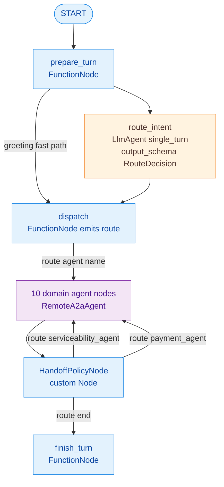

# Design: ADK 2.x Workflow Orchestration

## Context

See proposal.md for motivation. The ADK 2.10.0 behaviors below were verified in a scratch venv with fake models (not recalled from memory):

- An LlmAgent used as a Workflow node receives **only its node input, not chat history**. Inside graphs, `mode="chat"` is discouraged and `task` mode is disabled.
- A coordinator LlmAgent with chat-mode sub-agents is **sticky**: after `transfer_to_agent`, later user turns go straight to the sub-agent until it transfers back. A remote A2A agent cannot transfer back to the gateway, so a coordinator design would get stuck on the first remote agent.
- A2A carries **message parts only**. Remote `function_call` / `function_response` parts and the author name do arrive at the client. Local `session.state` is not sent, and the remote `state_delta` is not returned.
- `App.plugins[].on_event_callback` may add `actions.state_delta` to an event before it is persisted.
- An `output_schema` LlmAgent node emits a `dict` output that a routing function node can consume.
- A `Workflow` cannot be an `LlmAgent.sub_agents` entry; `SequentialAgent` / `ParallelAgent` / `LoopAgent` are deprecated.

## Goals / Non-Goals

**Goals:**
- Deterministic control flow where the business requires it (handoffs). LLM judgment is used only for intent classification.
- One orchestration graph that works identically with in-process agents (tests) and `RemoteA2aAgent` nodes (deployment).
- Every ADK 2.x context feature the user named is used and observable: Conversational context, Sessions, State, Events, Memory, Context compression, Model context caching.

**Non-Goals:**
- Streaming token-by-token from remote agents (A2A returns status/artifact updates; the gateway streams per event).
- Human-in-the-loop `RequestInput` pauses. The conversational UI already asks questions in-band.

## Decisions

### D1. Root is a `Workflow` graph ("custom template workflow" for ADK 2.0)



- `prepare_turn(ctx, node_input)`:
  - stores the user message in `turn_user_message`, resets `handoff_hops=0`, and appends to `transcript`
  - searches memory (`ctx.search_memory`)
  - builds a compact router input: message, `last_agent`, last agent reply excerpt (≤400 chars), journey flags derived from context keys, memories, `user:company_name`
  - for greetings, emits `route="greeting_agent"` directly (fast path, no LLM call)
- `route_intent`:
  - `Agent(mode="single_turn", output_schema=RouteDecision, include_contents="none", generate_content_config=temperature 0)`
  - its `static_instruction` holds the routing rules ported from `prompts.py`, stripped of the "call transfer_to_agent" mechanics
- `dispatch`:
  - validates `RouteDecision.target` against the agent registry, falling back to `faq_agent`
  - writes `last_agent`
  - outputs the original user message text as the remote node's input
- `HandoffPolicyNode(Node)` is the custom template workflow node. It is a subclass of `google.adk.workflow.Node` implementing `run_node_impl`, holding the declarative handoff rules:
  - `discovery_agent` just ran, `customer_context` has a `customer_id` and `address.zip_code`, and `serviceability_context` is absent or was checked for a different ZIP → route `serviceability_agent` with the synthetic input "Check service availability for this address: <JSON address>"
  - `service_fulfillment_agent` just ran, `appointment_confirmed_order` (order id) is set by the bridge from a `schedule_installation` response with `success=true`, `payment_context.status` ∉ {completed, approved, captured}, and `order_context.status` ∈ {pending_payment, draft, None} → route `payment_agent` with "Installation is scheduled for order <id>; total <amount>. Start payment."
  - it increments `handoff_hops` and routes `end` when `handoff_hops ≥ 2`; the chosen agent's outbound text is written to `a2a_outbound_message`
- Rules are data (a list of `HandoffRule` dataclasses) and unit-testable without an LLM.

**Alternatives considered:**
- Coordinator LlmAgent with RemoteA2aAgent `sub_agents`: rejected because of stickiness (above).
- Subclassing `BaseAgent._run_async_impl` (1.x custom template agents): works in 2.10, but the 2.0 migration notes flag it as bypassed by the graph engine. `Node` subclasses are the supported 2.x extension point.
- Declarative YAML graph: the loader is marked deprecated, and Python gives type-checked rules.

### D2. Shared journey context crosses A2A via metadata and tool-result envelopes

- **Gateway → agent:** `RemoteA2aAgent(a2a_request_meta_provider=...)` sends `{"journey_context": {5 keys}, "session_ref": <gateway session id>, "transcript": <last 6 turns, ≤2k chars>, "user_profile": {...}}`. On the agent side, a shared `before_agent_callback` (`sales_common.context.import_forwarded_context`) copies `run_config.custom_metadata["a2a_metadata"]` into session state (the 5 keys, `journey_transcript`, `user_profile`). Existing tools that read `tool_context.state[...]` keep working, and instructions can template `{customer_context?}` / `{journey_transcript?}`.
- **Agent → gateway:** a shared `after_tool_callback` (`sales_common.context.export_context_delta`) appends `"_context_update": {key: value}` to the tool's response dict whenever the tool changed any of the 5 keys (read from `tool_context.actions.state_delta`). The gateway plugin `ContextBridgePlugin.on_event_callback` finds `function_response` parts carrying `_context_update` and merges them into `event.actions.state_delta`, so they persist in the gateway session before `HandoffPolicyNode` runs. It also sets `appointment_confirmed_order` from successful `schedule_installation` responses.
- **Alternative considered:** a shared `journey_context` DB table written by agents. Rejected because it would couple every agent to a gateway-owned table and bypass ADK state.

### D3. `App` configuration (all LLM-backed apps)

```python
App(name=..., root_agent=...,
    plugins=[ContextBridgePlugin()],   # gateway only; it also writes the delegation audit log
    events_compaction_config=EventsCompactionConfig(compaction_interval=8, overlap_size=2,
                                                    token_threshold=60_000, event_retention_size=10),
    context_cache_config=ContextCacheConfig(cache_intervals=10, ttl_seconds=1800, min_tokens=4096))
```

- Imports: `google.adk.apps.App`, `google.adk.apps.app.EventsCompactionConfig`, `google.adk.agents.context_cache_config.ContextCacheConfig`.
- Values come from env (`COMPACTION_INTERVAL`, `CONTEXT_CACHE_TTL_SECONDS`, …) with these defaults.
- `min_tokens=4096` matches the Gemini 3 minimum cacheable prefix. Long prompts move to `static_instruction` so the cacheable prefix is stable.

### D4. Sessions, state scopes, memory

- `DatabaseSessionService(db_url=SESSION_DB_URL)`:
  - URL format: `postgresql+asyncpg://…`
  - Cloud SQL: `?host=/cloudsql/<conn>`
  - requires `greenlet`
- User identity:
  - the client generates `csa_uid` (UUIDv4, localStorage) and sends it to `POST /api/session`
  - the ADK `user_id` is `web:<csa_uid>` (validated as a UUID, else a fresh one); the ADK `session_id` is the server-generated session id
- State scopes:
  - session: the 5 journey keys, `last_agent`, `last_reply`
  - `user:`: `user:customer_id`, `user:company_name`
  - per-turn bookkeeping (session scope, overwritten each turn): `turn_user_message`, `handoff_hops`, `a2a_outbound_message`, `appointment_confirmed_order`. `temp:` keys were not used: workflow-plugin state deltas must be visible to later nodes and to the A2A `context_builder`, so plain session keys were chosen.
- `PostgresMemoryService(BaseMemoryService)` in `sales_common.memory`:
  - table `adk_memories(id, app_name, user_id, session_id, author, text, created_at, tsv tsvector)` with a GIN index
  - `add_session_to_memory` upserts user and agent text events (dedup on event id)
  - `search_memory` uses `websearch_to_tsquery` ranking, limited to 5 results, always filtered by `(app_name, user_id)`
  - it is async via SQLAlchemy async engine
- `finish_turn` stores `last_reply`. The server calls `memory_service.add_session_to_memory` after the stream completes (outside the latency path).

### D5. Token auth without in-memory registry

- Session tokens are `itsdangerous.URLSafeTimedSerializer(SESSION_SECRET_KEY)` payloads `{sid, uid}` with max age `SESSION_TOKEN_EXPIRY_MIN`.
- Revocation writes `sid` to a `revoked_sessions` table.
- Rate limiting stays an in-memory token bucket per instance (documented limitation).
- Alternative considered: hand-rolled HMAC. Rejected per the security policy (use vetted libraries).

### D6. SSE mapping

- `server/api/chat.py` keeps the event taxonomy.
- Text tokens:
  - taken only from events whose `author` ∈ domain agent registry
  - de-duplicated by `(author, text hash)` per turn
  - streamed with `RunConfig(streaming_mode=StreamingMode.SSE)`
- `activity_update` / `cart_update` / `structured_card` continue to be derived from `function_response` parts (verified to arrive through A2A), with the fixed tool-name tables:
  - `check_business_credit` and `process_payment` for payment
  - `find_best_bundle_offer` added to quotes
  - payment status accepted as `completed` or `approved`
- The suggestion generator reuses the same model config via `google-genai`.

## Risks / Trade-offs

- **[Router lacks full history] → Mitigation:** `prepare_turn` supplies `last_agent`, a last-reply excerpt, journey flags and memories. Routing tests cover the follow-up scenarios in the spec.
- **[Extra LLM hop per turn (router)] → Mitigation:** greeting fast path, temperature 0 with small output, and context caching of the static routing instruction.
- **[`_context_update` visible to the agent's model] → Mitigation:** the field is small JSON the model already produced via the tool; the key is documented in the agent instructions as internal.
- **[Experimental ADK features (compaction, caching, `to_a2a`)] → Mitigation:** pin `google-adk==2.10.0`; integration tests assert compaction events and the App config.
- **[Existing domain bugs]** found during the port, now fixed (each with a regression test):
  - duplicate Payment tool definitions (dead duplicates removed)
  - Offer quote cache keyed without the customer, and offer ids shared across customers (cache now holds only customer-independent pricing; offer ids are per customer)
  - Discovery log line before each docstring, which left tool descriptions empty
  - `hash()`-based IDs in Order and Payment (`sales_common.ids.new_id` random ids; `stable_number` for the mock credit score)

## Migration Plan

1. Deploy PostgreSQL and run migrations (sessions tables are auto-created by ADK; memory and revocation tables come from `db/migrations`).
2. Deploy agent services (change `a2a-agent-services`), then the gateway.
3. Rollback: redeploy the previous single-container image. Its SQLite and in-memory state is independent of PostgreSQL.

## Open Questions

- Whether to move memory to Vertex AI Memory Bank in GCP later. This is deferrable because the `BaseMemoryService` interface is unchanged.
