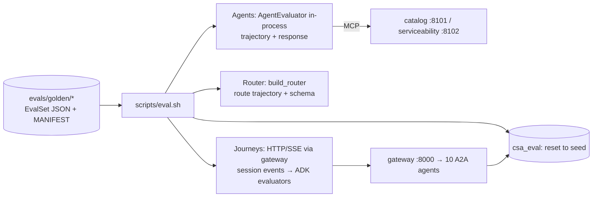

# Design: Golden-Dataset Agent Eval Suite

## Context

See proposal.md. Agents are ADK 2.10 packages exporting `root_agent` (`<pkg>/__init__.py`: `from .agent import build_agent, root_agent`). They receive journey context through session state (`sales_common.context.JOURNEY_KEYS`, imported from A2A metadata by `import_forwarded_context`). The gateway is an ADK `Workflow` of `RemoteA2aAgent`s whose session events (including remote tool calls and responses) are stored by `DatabaseSessionService` in PostgreSQL.

## Decisions

### D1. Golden format: ADK `EvalSet` + manifest

Goldens are `google.adk.evaluation.eval_set.EvalSet` JSON, one file per agent, one for the router, one per journey. Each turn is an `Invocation`:
- `user_content`
- `intermediate_data.tool_uses`: the golden trajectory
- `final_response`: the golden reference reply
- `rubrics`

`EvalBaseModel` forbids extra fields, so review status, scenario IDs, router targets and journey expectations (`turn_agents`, `turn_events`) live in `evals/golden/MANIFEST.json`, keyed by `<set id>/<eval_id>`. `evals/golden/tool_schemas.json` snapshots every agent's tool parameters so goldens are validated offline.

### D2. Trajectory scoring

- **Agents:** the custom ADK metric `golden_trajectory_v1` (`evals/metrics.py`, registered through `EvalConfig.custom_metrics` → `google.adk.evaluation.custom_metric_evaluator`). ADK's `tool_trajectory_avg_score` requires every argument to match exactly, which fails for values created during a run (cart/order/appointment ids, tokens, dates). Goldens therefore list only stable arguments, and the metric checks that golden calls appear in order (extra calls allowed) with every listed argument equal (strings case/whitespace-insensitive, numbers numeric, lists as multisets). Per turn: matched / expected calls; no expected calls means none allowed. Threshold 1.0 for deterministic agents (serviceability, order, payment, fulfillment, communication), 0.8 otherwise.
- **Router:** the trajectory is the chosen `target`: exact match, or membership in `allowed_targets`.
- **Journeys:** the trajectory is the answering-agent sequence per turn (event `author`) plus tool calls (`golden_trajectory_v1`).

### D3. Response scoring

- `final_response_match_v2`: LLM judge, semantic equivalence with the golden reference.
- `rubric_based_final_response_quality_v1`: case rubrics.
- `hallucinations_v1`: reply supported by tool output.

The judge model defaults to `gemini-3-flash-preview` in each `test_config.json` (ADK's default `gemini-2.5-flash` returns 404 "no longer available to new users" for this project's key); `EVAL_JUDGE_MODEL` and `EVAL_JUDGE_SAMPLES` override it. `hallucinations_v1` is not used for the tool-less greeting and FAQ agents. For the router, the response check is that `RouteDecision` parses and the model finished with `STOP`; the `MAX_TOKENS` guard is a regression check for the truncation bug.

### D4. Golden lifecycle

1. Inputs, expected tools and rubrics are written from `Scenarios.md`.
2. `evals/record_golden.py` runs the real model and fills in the observed trajectory and response as a **draft** (`reviewed: false`).
3. A reviewer corrects the draft and approves it with `python -m evals.review --approve <key> --by <name>`, which sets `reviewed: true` with `reviewed_by`/`reviewed_at` and refuses cases without reference responses.

`EVAL_INCLUDE_DRAFTS=1` scores recorded drafts for debugging the suite only; `eval.sh` never sets it. `record_golden` saves after every case so an interrupted run (quota, billing) keeps its progress.

Live evals run only reviewed cases. `--refresh` re-records on purpose, and the diff is reviewed in the PR. `MANIFEST.json` stores SHA-256 hashes of `db/seed/*.sql`; `test_golden_valid.py` fails when the seed changed since review.

### D5. Isolation and data stability

Every run resets `csa_eval` with `scripts/db.sh reset --yes`, so seed IDs referenced by goldens are valid and the dev database is never written. Catalog and serviceability serve read-only reference data and are shared with the dev stack. Journeys start their own full stack on `csa_eval` with `DEBUG=true`, and refuse to run while the dev stack holds the ports.

### D6. Journey trace extraction

The runner drives `/api/session` + `/api/chat` (helpers moved from `scripts/e2e_test.py` to `scripts/e2e_client.py`) and reads `{session_id, user_id}` from `/api/debug/session`. It then loads the session with `google.adk.sessions.DatabaseSessionService(sales_common.db.session_db_url())` and splits events into one `Invocation` per user turn (`evals/trace.py`), opening a turn only on user events whose text is the next message sent, so workflow-internal user-role events cannot shift turns:
- `function_call` / `function_response` parts of agent-authored events become `tool_uses` / `tool_responses` (verified on a real gateway session: remote serviceability calls with full arguments are stored)
- the streamed SSE text of the turn (what the user saw, all answering agents) becomes the actual `final_response`; SSE token authors are the agent trajectory

Scoring calls the ADK evaluators directly (`metric_evaluator_registry.DEFAULT_METRIC_EVALUATOR_REGISTRY.get_evaluator(...).evaluate_invocations(actual, expected)`).

### D7. Gating

All live tests are marked `eval` and skipped unless `RUN_EVALS=1`, so `pytest` in any service stays offline. `test_golden_valid.py` and `test_metrics.py` are not gated and run everywhere. `AgentEvaluator.evaluate_eval_set` runs with `num_runs=1`; repetition is `eval.sh --runs N`, which resets `csa_eval` before every run so write cases (registrations, cancellations) start from seed data each time, and a case passes only if it passes in every run.

## Risks / Trade-offs

- LLM judges are themselves nondeterministic: `num_runs` (default 2) averages runs, and thresholds start lenient with recorded baselines.
- Cost: a full run is roughly 1,000–1,500 Gemini requests (estimate). Tiers can be run separately with `--only`.
- Remote tool calls in the gateway session depend on ADK's A2A part conversion. This is verified as the first journey task; the fallback scores only the agent trajectory and responses.
