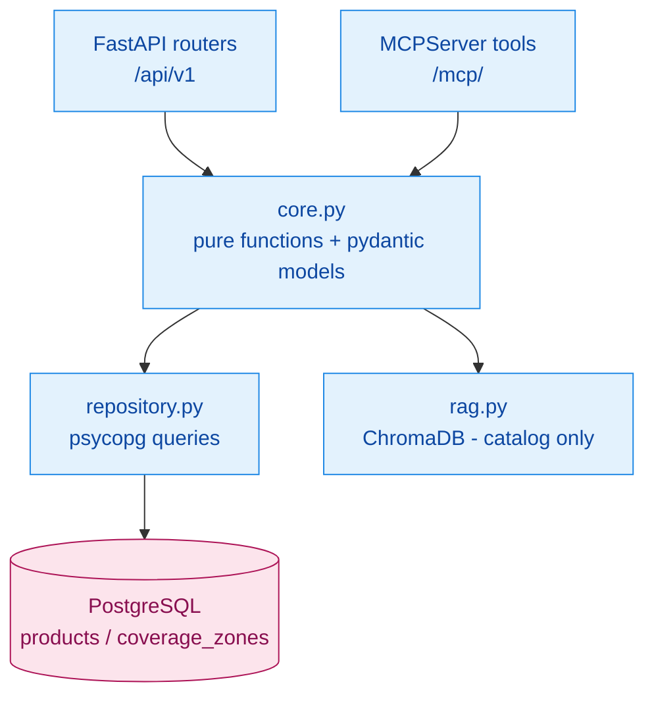

# Design: Catalog and Serviceability REST + MCP Services

## Context

See proposal.md. Verified libraries:
- `mcp` 2.2.0: `from mcp.server.mcpserver import MCPServer` (renamed from `FastMCP`). Mounting requires `mcp.session_manager.run()` in the FastAPI lifespan.
- The default `host="127.0.0.1"` enables DNS-rebinding protection that returns HTTP 421 for `*.run.app` Host headers.
- ADK client: `google.adk.tools.mcp_tool.McpToolset(connection_params=StreamableHTTPConnectionParams(url=..., timeout=...), tool_filter=..., header_provider=...)`.

## Goals / Non-Goals

**Goals:** one implementation per operation shared by REST and MCP; stateless horizontally scalable services; identical tool names so agent prompts keep working.

**Non-Goals:** API gateway / API keys for third parties (services are private behind IAM); write operations on the catalog.

## Decisions

### D1. Layering per service



Layout:

```text
services/catalog/
├── pyproject.toml   Dockerfile   README.md
├── catalog_service/{__init__,app,core,models,repository,rag,mcp_server}.py
├── scripts/ingest_knowledge.py      # moved from ProductAgent/scripts
├── data/product_docs/*.md           # moved from ProductAgent/data
└── tests/
```

Serviceability uses the same layout, with `address.py` (moved validation logic) and `gis_client.py` (optional upstream) in place of `rag.py`.

- **REST and MCP share `core`:**
  - `core` functions take plain args and return pydantic models
  - REST routes return `model.model_dump()`
  - MCP tools are thin wrappers with the legacy names and docstrings, returning dicts
- **MCP server mount:** `mcp.streamable_http_app(streamable_http_path="/", stateless_http=True, json_response=True, host="0.0.0.0")`, mounted at `/mcp`; the client URL is `<base>/mcp/`.

### D2. Data

- Migrations `002_catalog.sql` (products) and `004_coverage.sql` (coverage_zones; split so both services could be built in parallel):
  - `products(product_id PK, product_name, category, technology, speeds JSONB, description, features JSONB, available BOOL, unit_price NUMERIC(10,2), family)`
  - `coverage_zones(zip_code PK, city, state, serviceable BOOL, service_zone, infrastructure_type, infrastructure JSONB, max_speed_mbps INT, estimated_install_days INT, available_products JSONB, available_product_categories JSONB)`
- Seeds: `db/seed/002_catalog.sql` (`scripts/export_catalog_seed.py`) and `db/seed/003_coverage.sql` (`scripts/export_coverage_seed.py`), generated from the legacy dicts. Sparse coverage records get infrastructure from `INFRASTRUCTURE_DEFAULTS[technology]` at export time.
- The ChromaDB index persists at `CHROMA_PATH` (default `/app/data/embeddings`) and is built at image build time, or on first start if missing, from `data/product_docs`. The embedding model path is `EMBEDDING_MODEL_PATH` (optional pre-staged files).

### D3. Defects fixed because they break the API contract

- Case-insensitive product id lookup.
- Numeric speed comparison: parse `"1 Gbps"` / `"500 Mbps"` to Mbps for `fastest` and `faster`.
- `max_price` / `max_budget` parameters were ignored. They are removed from the product tools, since pricing is not disclosed (spec requirement). `get_best_value_product` ranks by Mbps within the category instead.
- `available_products` is returned in the serviceability response.
- `zone` is ignored by `get_infrastructure_by_technology`: it is documented as ignored and not fixed (no data exists per zone).

### D4. Agent side

```python
McpToolset(connection_params=StreamableHTTPConnectionParams(url=f"{CATALOG_MCP_URL}", timeout=15),
           header_provider=lambda ctx: service_headers(CATALOG_BASE_URL))
```

- `serviceability_agent`: its `after_tool_callback` parses the `check_service_availability` MCP result (`structuredContent`, or the JSON text content) and writes `serviceability_context`. The shared `export_context_delta` then adds `_context_update`.
- Agent prompts keep the same tool names; references to in-process tool behaviour are removed.

## Risks / Trade-offs

- **[MCP session per agent invocation adds latency] → Mitigation:** stateless HTTP + JSON responses; `tool_list_cache_ttl_seconds=300`.
- **[Chroma index in container is per-replica] → Mitigation:** the index is read-only and deterministic from docs, baked into the image.
- **[mcp 2.x drops undeclared result fields] → Mitigation:** tools return dicts, which become `structuredContent`; a test asserts a round trip through `McpToolset`.
