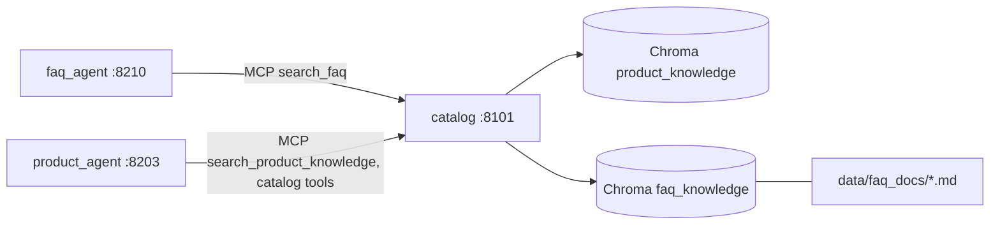

# Design: Fix Defects Found by the Golden Evals

## Context

See proposal.md. The catalog service already embeds `data/product_docs` with sentence-transformers into Chroma collection `product_knowledge` (`catalog_service/rag.py`) and serves `search_product_knowledge` over MCP. Agents receive state via `sales_common.context.import_forwarded_context` and the templated `JOURNEY_CONTEXT_INSTRUCTION`.



## Decisions

### D1. FAQ index in the catalog service

`rag.py` is generalized to a `Corpus` (docs dir, collection name, id prefix, metadata):
- `PRODUCT_CORPUS` is unchanged (same ids and collection).
- `FAQ_CORPUS` reads `data/faq_docs`, collection `faq_knowledge`, ids `faq_<sha>`, metadata `topic` (file stem) and `section`.

Each corpus has its own lazily loaded index; `warm_up` builds any empty corpus. `search_faq(query, top_k)` returns `{available, query, passages[{text, topic, section, distance}], count, message}`, the same contract as product search.

### D2. FAQ agent grounded by tool

`faq_agent` gets `McpToolset(CATALOG_MCP_URL, tool_filter=["search_faq"])` through the shared MCP helper the product agent uses. Prompt rules:
- always call `search_faq` before answering
- answer only with facts in the returned passages
- when nothing relevant comes back (or the search is unavailable), say a specialist will follow up
- never quote prices; redirect pricing to a quote

### D3. Current date for every agent

`import_forwarded_context` sets `state["current_date"]` (ISO date + weekday, server local time) on every turn, including without gateway metadata. `JOURNEY_CONTEXT_INSTRUCTION` adds "Today's date: {current_date?}. Resolve relative dates from it; never use dates in the past for new plans or appointments." Tools also guard:
- `setup_payment_plan` rejects a `start_date` before today and defaults it to today + 30 days
- `check_availability` rejects a `start_date` before today and defaults it to tomorrow (reschedule and schedule already validate)

### D4. Cancellation guard in the tool

`cancel_order` refuses statuses in `NON_CANCELLABLE = {fulfilled, activated, installed, completed, cancelled}` with `success: false`, `status` and a reason message. The prompt says to call it directly with the reason the customer gave (if any) and relay a refusal.

### D5. Payment history from the database

```sql
SELECT p.* FROM payments p LEFT JOIN orders o ON o.order_id = p.order_id
WHERE COALESCE(NULLIF(p.customer_id, ''), o.customer_id) = %s
```

The query has optional `created_at` bounds, `ORDER BY created_at DESC LIMIT %s`. `total_amount` sums completed payments. The method token is masked.

### D6. Prompt-only fixes

- **Product:** a competitor rule with an example refusal.
- **Discovery:** never ask for suite/unit/floor; call `add_new_company` in the same turn once the required fields are known (industry inferred).
- **Router:** company-introduction rule ahead of the serviceability rule, with an example.

## Risks / Trade-offs

- The FAQ corpus is authored content for a fictional company; it is the single source the agent may quote, so wrong corpus text becomes wrong answers (reviewed like code).
- Prompt-only fixes are verified by the golden evals, not unit tests.
