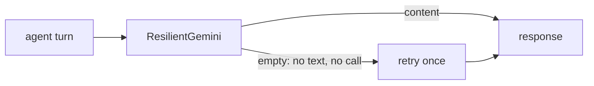

# Design: Fix Eval Follow-ups

## Decisions

### D1. Retry on empty model output

`ResilientGemini(Gemini)` overrides `generate_content_async`. For non-streaming calls it collects the responses; if the final response has neither text nor a function call (and no error code), it calls the model once more and yields the retry's responses. Streaming calls pass through unchanged.

`agent_model()` returns `ResilientGemini(model=model_name())`; agents use it when no model is injected, so tests still pass a scripted model.

### D2. Judge retry

`AgentEvaluator.evaluate_eval_set` raises one `AssertionError` listing failures. If every listed failure line is a "was not evaluated" message, the same group is evaluated once more and that result stands.

