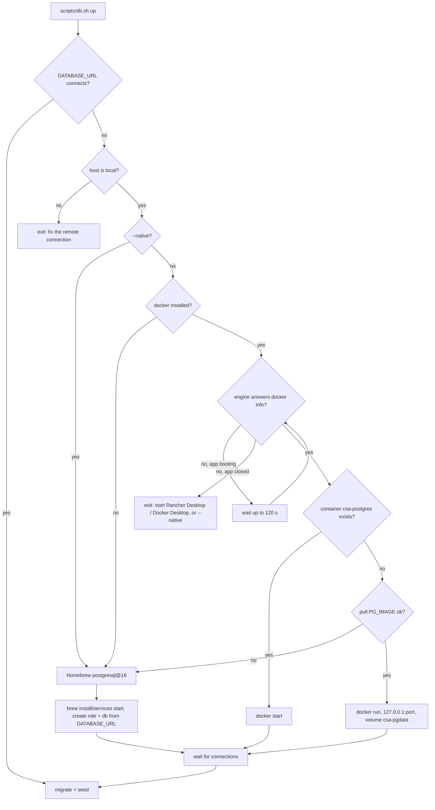

# Design: Local Development Reliability

## Context

See proposal.md. The only contract between the application and its database is `DATABASE_URL`; how a developer provides PostgreSQL was undocumented beyond one `docker run` line. The router change is local to `SuperAgent/super_agent/workflow.py`.

## Decisions

### D1. `db.sh up` decision flow

- Reachability is checked with `psycopg.connect(..., connect_timeout=3)` from the venv (`db_check` in `scripts/lib.sh`), so no `psql` client is required.
- Credentials, port and database name come from `DATABASE_URL` (`db_url_parts`), so the container and the Homebrew role always match `.env`.
- A closed engine is a hard stop rather than a fallback: falling back would quietly put developers on different setups. Only a failed pull (environmental, not user-fixable in the moment) falls back.
- Homebrew's cluster has a superuser named after the OS user; role and database are created idempotently with `format(... %I/%L)` + `\gexec`.

### D2. Start preflight

`start_local.sh` calls `db_check` after the config checks and before starting any process. It prints the driver error and `scripts/db.sh up`.

### D3. Router output budget

`google.adk.Agent(output_schema=RouteDecision)` sets `response_schema`, but Gemini 3 thinking still consumes `max_output_tokens`. `build_router` sets `google.genai.types.ThinkingConfig(thinking_level=types.ThinkingLevel.MINIMAL)` when the model name starts with `gemini-3` (other families reject `thinking_level`), and raises the cap to 1024 as headroom for models that think. Measured on `gemini-3-flash-preview`: 5/5 correct routes, ~1 s per call, versus truncation at 256.

### D4. Single `.env`

`super_agent/config.py` loads only `<repo>/.env` (`override=False`). The `SuperAgent/server/.env` fallback is removed; `SuperAgent/.gitignore` keeps ignoring that path.

## Risks / Trade-offs

- Homebrew fallback means a machine can end up native while others use Docker; `db.sh up` logs which backend it chose, and `down` handles both.
- Port conflicts (another PostgreSQL on 5432 with other credentials) are reported, not resolved.
- `thinking_level` gating is by model-name prefix; a future model family needs the same check.
