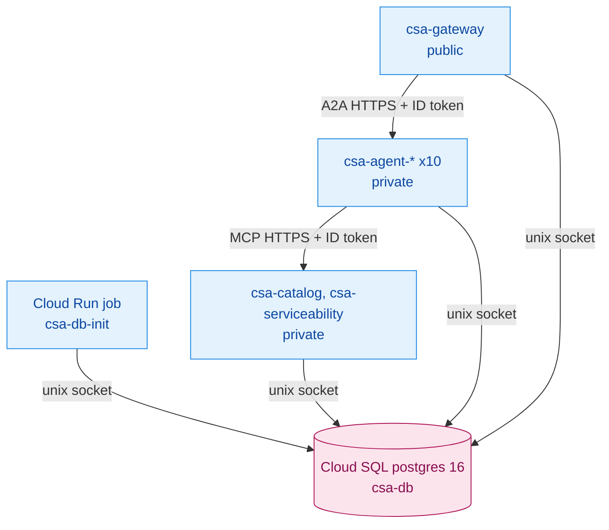

# Design: Multi-Service Scripts and Deployment

## Context

See proposal.md. The sandbox used for implementation has no Docker daemon. Compose and Dockerfiles are therefore validated statically (`docker compose config` when available, otherwise YAML parse), and runtime behavior is verified with `start_local.sh` against a local PostgreSQL 16.

## Decisions

### D1. Service manifest as single source

`scripts/services.conf` is a bash-sourceable table: `name|dir|module|port|kind(tool|agent|gateway)|cloud_run_name|a2a_name|mcp_deps`. Every script (start/stop/deploy) iterates this table, so adding an agent is one line.

### D2. Images

- One `Dockerfile` per service. Build context is the repo root, so it can `COPY libs/sales_common`.
- Base `python:3.12-slim`; `pip install ./libs/sales_common ./<ServiceDir>`.
- Non-root user; `CMD uvicorn <module>:app --host 0.0.0.0 --port ${PORT:-8080}`.
- The gateway image adds a Node 20 build stage for the React client.
- The catalog image adds CPU-only torch and a Chroma index build at image build time.

### D3. Cloud Run wiring

- All services run with `--add-cloudsql-instances`.
- `DATABASE_URL=postgresql://csa@/csa?host=/cloudsql/<conn>` carries no password; the `DB_PASSWORD` secret is injected as `PGPASSWORD` (read by libpq and asyncpg).
- Deploy order and URL injection:
  1. Tool services; their URLs are read back with `gcloud run services describe --format='value(status.url)'`.
  2. Agents get `CATALOG_MCP_URL` / `SERVICEABILITY_MCP_URL` and `PUBLIC_URL`. A second pass sets `PUBLIC_URL` after the URL is known on first deploy.
  3. The gateway gets `AGENT_URL_<NAME>` for each agent.
- IAM:
  - `csa-gateway` SA: invoker on agents
  - `csa-agents` SA: invoker on tools
  - all SAs: `roles/cloudsql.client` and `roles/secretmanager.secretAccessor` on the needed secrets
- The gateway is `--allow-unauthenticated`; all others use `--no-allow-unauthenticated`.

### D4. Safety

- Scripts use `set -euo pipefail`.
- No secrets are echoed; secret values are read with `read -rs`.
- Destructive operations (`db.sh reset`) require `--yes`.
- `stop_local.sh` kills only recorded PIDs. There is no `pkill -f` or port-wide `kill -9` as in the old `start_servers.sh`.

## Risks / Trade-offs

- **[13 services multiply cold starts] → Mitigation:** gateway `min-instances` configurable (default 0 for demo cost); agents are light images without torch.
- **[First-deploy PUBLIC_URL chicken-and-egg] → Mitigation:** two-pass env update, documented in `GCP_DEPLOY.md`.
- **[Untestable here: gcloud/docker] → Mitigation:** `bash -n` and `shellcheck` (if available) on all scripts; dry-run flag `--dry-run` prints commands without executing.
