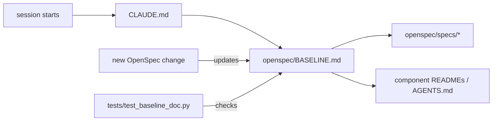

# Design: Project Baseline Spec

## Context

Facts in the baseline come from the code and generated artifacts that already exist:
- `scripts/services.conf` (services, ports, A2A names, MCP dependencies)
- `evals/golden/tool_schemas.json` (tool parameters, snapshotted from each `root_agent`)
- `sales_common.context.JOURNEY_KEYS` and the agents' `tool_context.state[...]` writes
- `SuperAgent/super_agent/workflow.py` (`prepare_turn`, `route_intent`, `evaluate_handoff`, `MAX_HANDOFF_HOPS = 2`)
- `db/README.md` (table ownership)
- `db/seed` (ids used by goldens)

## Decisions

### D1. One map, links for depth

BASELINE.md is a map, not a manual: tables and short rules, each linking to the component doc that holds the detail. That keeps it short enough to read in full at the start of every session.

### D2. Archived specs are the behavioral source of truth

`openspec/specs/<capability>/spec.md` (after archiving) holds the requirements; BASELINE.md indexes them. New changes write delta specs against these capabilities.

### D3. Drift is a test failure

`tests/test_baseline_doc.py` parses `services.conf` and `tool_schemas.json` and asserts every service name, port and agent tool appears in BASELINE.md. It needs no database, key or network.

## Risks / Trade-offs

- Prose sections (recipes, known issues) are not machine-checked; the OpenSpec-first rule requires updating them in the same change.
